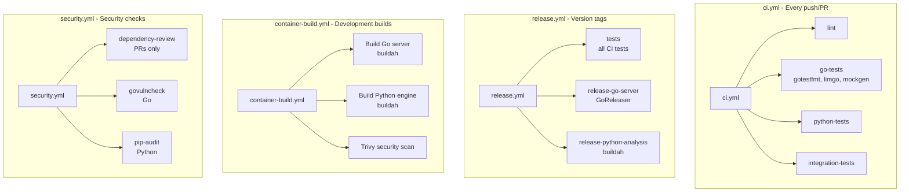

# GitHub Actions Workflows

This directory contains the CI/CD workflows for the Arcaflow MCP project.

## Workflows Overview

### ci.yml - Continuous Integration

Runs on every push and pull request to validate code quality.

**Jobs:**
- `lint`: Go and Python linting using golangci-lint and Black/flake8
- `go-tests`: Go unit tests with gotestfmt formatting and limgo coverage enforcement
- `python-tests`: Python unit tests with pytest and coverage reports
- `integration-tests`: Cross-component integration validation

**Key Features:**
- Uses organization variables for Go/Python versions (`ARCALOT_GO_VERSION`, `ARCALOT_PYTHON_VERSION`)
- Mock generation with mockgen before testing
- Beautiful test output formatting with gotestfmt
- Coverage enforcement with limgo (85% minimum)
- Coverage reports added to GitHub Step Summary
- Dependency caching for faster builds

**Advanced Testing Tools:**
- **gotestfmt**: Formats Go test output for better readability
- **limgo**: Enforces test coverage thresholds per package
- **mockgen**: Generates mocks for testing

### release.yml - Release Management

Triggers on version tags (`v*`) to create official releases.

**Jobs:**
- `tests`: Runs complete test suite before release
- `release-go-server`: Uses GoReleaser for multi-platform Go server binaries and containers
- `release-python-analysis`: Builds and pushes multi-arch Python analysis engine containers

**Go Server Release (GoReleaser):**
- Multi-platform binaries: Linux, macOS, Windows (amd64, arm64)
- Multi-arch container images: `quay.io/arcalot/arcaflow-mcp-server`
- Automatic changelog generation
- GitHub release creation with download links
- SBOM generation for security compliance
- Cosign signing for artifact verification

**Python Analysis Engine Release:**
- Multi-arch container images: `quay.io/arcalot/arcaflow-mcp-analysis`
- Built with buildah/podman for amd64 and arm64
- Security scanning with Trivy
- Published to quay.io registry

**Container Image Tags:**
```
# Go Server
quay.io/arcalot/arcaflow-mcp-server:v1.0.0
quay.io/arcalot/arcaflow-mcp-server:v1
quay.io/arcalot/arcaflow-mcp-server:latest

# Python Analysis Engine
quay.io/arcalot/arcaflow-mcp-analysis:v1.0.0
quay.io/arcalot/arcaflow-mcp-analysis:latest
```

### container-build.yml - Development Container Builds

Builds container images for development branches and pull requests.

**Triggers:**
- Push to main or initial-development branches
- Pull requests modifying server/ or analysis/ directories
- Manual workflow dispatch

**Images Built:**
- Go MCP Server: Multi-arch (amd64, arm64)
- Python Analysis Engine: Multi-arch (amd64, arm64)

**Tag Strategy:**
- PRs: `pr-{number}-{sha7}` (expires in 14 days)
- Branches: `{branch}-{sha7}` (expires in 30-90 days)
- Only pushes to registry for main branch
- All builds create local `-local` tag for testing

**Security:**
- Trivy scanning for vulnerabilities (HIGH/CRITICAL)
- Automatic expiration labels for development images

### security.yml - Security Scanning

Runs security checks on every push and pull request.

**Jobs:**
- `dependency-review`: GitHub dependency review on PRs
- `govulncheck`: Go vulnerability scanning
- `pip-audit`: Python dependency vulnerability scanning

**Features:**
- Automatic vulnerability detection
- Configurable CVE exceptions (see workflow for details)
- Runs on every code change

## Configuration

### Organization Variables

These should be set at the GitHub organization or repository level:

- `ARCALOT_GO_VERSION`: Go version (currently "1.24.3" - aligned with arcaflow-engine main)
- `ARCALOT_PYTHON_VERSION`: Python version (currently "3.12")
- `ARCALOT_PYTHON_SUPPORTED_VERSIONS`: Python versions for matrix testing (currently ['3.12', '3.13'])
- `IMAGE_REPO`: Container registry repository (defaults to "quay.io/arcalot")

### Required Secrets

- `QUAY_USERNAME`: Quay.io username for container pushes
- `QUAY_PASSWORD`: Quay.io password/token
- `GITHUB_TOKEN`: Automatically provided by GitHub Actions

### Optional Secrets

- `PYPI_TOKEN`: For future Python package publishing

## Testing Workflows Locally

### GoReleaser (Snapshot Build)

```bash
# Install GoReleaser
go install github.com/goreleaser/goreleaser@latest

# Test release build (no push)
goreleaser release --snapshot --clean

# Check generated artifacts
ls -la dist/
```

**Note:** GoReleaser uses git tags for versioning (e.g., `v1.0.0`). The root `VERSION` file provides runtime version for both Go server and Python analysis engine.

### Container Builds

```bash
# Build Go server locally
podman build -t arcaflow-mcp-server:local -f server/Containerfile server/

# Build Python analysis engine locally
podman build -t arcaflow-mcp-analysis:local -f analysis/Containerfile analysis/

# Test multi-arch build
buildah manifest create test-manifest
buildah bud --override-arch amd64 -t test:amd64 -f server/Containerfile server/
buildah bud --override-arch arm64 -t test:arm64 -f server/Containerfile server/
buildah manifest add test-manifest test:amd64
buildah manifest add test-manifest test:arm64
```

## GoReleaser Configuration

The `.goreleaser.yml` file in the repository root controls the release process:

- **Builds**: Multi-platform binary compilation
- **Archives**: Compressed release archives (tar.gz, zip)
- **Dockers**: Multi-arch container image builds
- **Checksums**: SHA256 checksums for all artifacts
- **Changelog**: Automatic generation from commit messages
- **SBOMs**: Software Bill of Materials for security
- **Signing**: Cosign signing for artifact verification

See `.goreleaser.yml` for detailed configuration.

## Limgo Coverage Configuration

The `.limgo.json` file defines test coverage requirements:

- **Overall threshold**: 85% minimum
- **Per-package thresholds**: Customized for each package
- **Exclusions**: Test files, mocks, and cmd packages
- **Output**: Markdown format for GitHub summaries

See `.limgo.json` for specific package thresholds.

## Workflow Dependencies



## Release Process

To create a new release:

1. **Update version information:**
   ```bash
   # Update server/VERSION if needed
   echo "1.0.0" > server/VERSION
   
   # Update Python version in analysis/pyproject.toml
   cd analysis
   poetry version 1.0.0
   ```

2. **Commit changes:**
   ```bash
   git add .
   git commit -m "chore: Prepare v1.0.0 release"
   ```

3. **Create and push tag:**
   ```bash
   git tag -a v1.0.0 -m "Release v1.0.0"
   git push origin v1.0.0
   ```

4. **Monitor workflow:**
   - GitHub Actions will automatically build and release
   - Check: https://github.com/arcalot/arcaflow-mcp/actions

5. **Verify release:**
   - Binaries: https://github.com/arcalot/arcaflow-mcp/releases
   - Containers: https://quay.io/repository/arcalot/arcaflow-mcp-server
   - Containers: https://quay.io/repository/arcalot/arcaflow-mcp-analysis

## Troubleshooting

### GoReleaser Fails

- Check `.goreleaser.yml` syntax
- Ensure all tags are fetched: `git fetch --tags`
- Verify Docker/buildx is available
- Check QUAY credentials are correct

### Container Build Fails

- Verify Containerfile syntax
- Check buildah/podman installation
- Ensure QEMU is properly configured for multi-arch
- Review Trivy scan results for security issues

### Test Coverage Fails

- Run `limgo` locally to see which packages are below threshold
- Update `.limgo.json` thresholds if needed
- Add more tests to improve coverage

### Mock Generation Fails

- Ensure mockgen is installed: `go install go.uber.org/mock/mockgen@latest`
- Run `go generate ./...` locally to debug
- Check `//go:generate` directives in source files

## References

- [GoReleaser Documentation](https://goreleaser.com/)
- [Limgo Documentation](https://github.com/GoTestTools/limgo)
- [gotestfmt Documentation](https://github.com/GoTestTools/gotestfmt)
- [Arcaflow Reusable Workflows](https://github.com/arcalot/arcaflow-reusable-workflows)
- [Arcaflow Engine Workflows](https://github.com/arcalot/arcaflow-engine/tree/main/.github/workflows)
