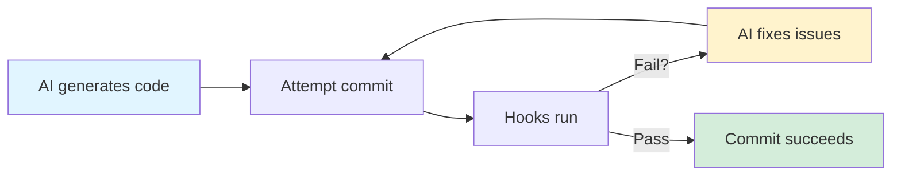

# Contributing to Arcaflow MCP

Thanks for your interest in contributing to Arcaflow MCP! This document provides guidelines for different types of contributions, from requesting features to submitting code.

**Quick Links:**
- [Requesting Features](#requesting-features)
- [Reporting Bugs](#reporting-bugs)
- [Contributing Code](#contributing-code)
- [Development Setup](#development-setup)
- [Testing](#testing)
- [Documentation](#documentation)

---

## Ways to Contribute

There are many ways to contribute to Arcaflow MCP:

- 🐛 **Report bugs** - Help us identify and fix issues
- 💡 **Request features** - Suggest new capabilities
- 📝 **Improve documentation** - Help others understand and use the project
- 🔧 **Submit code** - Fix bugs or implement features
- 🧪 **Test early releases** - Provide feedback on alpha/beta versions
- 💬 **Participate in discussions** - Share your expertise and help others
- 👍 **Vote on issues** - Help us prioritize development

---

## Requesting Features

We welcome feature requests! Before submitting, please:

### 1. Check Existing Resources

- **[Feature Status](FEATURE_STATUS.md)** - Comprehensive list of implemented and planned features
- **[Roadmap](ROADMAP.md)** - Development timeline and priorities
- **[Existing Issues](https://github.com/arcalot/arcaflow-mcp/issues)** - Search for similar requests

### 2. Understand Project Scope

Arcaflow MCP focuses on:
- ✅ **Input construction** for Arcaflow workflows
- ✅ **Result analysis** and optimization suggestions
- ✅ **MCP protocol** implementation
- 🚀 **Workflow execution** integration (planned)

Out of scope:
- ❌ Direct workflow editing (use text editors)
- ❌ Graphical visualizations (use Grafana/Kibana)
- ❌ Plugin development (use Arcaflow SDK)

See [Feature Status - Out of Scope](FEATURE_STATUS.md#explicitly-out-of-scope) for details.

### 3. Submit a Feature Request

Use our [feature request template](https://github.com/arcalot/arcaflow-mcp/issues/new?template=feature_request.yml) which includes:

- **Problem/Use Case**: What problem does this solve?
- **Proposed Solution**: How should it work?
- **Alternatives**: What workarounds exist?
- **Components**: Go server, Python engine, or both?
- **Deployment Mode**: Local, server, or both?

### 4. What Happens Next?

- Maintainers review feature requests regularly
- High-impact features may be fast-tracked
- We'll provide feedback as time permits
- Community input (votes, comments) influences prioritization
- Accepted features are added to the [Roadmap](ROADMAP.md)

**Want to implement it yourself?** Mention this in your request! We prioritize features with community contributions.

---

## Reporting Bugs

Found a bug? Help us fix it!

### 1. Search Existing Issues

Check if someone already reported it: [GitHub Issues](https://github.com/arcalot/arcaflow-mcp/issues)

### 2. Gather Information

Before reporting, collect:
- Arcaflow MCP version (`arcaflow-mcp --version`)
- Deployment mode (local/server)
- Installation method (containers/binaries/source)
- OS and environment details
- Steps to reproduce
- Error messages and logs (sanitized!)

### 3. Submit a Bug Report

Use our [bug report template](https://github.com/arcalot/arcaflow-mcp/issues/new?template=bug_report.yml).

**Security vulnerabilities**: DO NOT open public issues. See [SECURITY.md](SECURITY.md) for private reporting.

---

## Contributing Code

Ready to contribute code? Excellent! Here's how:

### Before You Start

1. **Check for existing work**: Search issues and PRs to avoid duplication
2. **Discuss large changes**: For major features, open an issue first to discuss approach
3. **Review the codebase**: Read [Architecture Documentation](docs/architecture/README.md)
4. **Read AGENTS.md**: Understand our coding standards and AI-assisted development practices

### AI-Assisted Development

**We embrace AI-assisted development!** This project is built with AI coding agents (Claude, Gemini, etc.), and we encourage contributors to use AI tools effectively.

**Required Practices:**

1. **Tag AI-assisted commits**: Always include `AI-assisted-by: <model name and version>` in commit messages
   ```
   feat(server): add workflow validation tool
   
   Implement new validation tool that checks workflow schemas before execution.
   Uses Arcaflow SDK schema validation for deterministic results.
   
   AI-assisted-by: Claude Sonnet 4.5
   ```

2. **Review AI-generated code**: You are responsible for all code you submit
   - Verify correctness and quality
   - Ensure it follows project standards
   - Test thoroughly
   - Understand what the code does

3. **Follow AGENTS.md standards**: AI agents working on this project must follow [AGENTS.md](AGENTS.md)
   - Write tests WITH code (never defer)
   - Update docs immediately (never postpone)
   - Ensure git hooks pass before committing (see [Git Hooks: Automated Accountability](#git-hooks-automated-accountability))
   - Explain "why" in comments, not "what"

**Best Practices:**

- **Use AI for**: Research, boilerplate generation, test writing, documentation, code review suggestions
- **Don't rely on AI for**: Security-critical code without thorough review, architectural decisions without discussion
- **Prompt engineering**: Provide context from AGENTS.md and project standards in your prompts
- **Iterative refinement**: Use AI to iterate on solutions, not just one-shot generation
- **Learn from AI**: Use AI suggestions as learning opportunities

**Example Prompt for AI Assistants:**

```
I'm contributing to Arcaflow MCP. Read AGENTS.md for complete project standards.

Key points:
- Git hooks enforce quality: formatting, linting, tests, 85% coverage
- Run ./scripts/validate.sh to check before committing

Task: [Your task description]
```

**Transparency:**

We believe in transparent AI usage:
- All AI-assisted commits are clearly labeled
- Code quality standards apply equally to human and AI-generated code
- The goal is better software, regardless of authorship

### Git Hooks: Automated Accountability

**Why Git Hooks Matter:**

Git hooks create a **self-checking loop** that ensures both human and AI contributors meet quality standards before code reaches review. They're especially critical for AI-assisted development because they:

- ✅ **Prevent common AI mistakes** (unused imports, formatting issues, missing tests)
- ✅ **Enforce standards automatically** (no manual checking required)
- ✅ **Catch problems early** (before push, before review)
- ✅ **Create accountability** (contributors can't bypass quality gates)

**Setup (One-Time):**

```bash
# Run this once after cloning the repository
./scripts/dev-setup.sh
```

This installs shared git hooks from `.githooks/` that run automatically on commit.

**What the Hooks Check:**

Every commit automatically runs:

1. **Code Formatting**
   - Go: `gofmt` (standard Go formatting)
   - Python: `black` (88-character line length)
   - **Fails if**: Code isn't properly formatted

2. **Linting**
   - Go: `golangci-lint` (unused imports, error handling, style issues)
   - Python: `flake8` (PEP 8 compliance, unused imports)
   - **Fails if**: Linting errors exist

3. **All Tests**
   - Go: `go test ./...` (all packages)
   - Python: `pytest` (all test files)
   - **Fails if**: Any test fails

4. **Coverage Checks**
   - Go: `go test -cover` (minimum 85% coverage)
   - Python: `pytest --cov` (minimum 85% coverage)
   - **Fails if**: Coverage below threshold

**The Self-Checking Loop (AI Agents):**

For AI-assisted development, hooks create this workflow:



**Why This Works:**

- AI agents can see hook failures and fix them automatically
- No human intervention needed for common issues
- Quality gates enforced before code enters review
- Creates muscle memory for AI to generate compliant code

**Hook Failure Example:**

```bash
$ git commit -m "feat: add new tool"
Running validation checks...
Running linters...
server/pkg/tools/newtool.go:15:2: unused import: "fmt" (golangci-lint)
analysis/tests/test_new.py:10:1: F401 'json' imported but unused (flake8)

ERROR: Linting failed. Fix issues and try again.
```

**AI Agent Response:** Fix unused imports and retry commit.

**For AI Agents Specifically:**

If you're an AI agent working on this project:

1. **Always run hooks**: Never use `--no-verify` unless explicitly instructed
2. **Fix issues iteratively**: Read hook output, fix problems, retry
3. **Learn from failures**: Common patterns (unused imports, coverage gaps) should be avoided in future code
4. **Check before committing**: Run `./scripts/validate.sh` manually to catch issues early

**For Human Contributors:**

- Same rules apply - hooks keep everyone accountable
- If hooks fail, don't bypass them - fix the issues
- Use `./scripts/validate.sh` to check before committing (optional but recommended)
- Only use `--no-verify` when explicitly justified (document why in commit message)

**Manual Validation:**

You can run the same checks manually:

```bash
# Run full validation (what hooks run)
./scripts/validate.sh

# Run just linting
./scripts/lint.sh

# Run just tests
./scripts/test-all.sh

# Run specific component tests
./scripts/test-go.sh      # Go tests only
./scripts/test-python.sh  # Python tests only
```

**Cache Directories:**

Hooks create cache directories to speed up repeat runs:
- `.gocache/` - Go build cache
- `.gomodcache/` - Go module cache
- `.cache/` - Python/poetry cache

These are git-ignored and safe to delete if needed.

### Development Workflow

1. **Fork and clone** the repository
2. **Create a feature branch** from `main`
3. **Set up your environment** (see [Development Setup](#development-setup))
4. **Make your changes** following our [coding standards](#coding-standards)
5. **Write tests** alongside code (not after!)
6. **Update documentation** immediately (not later!)
7. **Run validation** (`./scripts/validate.sh`)
8. **Commit with hooks** (see [Commit Guidelines](#commit-guidelines))
9. **Push and open a PR** (see [Pull Request Process](#pull-request-process))

### Coding Standards

**General Principles:**
- Write tests WITH code (minimum 85% coverage)
- Update documentation immediately
- Explain "why" in comments, not "what"
- Use structured logging
- Handle errors appropriately
- Maximum line length: 88 characters

**Go:**
- Follow Go best practices and idioms
- Use `golangci-lint` for linting
- Comprehensive godoc comments for exported symbols
- Table-driven tests

**Python:**
- Follow PEP 8 style guide
- Use Black formatter (88 char lines)
- Type hints for all function signatures
- NumPy-style docstrings
- pytest for testing

See [AGENTS.md](AGENTS.md) for complete standards.

### Commit Guidelines

**Format**: Use conventional commits

```
type(scope): brief description

Detailed explanation of the change and rationale.
Include context, trade-offs, and decisions made.

Fixes #123
AI-assisted-by: Claude Sonnet 4.5
```

**Types:**
- `feat`: New feature
- `fix`: Bug fix
- `docs`: Documentation changes
- `test`: Adding or updating tests
- `refactor`: Code refactoring
- `perf`: Performance improvements
- `chore`: Maintenance tasks

**Requirements:**
- Verbose and descriptive (not one-liners)
- Include rationale for changes
- Always include: `AI-assisted-by: <model>` if AI was used (see [AI-Assisted Development](#ai-assisted-development))
- Reference related issues

**Git Hooks**: Our pre-commit hooks automatically run on every commit:
- Code formatting (black, gofmt)
- Linting (golangci-lint, flake8)
- All tests (go test, pytest)
- Coverage checks (85% minimum)

See [Git Hooks: Automated Accountability](#git-hooks-automated-accountability) for complete details on setup, what's checked, and how AI agents use hooks for self-correction.

Only use `--no-verify` when explicitly justified (document why in commit message).

### Pull Request Process

1. **Ensure CI passes**: All tests, linting, and builds must pass
2. **Update documentation**: User docs and project docs as needed
3. **Add tests**: Minimum 85% coverage for new code
4. **Write a clear PR description**:
   - What problem does this solve?
   - What changes were made?
   - How was it tested?
   - Any breaking changes?
5. **Link related issues**: Use `Fixes #123` or `Relates to #456`
6. **Request review**: Maintainers will review as time permits
7. **Address feedback**: Make requested changes promptly
8. **Squash commits**: We'll squash on merge, but feel free to squash during review

**PR Title Format**: Same as commit messages (`type(scope): description`)

**What Maintainers Look For:**
- ✅ Tests and documentation included
- ✅ Code quality and style compliance
- ✅ Clear commit messages
- ✅ No breaking changes (or clearly documented)
- ✅ Aligns with project vision
- ✅ Adds value for users

---

## Development Setup

This is a hybrid Go + Python project with two main components:
- **Go MCP Server**: Protocol handler and input construction
- **Python Analysis Engine**: Result analysis and optimization

### Prerequisites

**Required Tools** (versions aligned with [Arcalot organization standards](https://github.com/arcalot)):
- Go (see `ARCALOT_GO_VERSION` org variable)
- Python (see `ARCALOT_PYTHON_SUPPORTED_VERSIONS` org variable)
- Poetry (Python dependency management)
- protoc with Go and Python gRPC plugins
- Podman/Buildah (for container workflows)

**Finding Current Version Requirements:**
- Check `.github/workflows/ci.yml` for exact versions used in CI
- See [Version Management](docs/development/version-management.md) for details
- GitHub Organization variables define authoritative requirements

### Initial Setup

```bash
# 1. Clone the repository
git clone https://github.com/arcalot/arcaflow-mcp.git
cd arcaflow-mcp

# 2. Install git hooks and dependencies
./scripts/dev-setup.sh

# 3. Install Python dependencies
cd analysis && poetry install && cd ..

# 4. Download Go dependencies
cd server && go mod download && cd ..

# 5. Verify setup
./scripts/validate.sh

# 6. Run tests
./scripts/test-all.sh
```

**Detailed Setup**: See [Development Setup Guide](docs/development/setup.md)

---

## Testing

Testing is **not optional**. All code must have tests.

### Test Requirements

- **Minimum coverage**: 85% (measured via unit tests)
- **Test types**: Unit, integration, and E2E tests as appropriate
- **Error cases**: Test error conditions and edge cases
- **Regression tests**: Every bug fix must include a test

### Running Tests

```bash
# Run all tests
./scripts/test-all.sh

# Run Go tests only
./scripts/test-go.sh

# Run Python tests only
./scripts/test-python.sh

# Run specific test
cd server && go test ./pkg/arcaflow/...
cd analysis && poetry run pytest tests/test_specific.py

# Run with coverage
cd server && go test -cover ./...
cd analysis && poetry run pytest --cov
```

### Test Organization

- **Unit tests** (`*_test.go`, `test_*.py`): Test in isolation, mock dependencies
- **Integration tests** (`test/integration/`): Test component interactions
- **E2E tests** (`test/e2e/`): Test complete workflows with real dependencies

See [Testing Guide](docs/development/testing.md) for detailed standards.

---

## Documentation

Documentation is required with **every code change**. It's not optional or deferred.

### Documentation Structure

This project maintains dual documentation:

1. **User Documentation** (`docs/arcaflow-mcp/`):
   - For end users and operators
   - MkDocs format for Arcaflow site integration
   - Covers installation, usage, deployment, troubleshooting

2. **Project Documentation** (`docs/`):
   - For contributors and maintainers
   - Architecture, ADRs, API docs, development guides
   - Technical depth for developers

### What to Update

When making changes, update:

- **User docs** if it affects user-facing features or configuration
- **Project docs** if it affects architecture, APIs, or development workflow
- **README.md** if it affects quick start or high-level features
- **ADRs** if you make significant architectural decisions
- **Code comments** to explain "why" not "what"

### Documentation Standards

- **Format**: Markdown for easy GitHub viewing
- **Examples**: Include tested, working examples
- **Links**: Cross-reference related documentation
- **Code blocks**: Use proper syntax highlighting
- **Diagrams**: Use Mermaid for architecture diagrams

See [Documentation Standards](docs/README.md#documentation-standards) for details.

---

## Community Guidelines

### Code of Conduct

This project follows the [Arcalot Code of Conduct](https://github.com/arcalot/.github/blob/main/CODE_OF_CONDUCT.md). Be respectful, inclusive, and constructive.

### Communication Channels

- **GitHub Issues**: Bug reports, feature requests, specific problems
- **GitHub Discussions**: Questions, ideas, general discussion
- **Arcalot Round Table**: Community hub for broader Arcalot ecosystem
- **Pull Requests**: Code contributions and reviews

### Getting Help

- 📖 **Documentation**: Start with [Getting Started Guide](docs/arcaflow-mcp/getting-started.md)
- ❓ **FAQ**: Check [Frequently Asked Questions](docs/arcaflow-mcp/faq.md)
- 🔧 **Troubleshooting**: See [Troubleshooting Guide](docs/arcaflow-mcp/troubleshooting.md)
- 💬 **Ask the community**: [Start a discussion](https://github.com/arcalot/arcalot-round-table/discussions)

### Response Times

Maintainers respond to contributions as time permits. Response times will vary based on:
- Complexity and scope of the contribution
- Maintainer availability
- Project priorities

**Security issues** require urgent attention - see [SECURITY.md](SECURITY.md) for reporting process.

---

## License

By contributing to Arcaflow MCP, you agree that your contributions will be licensed under the Apache License 2.0. See [LICENSE](LICENSE) for details.

---

## Questions?

- **Contributing questions**: [Start a discussion](https://github.com/arcalot/arcalot-round-table/discussions)
- **Project governance**: See [MAINTAINERS.md](MAINTAINERS.md)
- **Development setup issues**: See [Debugging Guide](docs/development/debugging.md)

Thank you for contributing to Arcaflow MCP! 🎉
