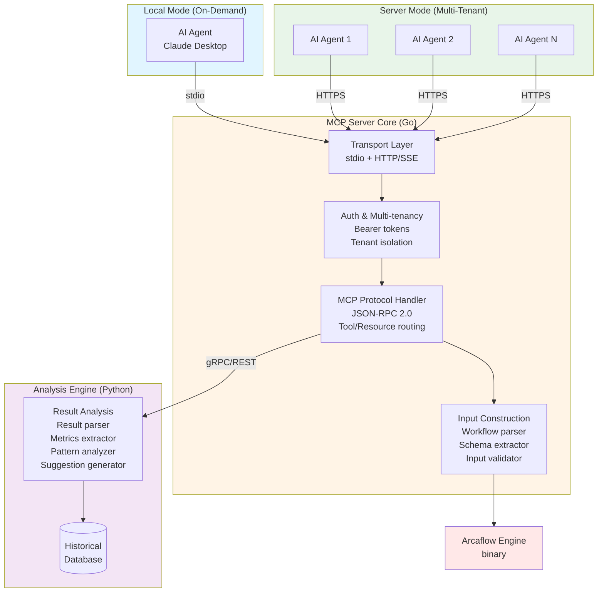
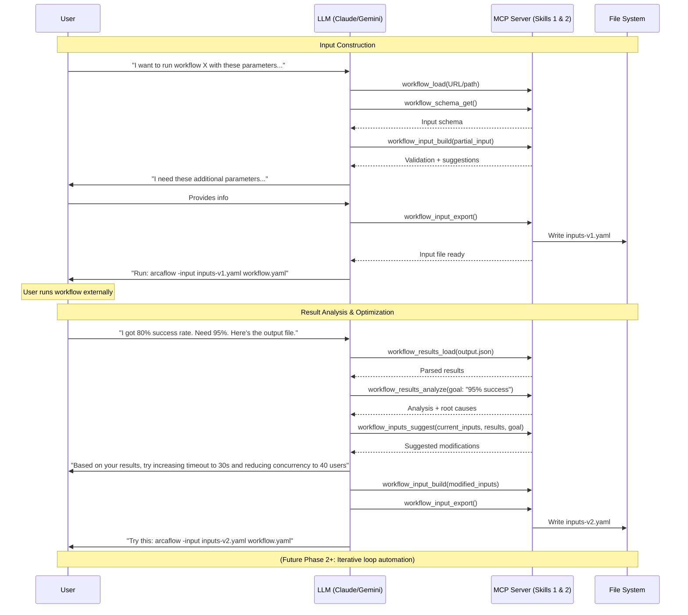

# Arcaflow MCP Server - Development Plan

**Version:** 1.2.0  
**Last Updated:** 2026-01-27  
**Language:** Go for MCP server core, Python for analysis engine  
**Current Phase:** Phase 6 - Workflow Discovery UX (Not Started)

**Historical Record:** Completed phases are archived in `DEVELOPMENT_RECORD.md` with full details. This document contains concise summaries for completed work and full details for current and future phases.

---

## Instructions for AI Agent

### How to Use This Document

1. Always read the "Current Phase" section first to understand where you are
2. Check "Current Task" to see what specific work is active
3. Update task status when completing work (mark with [DONE] and timestamp)
4. **DO NOT proceed to next phase** without explicit user approval
5. Log all plan changes (excluding status maintenance) in the Changelog section at the bottom
6. Update version and last updated date above when making significant changes to this plan
7. Update "Current Phase" and "Current Task" as work progresses
8. Review MCP standards and best practices before implementing protocol features
9. Check for MCP specification updates regularly during development
10. Maintain each phase checklist: update task and exit criteria checkboxes
   as work progresses, keeping them in sync with implementation

### Balancing Guidance with Creativity

This plan provides outcomes and requirements, not prescriptive step-by-step instructions.

- Focus on "WHAT" and "WHY," not "HOW" - The plan defines desired outcomes, requirements, and constraints
- Apply your expertise - Use best practices, modern patterns, and your knowledge to determine implementation approach
- Creative freedom encouraged - Where tasks specify "Creative Freedom," exercise judgment to choose optimal solutions
- Treat standards as boundaries - Follow MCP spec, Go/Python idioms, and security requirements, but innovate within those constraints
- Question and improve - If you see a better approach that meets requirements, discuss it with the user
- Document the "why" behind decisions - Explain your implementation choices in documentation for future developers

The goal: Leverage AI creativity and modern best practices while ensuring project requirements are met.

### Documentation & Testing Requirements

CRITICAL: Tests and documentation must be written WITH code, never deferred.
See AGENTS.md for complete standards. Before advancing between phases, verify that all tests pass and documentation is current.

### Document Lifecycle

This document serves as the living development plan throughout the project phases.

When This Plan is Complete or Retired:
1. Mark final phase status as "COMPLETE" with timestamp
2. Add final completion entry to Changelog
3. Archive this document to preserve the planning record:
   - Create `docs/planning/` directory (if not already exists)
   - Move this file to `docs/planning/DEVELOPMENT_PLAN-v{VERSION}.md` (using the version number from the header)
   - Create `docs/planning/README.md` explaining archived plans
   - Update root README.md to reference archived plan location

### Task Status Indicators

- `[ ]` - Not started
- `[IN PROGRESS]` - Currently being worked on
- `[DONE]` - Completed (with timestamp)
- `[BLOCKED]` - Blocked/On hold
- `[CANCELLED]` - Cancelled

### Phase Gate Protocol

When asked "What's next?" or similar questions, AI agents MUST:

1. Identify the current phase
   - Check the "Current Phase" header at the top of this document
   - Locate that phase section below

2. Check if current phase is ready for completion
   - Review every task checkbox in the current phase
   - Tasks with these statuses indicate the phase is NOT ready:
     - `[ ]` (not started)
     - `[IN PROGRESS]` (work ongoing)
     - `[BLOCKED]` (cannot proceed)
   - Tasks marked `[DONE]` or `[CANCELLED]` are considered complete
   - If ANY tasks are not ready:
     - Report which tasks remain incomplete or blocked
     - Work on or ask about completing those tasks
     - **DO NOT suggest moving to the next phase**
   
3. Verify ALL exit criteria are satisfied
   - Review every exit criterion in the current phase
   - Ensure each is marked `[DONE]`
   - If ANY exit criteria are unsatisfied:
     - Report which criteria are not met
     - Work on or ask about satisfying those criteria
     - **DO NOT suggest moving to the next phase**

4. Verify tests pass (if applicable to phase)
   - Run test suite for completed work
   - Ensure >85% coverage requirement met
   - If tests fail or coverage is insufficient:
     - Report the issues
     - **DO NOT suggest moving to the next phase**

5. Verify documentation is current (if applicable to phase)
   - Check all new code has documentation
   - Verify examples work as documented
   - If documentation is incomplete:
     - Report what's missing
     - **DO NOT suggest moving to the next phase**

6. Only if ALL of the above are complete:
   - Update phase status to "COMPLETE"
   - Set "Awaiting Gate Approval: YES"
   - Review MCP specification for updates relevant to next phase
   - **STOP and request user approval:**
     - Report phase completion with summary
     - List all completed tasks and exit criteria
     - Request explicit user approval to proceed to next phase
     - **DO NOT move to next phase without user approval**

Critical Rules:
- Never suggest proceeding to the next phase if ANY task or exit criterion in the current phase is incomplete
- Always verify completion status before recommending phase transitions
- When in doubt, report status and ask the user

### Managing the Plan and Record Split

**Two Documents:**
- **DEVELOPMENT_PLAN.md** (this file) - Active planning with current and future phases
- **DEVELOPMENT_RECORD.md** - Historical record of completed phases

**When a phase is completed:**

1. **Archive full details to DEVELOPMENT_RECORD.md:**
   - Copy the entire completed phase section (including all tasks, exit criteria, completion dates, notes)
   - Append to DEVELOPMENT_RECORD.md with a separator (`---`)
   - Preserve ALL detail - this is the permanent historical record

2. **Replace in DEVELOPMENT_PLAN.md with concise summary:**
   - Keep phase header with COMPLETE status and date
   - Replace detailed tasks with brief outcome summary (3-5 bullet points)
   - Replace detailed exit criteria with "See DEVELOPMENT_RECORD.md for full details"
   - Keep any critical lessons learned or architectural decisions
   - Maximum 10-15 lines per completed phase summary

3. **Update document metadata:**
   - Increment version (minor or patch as appropriate)
   - Update "Last Updated" date
   - Add changelog entry describing the archival

**Goal:** Keep DEVELOPMENT_PLAN.md focused on current and future work while preserving complete history in DEVELOPMENT_RECORD.md.

### Document Maintenance - Token Efficiency Guidelines

This document is loaded into AI agent context frequently. Keep it efficient:

Prohibited (High Token Cost):
- Decorative emojis in section headers
- Status emojis (use text: [DONE], [PENDING], [BLOCKED])
- Redundant explanations already covered in AGENTS.md
- Verbose examples when brief ones suffice
- Long command-line examples (link to scripts instead)
- Repetitive task descriptions across phases
- Verbose changelog entries (keep concise)

Required (Low Token Cost):
- Clear section headers (plain text)
- Concise task descriptions
- Standard markdown checkboxes for status
- Brief inline code references
- Links to detailed documentation

When updating this plan:
- Remove redundancy - check if content exists in AGENTS.md first
- Use text status indicators, never emojis
- Consolidate similar tasks
- Keep explanations brief and direct
- Question if new content truly belongs here vs. in permanent docs
- Update "Last Updated" date in header for minor edits
- When changing phases, update header Status and Current Phase fields
- Increment version and add changelog entry for significant plan changes

Change Tracking:
- Changelog purpose: Track significant changes to the PLAN itself (scope changes, architecture decisions, phase reorganization)
- Not for changelog: Task status updates, minor wording tweaks, formatting changes
- Keep entries concise: Date, brief description, rationale (1-3 lines max per entry)
- When archived: Changelog provides historical context for how planning evolved

Document Evolution (What to Prune vs. Preserve):

NEVER Prune (Preserve History):
- Completed phase summaries and outcomes
- Changelog entries (this is our historical record)
- Architectural decisions and rationale
- Phase exit criteria that were met
- Lessons learned or blockers encountered

Safe to Prune (Reduces Redundancy):
- Duplicate explanations of the same concept
- Verbose examples when a brief one exists
- Instructions already fully covered in AGENTS.md
- Detailed task breakdowns for phases already completed (high-level summary sufficient)
- Future phase details that become irrelevant due to scope changes

Target: Keep document focused and under 2,000 lines, but preserve all historical context and completed work.

---

## Governance & Standards

Note: Core coding standards, testing requirements, documentation practices, security controls, and MCP compliance are defined in `AGENTS.md`. This section covers project-specific governance items.

### Repository Governance

Code Ownership:
- Use `CODEOWNERS` file to designate component ownership
- Require reviews from designated owners for changes
- Maintain clear boundaries: Go server core, Python analysis engine, API definitions

Architecture Decision Records (ADRs):
- Document all major architectural decisions in `docs/adr/`
- Track rationale, alternatives considered, and consequences
- Examples: Language choice, monorepo decision, deployment modes

Security Review Requirements:
- Phase gate includes security review
- New skills require security assessment
- Third-party dependencies must be vetted
- Penetration testing before production deployment

### Documentation Strategy

Dual Documentation Approach:

This project maintains TWO distinct sets of documentation:

#### 1. User-Facing Documentation (For Arcaflow Docs Integration)
Location: `docs/arcaflow-mcp/` (MkDocs format)
Purpose: End-user documentation for integration into main Arcaflow documentation at https://arcalot.io/arcaflow/
Lifecycle: Developed in this repo, migrated/synced to main Arcaflow docs repository when stable
Content Focus:
- Getting started guides
- User tutorials and examples
- Tool and resource reference
- Deployment guides (local and server modes)
- Concepts and usage patterns

Format:
- Material for MkDocs format matching Arcaflow docs style
- Includes `docs/mkdocs-arcaflow.yml` for building just the integration docs
- Can be previewed locally with `mkdocs serve -f docs/mkdocs-arcaflow.yml`
- Structured for seamless integration into existing Arcaflow docs navigation

#### 2. Project Documentation (Permanent in This Repo)
Location: Root `docs/` directory and throughout the repo
Purpose: Developer and project-specific documentation that remains with the codebase
Lifecycle: Permanent part of this repository
Content Focus:
- Architecture documentation (`docs/architecture/`) - System design, component interaction, data flow
- Architecture Decision Records (`docs/adr/`) - Design decisions with rationale
- API documentation - Generated from code (godoc for Go, docstrings for Python)
- Development guides - How to contribute, code standards, testing practices
- Planning documents (`docs/planning/`) - Historical development plans
- Internal technical documentation - Implementation details, debugging guides
- Release notes and changelog - Version history and changes

Format:
- Standard Markdown (GitHub-first navigation)
- Generated API docs (godoc, Sphinx for Python)

User-Facing Documentation Structure (For Arcaflow Docs):
```
docs/
├── mkdocs-arcaflow.yml         # MkDocs config for user docs
└── arcaflow-mcp/               # User documentation (for integration)
    ├── index.md                # MCP Server overview
    ├── getting-started.md      # Quick start guide
    ├── concepts/               # Core concepts
    │   ├── architecture.md     # User-facing architecture
    │   ├── capabilities.md     # Input construction and result analysis
    │   ├── deployment-modes.md # Local vs Server mode
    │   └── multi-tenancy.md    # Multi-tenant usage
    ├── usage/                  # Using the MCP server
    │   ├── local-mode.md       # Local mode with Claude Desktop
    │   ├── server-mode.md      # Server mode usage
    │   ├── input-construction.md # Input construction guide
    │   ├── result-analysis.md  # Result analysis guide
    │   └── configuration.md    # Configuration reference
    ├── deployment/             # Deployment guides
    │   ├── container.md        # Podman-first container deployment
    │   ├── kubernetes.md       # Kubernetes deployment
    │   ├── authentication.md   # Auth setup
    │   └── tls.md              # TLS configuration
    ├── tools/                  # Tool reference
    │   ├── overview.md         # Tool catalog
    │   ├── input-tools.md      # Input construction tools
    │   └── result-tools.md     # Analysis tools
    └── examples/               # Usage examples
        ├── basic-workflow.md   # Simple example
        ├── iterative-optimization.md # Optimization cycle
        └── multi-run-comparison.md   # Comparison example
```

Project Documentation Structure (Permanent in Repo):
```
docs/
├── architecture/               # Technical architecture docs
│   ├── overview.md             # System design
│   ├── go-server.md            # Go MCP server internals
│   ├── python-engine.md        # Python analysis engine internals
│   ├── inter-service.md        # Go-Python communication
│   └── data-flow.md            # Data flow diagrams
├── adr/                        # Architecture Decision Records
│   ├── README.md               # ADR index
│   ├── 0001-hybrid-architecture.md
│   ├── 0002-monorepo-structure.md
│   └── [additional ADRs]
├── planning/                   # Historical planning docs
│   ├── README.md               # Planning archive overview
│   └── DEVELOPMENT_PLAN-v1.0.0.md
├── api/                        # API documentation
│   ├── go-server.md            # Go API overview (links to godoc)
│   ├── python-engine.md        # Python API overview (links to Sphinx)
│   └── grpc-protocol.md        # gRPC service contracts
├── development/                # Development guides
│   ├── setup.md                # Development environment setup
│   ├── testing.md              # Testing guidelines
│   ├── debugging.md            # Debugging guide
│   └── release-process.md      # How to release
└── CHANGELOG.md                # Version history
```

Additional Project Documentation:
```
README.md                       # Project overview and quick start
CONTRIBUTING.md                 # How to contribute
CODE_OF_CONDUCT.md              # Community standards
SECURITY.md                     # Security policy
LICENSE                         # Apache 2.0 license
```

Integration Points in Main Arcaflow Docs:
- New top-level section: "Tools & Extensions" → "Arcaflow MCP Server"
- Or integrate into: "Writing workflows" → "Using the MCP Server for Input Construction"
- Cross-references: Link from "Running Arcaflow" to MCP server for conversational workflows

Documentation Maintenance:
- Update WITH code changes (documentation is integral, not deferred)
- User docs (`docs/arcaflow-mcp/`): Keep synchronized with Arcaflow terminology and style
- Project docs (rest of `docs/`): Update architecture, API, and development docs as code evolves
- Include version compatibility matrix (which Arcaflow versions supported)
- Both doc sets maintained concurrently during development

Build Commands:
- `mkdocs serve -f docs/mkdocs-arcaflow.yml` - Preview user-facing docs (for Arcaflow integration)
- `mkdocs build -f docs/mkdocs-arcaflow.yml` - Build user-facing docs for CI
- Or use `./scripts/docs-serve.sh` and `./scripts/docs-build.sh` wrapper scripts

CI Validation:
- User docs build successfully
- Check for broken links and formatting issues
- Ensure code examples in docs are tested and functional
- Verify godoc and Python docstrings are complete

### Operational Governance

Service Level Objectives (SLOs):
- Availability: 99.9% uptime (server mode)
- Latency: <100ms protocol overhead (local), <200ms (server)
- Analysis execution: <3s for analysis operations
- Error Rate: <0.1% for valid requests

Observability Requirements:
- Structured logging in JSON format
- Distributed tracing with request IDs
- Metrics collection (Prometheus-compatible)
- Health check endpoints
- Performance monitoring

Deployment Standards:
- Blue-green deployments for server mode
- Rollback capability within 5 minutes
- Database migrations must be backward compatible
- Configuration as code (all configs in version control)

### Dependency Management

Approval Process:
- New dependencies require justification
- License compatibility check (Apache 2.0 compatible)
- Security vulnerability scan
- Active maintenance verification
- Team approval for major dependencies

Version Management:
- Pin all dependencies to specific versions
- Regular dependency updates (monthly review)
- Security updates applied within 48 hours
- Compatibility testing before updates

Shared Dependencies:
- API contracts versioned separately (semver)
- Go and Python share contract definitions via protobuf
- Breaking changes require major version bump
- Deprecation warnings for 2 versions before removal

### Release Process

Versioning:
- Semantic versioning (MAJOR.MINOR.PATCH)
- Both Go and Python components versioned together
- Pre-releases tagged as `-alpha`, `-beta`, `-rc`
- Git tags for all releases

Release Checklist:
- All tests passing
- Documentation updated
- Security scan clean
- Performance benchmarks met
- Changelog generated
- Release notes prepared
- Artifacts built for all platforms

Communication:
- Release announcement to Arcalot community
- Breaking changes highlighted
- Migration guide for major versions
- Known issues documented

---

## Project Overview

### Vision
Build a Model Context Protocol (MCP) server that provides MCP tools and resources
organized into capability areas for intelligent workflow optimization through
natural language conversation. The system enables users to iteratively refine
workflow inputs based on goals and past execution results.

Core Principle: Bridge natural language (LLM conversations) with machine-readable Arcaflow inputs. Produce deterministic, schema-validated JSON/YAML inputs that are guaranteed to work with Arcaflow workflows and plugins.

MCP Alignment: Per MCP specification, we expose:
- Tools - Callable functions for operations (e.g., `workflow_load`, `workflow_input_validate`, `workflow_input_export`)
- Resources - Accessible data (e.g., workflow schemas, example inputs, execution results)
- Organized into logical capability areas for clear separation of concerns

### Multi-Capability Architecture

The MCP server provides distinct but complementary capability areas. Each
capability is implemented as a set of MCP tools (callable functions) and MCP
resources (accessible data) per the MCP specification:

Critical Requirement: Arcaflow workflows and plugins always use machine-readable (JSON/YAML) structured inputs and outputs. All workflow inputs produced by this MCP server must be:
- Deterministic: Valid, structured data that conforms to schemas
- Schema-validated: Verified against workflow/plugin JSON schemas before export
- Machine-readable: JSON or YAML format, not free-form text

Input construction (Phase 1)
- Discover and introspect existing workflows (filesystem, URL, git, etc.)
- Extract JSON schemas and understand requirements
- Conversationally help users build structured inputs via natural language
- Validate inputs against schemas (mandatory)
- Export deterministic, schema-valid JSON/YAML input files

Result analysis (Phase 1/2)
- Read previous workflow execution results (local files initially)
- Analyze outputs against user goals
- Suggest input modifications based on results
- Learn from past runs to optimize future inputs
- Compare results across multiple runs
- Future: Integrate with external data store MCP servers (Horreum, Elasticsearch) to retrieve workflow results for analysis

Workflow execution (Phase 2)
- Execute workflows via Arcaflow engine
- Monitor execution status
- Collect and return results
- Integrate with result analysis for insights

Iterative optimization (Advanced Phase 2+)
- Accept user-defined goals
- Derive inputs to test hypotheses
- Execute workflow and analyze results
- Recursively refine inputs based on outputs
- Loop until goal achieved or optimization complete
- AI-driven workflow parameter tuning

### Phased Scope

Phase 1 (Initial): Input construction and result analysis (no execution)

Phase 2: Add workflow execution integration

Phase 2+ (Advanced): Add iterative optimization loops

Phase 3+: Workflow creation and composition

### Primary Use Cases (Initial Phase)

#### Use Case 1: Conversational Input Construction
Users provide a workflow (filesystem path, URL, etc.) and describe their intent. The LLM:
1. Loads and introspects the workflow
2. Extracts and understands JSON input schema requirements
3. Conversationally helps user build structured inputs via natural language
4. Validates inputs against schema (deterministic, machine-readable)
5. Exports schema-validated JSON/YAML input files ready for Arcaflow execution

#### Use Case 2: Output-Driven Input Optimization
Users provide previous workflow results and describe goals. The LLM:
1. Analyzes previous execution outputs
2. Compares results against user goals
3. Suggests input modifications to achieve goals
4. Generates optimized inputs based on learnings
5. Exports refined inputs for next iteration

Example: "I ran this workflow with 50 users and got 80% success rate. I need 95% success rate. What inputs should I change?"

#### Use Case 3: Multi-Run Analysis and Comparison
Users provide multiple execution results. The LLM:
1. Compares outputs across runs
2. Identifies patterns and correlations
3. Recommends optimal input combinations
4. Explains tradeoffs between different configurations

Note: Initial phase does NOT execute workflows. Users run workflows externally and provide results back for analysis. Execution integration is Phase 2.

### Core Objectives (Initial Phase - Input Construction and Result Analysis)

Input construction
1. Discover existing workflows (filesystem, URL, git repositories)
2. Expose workflow schemas as easily-understandable resources for LLMs
3. Introspect workflow input/output requirements through tools
4. Construct valid input structures through interactive dialogue
5. Validate inputs against workflow schemas
6. Export validated input files ready for workflow execution

Result analysis
7. Load previous workflow execution results from local files (JSON, YAML, logs); future: from data stores via MCP
8. Parse output structures and extract metrics
9. Analyze results against user-defined goals
10. Compare outputs across multiple workflow runs
11. Suggest input modifications to achieve goals
12. Learn patterns from past runs to optimize future inputs

### Phase Boundaries & Future Work

Phase 2 will add: Workflow Execution
- Executing workflows via Arcaflow engine
- Monitoring workflow execution status
- Real-time result streaming

Phase 2+ will add: Iterative Optimization
- Autonomous goal-driven optimization loops
- Recursive input derivation and testing
- Convergence detection and optimization termination
- Multi-objective optimization (Pareto fronts)

Phase 3+ will add: Workflow Creation
- Creating new workflow YAML from scratch
- Composing DAGs or multi-step workflow logic
- Plugin discovery and automated workflow generation
- Workflow refactoring and optimization
- Complex workflow debugging or step-through execution

Future Enhancement: External Data Store Integration (Result analysis)
- Integrate with external MCP servers for data stores (Horreum, Elasticsearch, etc.)
- Retrieve workflow results from data stores via their MCP interfaces
- Enable analysis of results stored in centralized systems
- Leverage existing data store MCP servers rather than reimplementing data retrieval
- Support federated queries across multiple data sources

Rationale for Phased Approach:
- Phase 1 (Initial): Input construction + output analysis leverage existing schemas and results - straightforward, high value
- Phase 2: Execution integration requires Arcaflow engine integration, process management, result handling
- Phase 2+ Advanced: Iterative optimization requires execution + sophisticated goal evaluation and convergence logic
- Phase 3+: Workflow creation requires complex validation of plugin compatibility, DAG structure, data flow

### Key Technical Decisions

#### Language Choice Re-evaluation

Given the expanded multi-capability architecture (input construction + result
analysis + suggestion generation), we need to reconsider the optimal language(s):

Option 1: Pure Go (Original Plan)

Pros:
- Excellent for MCP server, HTTP/SSE, multi-tenancy, concurrency
- Single binary deployment, easy distribution
- Fast, efficient, good for long-running services
- Aligns with Arcaflow engine (Go)

Cons:
- Limited data science/ML libraries for result analysis
- Suggestion engine would be basic heuristics only
- Pattern learning requires external services or basic logic

Option 2: Pure Python

Pros:
- Excellent ML/data science ecosystem (pandas, scikit-learn, numpy)
- Rich result analysis and pattern recognition libraries
- Could integrate LLMs for advanced suggestion generation
- Rapid development for analysis algorithms
- Great for text parsing and data manipulation

Cons:
- Performance concerns for high-throughput multi-tenant server
- Weaker concurrency (GIL limitations)
- Complex deployment (dependencies, virtual envs)
- Less ideal for long-running server infrastructure

Option 3: Hybrid Architecture (RECOMMENDED) ⭐
- Go for Core MCP Server:
  - Transport layer (stdio + HTTP/SSE)
  - Authentication and multi-tenancy
  - MCP protocol implementation
  - Request routing and orchestration
  - State management
  - Workflow parsing and schema extraction (input construction)
  
- Python for Analysis Engine:
  - Result parsing and metrics extraction (result analysis)
  - Historical database queries and analysis
  - Pattern recognition and learning
  - AI-driven suggestion generation
  - Multi-run comparison and statistical analysis
  - Future: ML model integration for optimization
  
- Communication: gRPC or REST API between Go server and Python analysis service

Benefits of Hybrid:
- Leverage Go's strengths for server infrastructure
- Leverage Python's strengths for data analysis and AI
- Each component uses the best tool for its job
- Clear separation of concerns
- Can scale independently
- Python analysis service could be optional/pluggable

#### Recommended Decision: Hybrid Go + Python

Phase 1 Implementation:
- Go: MCP server core + input construction
- Python: Analysis engine for result analysis
- Integration: gRPC service or REST API

Rationale:
- MCP server benefits from Go's concurrency and deployment simplicity
- Analysis engine benefits from Python's data science ecosystem
- Aligns with Arcaflow (Go) while enabling advanced analysis (Python)
- Future-proof for ML-driven optimization

#### Other Technical Decisions
- Deployment Modes:
  - Local Mode: stdio transport, launched on-demand by LLM client
  - Server Mode: HTTP/SSE transport, central multi-tenant server
- MCP Transport: stdio (local mode) + HTTP/SSE (server mode)
- Multi-tenancy: Tenant isolation via authentication + workspace separation
- Inter-service Communication: gRPC (preferred) or REST API
- Historical Database: SQLite (local), PostgreSQL (server mode)
- Arcaflow Integration: Exec arcaflow binary (Phase 1), potential library import (future)
- Target Workflow: [arcaflow-workflow-auto-perf](https://gitlab.com/redhat/edge/tests/perfscale/arcaflow-workflow-auto-perf)

---

## Architecture Design

### High-Level Components



### MCP Server Components

#### 1. Transport Layer (`pkg/transport/`)
- Stdio transport - For local mode (on-demand execution)
- HTTP/SSE transport - For server mode (persistent service)
- Transport abstraction interface
- Connection lifecycle management

#### 2. Auth & Multi-tenancy Layer (`pkg/auth/`)
- Authentication - Bearer token validation, API keys
- Tenant isolation - Workspace separation, resource quotas
- Rate limiting - Per-tenant request throttling
- Session management - Track active connections
- Audit logging - Security and compliance

#### 3. Protocol Layer (`pkg/protocol/`)
- JSON-RPC 2.0 message handling
- Protocol version negotiation
- Error handling
- Context propagation (tenant ID, auth info)

#### 4. Tool Handler (`pkg/tools/`)
Expose workflow operations as tools for existing workflows:

PRIMARY TOOLS - Input Construction (Initial Phase):
- `workflow_list` - Discover workflows (filesystem, URL, git)
- `workflow_load` - Load workflow from various sources (path, URL, git ref)
- `workflow_describe` - Get human-readable workflow description
- `workflow_schema_get` - Get workflow input/output schema
- `workflow_input_build` - Interactively build/modify input structure
- `workflow_input_validate` - Validate input structure against schema
- `workflow_input_export` - Export validated inputs to file (JSON/YAML)
- `workflow_input_examples_get` - Get example inputs for a workflow

PRIMARY TOOLS - Result Analysis (Initial Phase):
- `workflow_results_load` - Load previous execution results (JSON/YAML/logs)
- `workflow_results_parse` - Parse and structure output data
- `workflow_results_analyze` - Analyze results against goals/criteria
- `workflow_results_compare` - Compare outputs across multiple runs
- `workflow_inputs_suggest` - Suggest input changes based on results analysis
- `workflow_optimization_guide` - Get recommendations for achieving goals

SECONDARY TOOLS (Initial Phase):
- `plugin_schema_get` - Get plugin schema for understanding workflow components
- `workflow_results_metrics_extract` - Extract specific metrics from results
- `workflow_history_load` - Load historical run data for pattern analysis

FUTURE TOOLS - Workflow Execution (Phase 2):
- `workflow_execute` - Run workflow with provided inputs
- `workflow_status` - Check execution status
- `workflow_cancel` - Stop running workflow
- `workflow_results_stream` - Stream results in real-time

FUTURE TOOLS - Iterative Optimization (Phase 2+):
- `workflow_optimize_start` - Start goal-driven optimization loop
- `workflow_optimize_iterate` - Run one optimization iteration
- `workflow_optimize_status` - Check optimization progress
- `workflow_optimize_stop` - Terminate optimization loop
- `workflow_goal_evaluate` - Evaluate if goal achieved

FUTURE TOOLS - Workflow Creation (Phase 3+):
- `workflow_create` - Generate new workflow YAML
- `workflow_compose` - Build DAG from plugin selections
- `plugin_discover` - Find compatible plugins for workflow building

#### 5. Resource Handler (`pkg/resources/`)
Expose existing workflow artifacts as resources:

PRIMARY RESOURCES - Input Construction (Initial Phase):
- Workflow input schemas (JSON Schema format) - extracted from workflows
- Workflow input examples (sample valid inputs) - from existing workflows
- Workflow metadata and descriptions - for workflow discovery
- Validated input files (JSON/YAML) - ready-to-use inputs
- Workflow source URIs (workflow:// scheme) - load from various sources

PRIMARY RESOURCES - Result Analysis (Initial Phase):
- Workflow execution results (result:// scheme) - previous run outputs
- Parsed workflow metrics (metric:// scheme) - extracted performance data
- Historical run data (history:// scheme) - past execution records
- Optimization suggestions (suggestion:// scheme) - AI-generated recommendations
- Comparison reports (comparison:// scheme) - multi-run analysis

SECONDARY RESOURCES (Initial Phase):
- Workflow definitions (YAML files) - read-only, for reference
- Plugin schemas and documentation - for understanding workflow components
- Execution logs (log files) - for detailed troubleshooting

FUTURE RESOURCES (Phase 2 - Execution):
- Real-time execution status (execution-status:// scheme)
- Streaming execution logs (execution-log:// scheme)
- Live metrics during execution (live-metric:// scheme)

FUTURE RESOURCES (Phase 2+ - Iterative Optimization):
- Optimization state (optimization:// scheme) - current optimization progress
- Goal evaluation results (goal-eval:// scheme) - goal achievement status
- Optimization history (opt-history:// scheme) - iteration records
- Convergence analysis (convergence:// scheme) - optimization trajectory

FUTURE RESOURCES (Phase 3+ - Creation):
- Workflow templates for new workflow creation
- Plugin compatibility matrices
- Workflow composition wizards

#### 6. Arcaflow Integration (`pkg/arcaflow/`)
Focus: Schema extraction, input validation, and output analysis (Initial Phase)

Input construction
- Workflow parser (YAML) - parse workflow files from various sources
- Workflow loader - fetch from filesystem, URL, git
- Schema extractor - extract input/output schemas from workflows
- Input validator - validate inputs against extracted schemas
- Input file generator - export validated inputs to JSON/YAML files

Result analysis
- Result loader - load from local files initially; future: integrate with data store MCP servers (Horreum, Elasticsearch)
- Result parser - parse execution outputs (JSON, YAML, logs)
- Metrics extractor - extract performance and success metrics
- Result analyzer - analyze against goals and criteria
- Result comparator - compare across multiple runs
- Suggestion generator - AI-driven input optimization suggestions

NOT in scope (Initial Phase - Future Work):
- Execution wrapper - run workflows via Arcaflow engine (Phase 2)
- Process manager - monitor running workflows (Phase 2)
- Container runtime interface (Docker/Podman/K8s) (Phase 2)
- Optimization orchestrator - iterative optimization loops (Phase 2+)
- Workflow generator or composer (Phase 3+)
- Plugin orchestrator for new workflows (Phase 3+)
- DAG builder or optimizer (Phase 3+)

#### 7. State Management (`pkg/state/`)
Initial Phase (Skills 1 & 2 State):
- Track in-progress input construction sessions
- Cache parsed workflow schemas
- Store draft inputs for resuming conversations
- Store loaded execution results for analysis
- Track analysis sessions and suggestions
- Historical run database for pattern learning
- Multi-tenant state - Per-tenant sessions, results, and history

Future (Execution & Optimization State - Phase 2+):
- Track running workflow executions (Phase 2)
- Store real-time execution history (Phase 2)
- Manage execution work directories (Phase 2)
- Optimization loop state - iteration tracking, convergence data (Phase 2+)
- Workspace isolation - Separate execution directories per tenant (Phase 2)
- Track running workflows
- Store execution history
- Cache plugin schemas
- Manage work directories

### Data Flow



---

## Development Phases

### Phase 0: Planning & Design
**Status:** COMPLETE (2026-01-20)

**Outcome:** Comprehensive development plan and architectural decisions established.

**Key Achievements:**
- Created DEVELOPMENT_PLAN.md with 8-phase roadmap
- Established hybrid Go + Python architecture  
- Defined multi-capability vision
- Set up governance standards and MCP compliance

**Full Details:** See DEVELOPMENT_RECORD.md

---

### Phase 1: Project Setup & Scaffolding
**Status:** COMPLETE (2026-01-20)

**Outcome:** Project structure, tooling, and development infrastructure established.

**Key Achievements:**
- Initialized Go module and Python Poetry project
- Created governance files and development scripts
- Set up git hooks, CI/CD workflows
- Established dual documentation structure

**Full Details:** See DEVELOPMENT_RECORD.md

---

### Phase 2: Core MCP Protocol Implementation
**Status:** COMPLETE (2026-01-20)

**Outcome:** Functional MCP server with stdio and HTTP/SSE transports.

**Key Achievements:**
- Implemented JSON-RPC 2.0 protocol layer
- Built stdio and HTTP/SSE transport handlers
- MCP capability negotiation working
- Verified with Claude Desktop

**Full Details:** See DEVELOPMENT_RECORD.md

---

### Phase 2.5: Authentication & Multi-tenancy
**Status:** COMPLETE (2026-01-20)

**Outcome:** Secure server mode with authentication and tenant isolation.

**Key Achievements:**
- Implemented bearer token authentication
- Built multi-tenant workspace isolation
- Added per-tenant rate limiting
- Created audit logging

**Full Details:** See DEVELOPMENT_RECORD.md

---

### Phase 2.75: Admin Operations & Audit Persistence
**Status:** COMPLETE (2026-01-21)

**Outcome:** Administrative capabilities and persistent audit trail.

**Key Achievements:**
- Built admin endpoints for tenant/token management
- Implemented persistent audit log storage
- Added usage statistics and monitoring

**Full Details:** See DEVELOPMENT_RECORD.md

---

### Phase 2.9: Persistence Foundations & Data Stores
**Status:** COMPLETE (2026-01-22)

**Outcome:** Database layer and persistent state management.

**Key Achievements:**
- Implemented SQLite backend for development
- Created schema migration system
- Built historical run database

**Full Details:** See DEVELOPMENT_RECORD.md

---

### Phase 3: Arcaflow Integration - Skills 1 & 2
Status: In Progress (2026-01-22)  
Gate Keeper: User approval to proceed to Phase 4

Objectives:
- Input construction: Parse workflows, extract JSON schemas, validate ALL inputs against schemas, export only schema-valid machine-readable JSON/YAML
- Result analysis: Load, parse, and analyze workflow execution results
- Suggest input optimizations based on results analysis
- Support multi-run comparison and historical analysis
- NOTE: Does NOT include workflow execution (Phase 2 future work)
- **CRITICAL:** All exported inputs must be deterministic and 100% schema-validated
- **NOTE:** Workflow schemas and plugin schemas are distinct:
  - Workflow `input` defines the top-level schema for MCP-generated inputs.
  - Plugin schemas define step input/output contracts for runtime execution.
  - Input construction validates ONLY against workflow `input` unless a task explicitly
    requires step-level validation.

Tasks - Input Construction (NO EXECUTION):
- [DONE] Implement workflow loading and discovery (2026-01-22)
  - Outcome: Load workflows from filesystem, URLs, and git repositories.
  - Requirements: Support multiple workflow sources, cache content, index with metadata, scan directories.
  - Creative Freedom: Choose caching strategy, decide on indexing approach, optimize for performance.

- [DONE] Create workflow parser (for EXISTING workflows) (2026-01-22)
  - Outcome: Parse Arcaflow YAML/JSON workflows and extract machine-readable schemas.
  - Requirements: Validate workflow syntax, extract input/output schemas (PRIMARY FOCUS), convert to JSON Schema format, handle workflow references, generate example inputs.
  - Considerations: This is the core of input construction - schema extraction must be accurate and complete.

- [DONE] Implement input validator (MANDATORY) (2026-01-22)
  - Outcome: Deterministic validation of all inputs against workflow JSON schemas before export.
  - Requirements: 
    - 100% schema validation coverage - no invalid inputs can be exported
    - Detailed error messages with correction suggestions
    - Handle optional vs required fields, type checking and coercion
    - Validate against Arcaflow workflow/plugin JSON schemas
  - CRITICAL: Validation must be enforced - export blocked if validation fails.

- [DONE] Build input file generator (2026-01-22)
  - Outcome: Export only schema-validated inputs as machine-readable JSON or YAML.
  - Requirements: 
    - Only export inputs that pass validation (enforced, not optional)
    - Support both JSON and YAML formats
    - Produce deterministic, Arcaflow-compatible output files
    - Include schema validation confirmation in export metadata
  - Verification: All exported files must work with external Arcaflow execution (100%).

Tasks - Result Analysis (Python Service):
- [DONE] Set up Python analysis service (2026-01-22)
  - Outcome: Fully functional gRPC service for analysis operations.
  - Requirements: Service definition in protobuf, gRPC server implementation, health checks and monitoring.

- [DONE] Implement result loader (2026-01-22)
  - Outcome: Load workflow execution results from multiple sources.
  - Requirements: Support JSON, YAML, and log files from filesystem, handle multiple formats, cache results efficiently.
  - Future Enhancement: Integrate with external data store MCP servers (Horreum, Elasticsearch) to retrieve results from centralized systems.

- [DONE] Create result parser (2026-01-22)
  - Outcome: Extract structured data and metrics from results.
  - Requirements: Parse to pandas DataFrames, extract KPIs, identify success/failure, handle incomplete data, normalize formats.
  - Creative Freedom: Choose parsing strategies, decide on data structures for metrics.

- [DONE] Build result analyzer (2026-01-22)
  - Outcome: Analyze results against goals and identify issues.
  - Requirements: Compare against criteria, identify bottlenecks, detect anomalies, calculate statistics, generate human-readable analysis.
  - Considerations: Use appropriate libraries (numpy, scipy), focus on actionable insights.

- [DONE] Implement multi-run comparison (2026-01-22)
  - Outcome: Compare multiple workflow runs to identify patterns and optimal configurations.
  - Requirements: Cross-run comparison, trend identification, input-output correlation, configuration ranking, prepare data for visualization.
  - Creative Freedom: Choose comparison algorithms, decide on ranking metrics.

- [DONE] Create suggestion engine (2026-01-22)
  - Outcome: Generate input suggestions based on result analysis.
  - Requirements: Rule-based suggestions initially, explain rationale, prioritize by impact, learn from historical patterns.
  - Future: ML model integration (Phase 2+).

- [DONE] Build historical database (2026-01-22)
  - Outcome: Persistent storage of run history for pattern analysis.
  - Requirements: Define schema, store runs with inputs/outcomes, index for queries, enable trend analysis.
  - Creative Freedom: Choose database (SQLite for simple, PostgreSQL for production), design schema for efficient queries.

- [DONE] Integration with Go server (2026-01-22)
  - Outcome: Seamless communication between Go MCP server and Python analysis service.
  - Requirements: Go gRPC client, error handling and retries, request/response mapping, performance optimization.
  - Note: If added later, Python-side input validation using the Arcaflow plugin
    SDK is optional and advisory only. Go-side validation remains the mandatory
    enforcement gate before any input export.
  - Implementation Note: HTTP endpoint `/analysis/summary` and Go HTTP client
    provide the initial integration path.

Tasks - Common:
- [DONE] Implement plugin schema handler (2026-01-22)
  - Outcome: Access and cache plugin schemas referenced by workflows.
  - Requirements: Read schemas from workflows, fetch for reference, cache efficiently, document requirements.

- [DONE] Create state manager (multi-tenant aware) (2026-01-22)
  - Outcome: Manage session state with complete tenant isolation.
  - Requirements: Track input construction sessions, store draft inputs, cache schemas, store results and analysis, maintain historical database - all per tenant with isolation. Session cleanup and timeout handling.
  - Considerations: This is critical for multi-tenancy - must prevent cross-tenant data leakage.

- [DONE] Add comprehensive integration tests (2026-01-22)
  - Outcome: Integration tests validating both skills with real workflows and results.
  - Requirements: Test with real workflow schemas (especially arcaflow-workflow-auto-perf), real execution results, suggestion generation, multi-run analysis.
  - Considerations: Use the target workflow as primary test case.

Dependencies:
- Phase 2.75 complete (admin ops, audit persistence, quota enforcement
  ready)
- Sample Arcaflow workflow YAML files available
- Sample Arcaflow execution result files available
- Target workflow (arcaflow-workflow-auto-perf) accessible
- gRPC or REST API between Go and Python functional

Exit Criteria:
- [DONE] Input construction: Can load workflows from multiple sources (filesystem, URL, git)
  (2026-01-22)
- [DONE] Input construction: Can parse workflow YAML and extract JSON schemas accurately
  (2026-01-22)
- [DONE] Input construction: Validates ALL inputs against schemas before export (100%
  enforcement) (2026-01-22)
- [DONE] Input construction: Exports only schema-valid, deterministic JSON/YAML inputs
  (2026-01-22)
- [DONE] Input construction: All exported inputs work with Arcaflow execution (100% success rate)
  (2026-01-22)
  - Validated with Arcaflow engine v0.20.0 and basic example workflow.
- [DONE] Result analysis: Can load and parse execution results (2026-01-22)
- [BLOCKED] Result analysis: Can analyze results against goals
  - Deferred to Phase 4 manual validation (requires MCP tools for end-to-end flow)
- [DONE] Result analysis: Can suggest input modifications based on analysis (2026-01-22)
- [DONE] Result analysis: Can compare multiple runs and identify patterns (2026-01-22)
- [DONE] Can parse and cache plugin schemas (2026-01-22)
- [DONE] State management for input and analysis sessions functional (2026-01-22)
- [DONE] Historical database operational (2026-01-22)
- [DONE] Unit tests written and passing for all input construction and result analysis components (>85% coverage)
  (2026-01-22)
- [DONE] Integration tests passing with real workflows and results (2026-01-22)
  - CI runs `scripts/test-integration.sh` with pinned engine and workflow.
- [DONE] All Go code documented (godoc comments) (2026-01-22)
- [DONE] All Python code documented (docstrings, type hints) (2026-01-22)
- [DONE] User documentation updated for input construction and result analysis (2026-01-22)
- [DONE] API documentation complete for analysis service (2026-01-22)
- [DONE] Does NOT execute workflows (Phase 2 future work)

Awaiting Gate Approval: NO - Approved to proceed to Phase 5 (2026-01-27)

---

### Phase 4: MCP Tools & Resources Implementation
Status: In Progress (2026-01-22)  
Gate Keeper: User approval to proceed to Phase 5

Objectives:
- Implement all MCP tools for input construction (NOT execution)
- Implement MCP resources for workflow schemas and inputs
- Connect tools/resources to Arcaflow schema layer
- Create comprehensive tool schemas
- Explicitly exclude execution tools (future phase)

Tasks:
- [DONE] Implement Tools - Input Construction (2026-01-22)
  - Outcome: Complete set of MCP tools enabling conversational workflow input construction.
  - Required Tools (PRIMARY):
    - [DONE] `workflow_list` - Discover available workflows from various sources
      (2026-01-22)
    - [DONE] `workflow_load` - Load workflow from filesystem, URL, or git
      (2026-01-22)
    - [DONE] `workflow_describe` - Get human-readable workflow description
      (2026-01-22)
    - [DONE] `workflow_schema_get` - Extract input/output schemas (JSON Schema
      format) (2026-01-22)
    - [DONE] `workflow_input_build` - Interactively construct inputs with
      validation (2026-01-22)
    - [DONE] `workflow_input_validate` - Validate constructed inputs
      (2026-01-22)
    - [DONE] `workflow_input_export` - Export validated inputs (JSON/YAML)
      (2026-01-22)
  - Additional Tools (SECONDARY):
    - [DONE] `workflow_input_examples_get` - Get example valid inputs
      (2026-01-22)
  - Creative Freedom: Design tool schemas, decide on error responses, optimize for LLM interaction patterns.
    
- [DONE] Workflow introspection enhancements (auto-perf) (2026-01-23)
  - Outcome: Resolve workflow inputs across sub-workflows, plugin schemas, and
    Arcaflow namespace refs.
  - Requirements:
    - [DONE] Schema source resolution pipeline (2026-01-23)
      - Load sub-workflow schemas from referenced workflow files.
      - Fetch plugin schemas by executing container images with
        `--json-schema input`.
      - Cache resolved schemas by path/image/step ID.
    - [DONE] Expression-aware input shape inference (2026-01-23)
      - Resolve Arcaflow namespace refs (e.g.,
        `$.steps.<step>.execute.inputs.items.item`).
      - Validate that referenced schema IDs resolve against plugin and
        sub-workflow schemas.
    - [DONE] Workflow schema extraction consistency (2026-01-23)
      - `workflow_schema_get` returns resolved input schema and derived output
        schema from `output`/`outputs` (or `outputSchema` when provided).
      - Update examples/tests to reflect resolved schema shape.
    - [DONE] Tool hints + error UX for schema resolution (2026-01-23)
      - Add explicit guidance for missing container runtimes or unresolved
        schema refs.
    - [DONE] Manual validation workflow entry added (2026-01-23)
      - Add manual validation for auto-perf input introspection.
  - Notes:
    - Plugin schema retrieval uses Arcaflow plugin flag `--json-schema input`.

- [DONE] Implement Tools - Result Analysis (2026-01-23)
  - Outcome: Complete set of MCP tools enabling result analysis and input optimization suggestions.
  - Required Tools (PRIMARY):
    - [DONE] `workflow_results_load` - Load execution results from files/URLs
      (2026-01-23)
    - [DONE] `workflow_results_parse` - Extract structured metrics and KPIs
      (2026-01-23)
    - [DONE] `workflow_results_analyze` - Analyze results against user-defined goals
      (2026-01-23)
    - [DONE] `workflow_results_compare` - Compare multiple runs, identify trends
      (2026-01-23)
    - [DONE] `workflow_inputs_suggest` - Generate input modification suggestions
      (2026-01-23)
    - [DONE] `workflow_optimization_guide` - Provide strategic optimization recommendations
      (2026-01-23)
  - Additional Tools (SECONDARY):
    - [DONE] `workflow_results_metrics_extract` - Extract specific metrics from results
      (2026-01-23)
    - [DONE] `workflow_history_load` - Access historical run data for pattern analysis
      (2026-01-23)
  - Creative Freedom: Design schemas appropriate for Python analysis engine, optimize for insight generation.

- [DONE] Implement Common Tools (2026-01-23)
  - Outcome: Supporting tools for plugin information and future capabilities.
  - Current Phase:
    - [DONE] `plugin_schema_get` - Get plugin schema and documentation
      (2026-01-23)
  - Future Phases (NOT implemented now):
    - Execution tools: `workflow_execute`, `workflow_status`, `workflow_cancel`, `workflow_results_get`
    - Creation tools: Workflow composition and creation capabilities

- [DONE] Implement MCP Resources (2026-01-23)
  - Outcome: Resource URIs for accessing workflow schemas, examples, and results.
  - Priority Resources:
    - [DONE] `workflow-schema://` - Workflow input schemas (JSON Schema format
      with examples) (2026-01-23)
    - [DONE] `workflow-example://` - Sample valid inputs demonstrating use cases
      (2026-01-23)
  - Additional Resources:
    - [DONE] `workflow://` - Full workflow definitions (2026-01-23)
    - [DONE] `execution://` - Execution results (2026-01-23)
    - [DONE] `plugin-schema://` - Plugin documentation (2026-01-23)
    - [DONE] `execution-log://` - Execution logs (2026-01-23)
  - Creative Freedom: Design URI schemes, decide on content format and structure.

- [IN PROGRESS] Create tool schemas, documentation, and tests (2026-01-23)
  - Outcome: All tools fully specified with JSON schemas, comprehensive documentation, security model, and unit tests.
  - Requirements: Each tool has proper schema, error handling, permission model, and test coverage.

Dependencies:
- Phase 3 complete
- MCP tool/resource spec understood

Exit Criteria:
- [DONE] All input construction tools implemented with tests and documented
  (2026-01-23)
- [DONE] All result analysis tools implemented with tests and documented
  (2026-01-23)
- [DONE] All schemas, inputs, and results resources accessible (2026-01-23)
- [DONE] Tool schemas complete and validated (2026-01-23)
- [DONE] End-to-end input construction workflow works with integration tests
  (2026-01-23)
- [DONE] End-to-end results analysis and suggestion workflow works with
  integration tests (2026-01-23)
- [DONE] Can generate validated input files (2026-01-23)
- [DONE] Can provide actionable optimization suggestions (2026-01-26)
- [DONE] Unit test coverage >85% (written concurrently with code) (2026-01-26)
- [DONE] All tools documented (usage, parameters, examples) (2026-01-23)
- [DONE] All resources documented (schemas, URI formats, access patterns)
  (2026-01-23)
- [DONE] Tool documentation includes examples (tested and verified) (2026-01-26)
- [DONE] Explicitly does NOT include execution tools (Phase 2 future work)
  (2026-01-23)
- [DONE] Manual User Validation:
  - [DONE] User can discover available MCP tools via Claude Desktop or equivalent
    client (2026-01-22)
  - [DONE] User can load a simple Arcaflow workflow using `workflow_load` tool
    (2026-01-22)
  - [DONE] User can request workflow schema via `workflow_schema_get` and
    receive valid JSON schema (2026-01-22)
  - [DONE] User can conversationally build workflow inputs using
    `workflow_input_build` tool (2026-01-22)
  - [DONE] User can validate inputs using `workflow_input_validate` and receive
    clear feedback on errors (2026-01-22)
  - [DONE] User can export inputs using `workflow_input_export` and receive a
    valid JSON/YAML file (2026-01-22)
  - [DONE] Exported input file successfully runs with external Arcaflow engine
    (manual execution) (2026-01-23)
  - [DONE] User can load previous execution results using `workflow_results_load` tool
  - [DONE] User can request analysis using `workflow_results_analyze` and receive actionable suggestions
  - [DONE] User can analyze results against explicit goals using `workflow_results_analyze`
  - [DONE] All tool interactions feel natural in LLM conversation (not overly technical)

Awaiting Gate Approval: YES

---

### Phase 5: Testing & Validation
**Status:** COMPLETE (2026-01-27)

**Outcome:** Comprehensive testing and validation completed against target workflow.

**Key Achievements:**
- Validated integration with arcaflow-workflow-auto-perf
- MCP protocol compliance verified
- Performance benchmarks met (<100ms overhead)
- Exported inputs verified with external Arcaflow engine
- >85% unit test coverage achieved
- Regression test suite created

**Full Details:** See DEVELOPMENT_RECORD.md

---

### Phase 6: Workflow Discovery UX
Status: Not Started  
Gate Keeper: User approval to proceed to Phase 7

Objectives:
- Improve workflow discovery UX for long-running git sources
- Provide clearer, actionable selection guidance
- Standardize discovery output across tools

Tasks:
- [ ] Add `workflow_discover` tool
  - Outcome: Single entry point for discovery with clear progress metadata.
  - Requirements:
    - Returns workflow list, suggested selector, cache status, and timing metrics
    - Exposes source metadata (ref, subdir, commit) when available
    - Supports filesystem, URL, and git sources
    - Includes deterministic ordering for stable UX
- [ ] Standardize selection flow in workflow tools
  - Outcome: All tools guide users through discovery/selection consistently.
  - Requirements:
    - `workflow_describe`, `workflow_load`, `workflow_schema_get`, etc. either
      accept selectors or return a discovery payload when selector is missing
    - Error messages always include available workflow paths/IDs
- [ ] Add progress feedback and timeouts
  - Outcome: Long-running git operations report progress and fail fast.
  - Requirements:
    - Git operations emit progress milestones (fetch, checkout, scan)
    - Default timeout with clear retry guidance
    - Cache hit/miss surfaced in discovery results
- [ ] Documentation + tests
  - Outcome: UX documented and validated.
  - Requirements:
    - Tool docs updated with discovery flow examples
    - Unit tests for discovery output, selection hints, and timeout behavior

Dependencies:
- Phase 5 complete

Exit Criteria:
- [ ] `workflow_discover` available with examples
- [ ] All workflow tools provide consistent selection guidance
- [ ] Discovery results include progress and cache info
- [ ] Timeouts and retry guidance verified
- [ ] Tests added for discovery + selection UX
- [ ] Documentation updated with new discovery flow

Awaiting Gate Approval: NO

---

### Phase 7: Documentation & Examples
Status: Not Started  
Gate Keeper: User approval to proceed to Phase 8

Objectives:
- Create comprehensive user documentation
- Build example workflows and use cases
- Document API and architecture
- Create getting started guide

Tasks:
- [ ] Complete user-facing documentation (for Arcaflow integration)
  - Outcome: Comprehensive user documentation in `docs/arcaflow-mcp/` ready for integration with main Arcaflow docs.
  - Requirements:
    - Complete all sections in `docs/arcaflow-mcp/` directory structure
    - `getting-started.md` - Installation and quick start for both modes
    - `concepts/` - Architecture, skills, deployment modes (user perspective)
    - `usage/local-mode.md` - Claude Desktop setup, MCP client configuration
    - `usage/server-mode.md` - Server deployment and usage
    - `usage/input-construction.md` - Input construction guide
    - `usage/result-analysis.md` - Result analysis guide
    - `usage/configuration.md` - Full configuration reference
    - `deployment/` - Docker, Kubernetes, authentication, TLS guides
    - `tools/` - Complete tool reference documentation (all MCP tools)
    - `examples/` - Working examples with tested code
    - Troubleshooting guide
  - Considerations:
    - Follow Material for MkDocs format and Arcaflow documentation style
    - Include version compatibility matrix with Arcaflow
    - Prepare for future migration to https://arcalot.io/arcaflow/
    - All code examples must be tested and functional

- [ ] Complete project documentation (permanent in repo)
  - Outcome: Comprehensive technical and developer documentation for contributors and maintainers.
  - Requirements:
    - `docs/architecture/` - Complete system architecture
      - `overview.md` - High-level system design
      - `go-server.md` - Go MCP server internals
      - `python-engine.md` - Python analysis engine internals
      - `inter-service.md` - Go-Python communication details
      - `data-flow.md` - Data flow diagrams and sequences
    - `docs/adr/` - All major decisions documented as ADRs
    - `docs/api/` - API documentation
      - Links to godoc for Go components
      - Links to generated Python docs (Sphinx or similar)
      - gRPC protocol documentation
    - `docs/development/` - Development guides
      - `setup.md` - Complete development environment setup
      - `testing.md` - Testing guidelines and practices
      - `debugging.md` - Debugging guide
      - `release-process.md` - How to create releases
    - Enhanced `CONTRIBUTING.md` with complete development workflow
    - `docs/CHANGELOG.md` - Complete version history
  - Considerations:
    - Focus on technical depth for contributors
    - Include implementation details not appropriate for user docs
    - Maintain as project evolves (living documentation)

- [ ] Create tutorials and examples (Focus on Skills 1 & 2)
  - Outcome: Working examples demonstrating all primary use cases.
  - Required Tutorials:
    1. Conversational Input Construction: Discover workflow, extract schema, build inputs conversationally, validate, export
    2. Results Analysis and Optimization: Load results, analyze against goals, generate optimization suggestions
    3. Iterative Optimization: Multiple cycles of input → external execution → analysis → refined input
    4. Multi-Run Comparison: Compare multiple configurations, identify optimal settings
  - Complete Example: Full workflow using arcaflow-workflow-auto-perf demonstrating Skills 1 & 2
  - Deployment Examples: Local mode (Claude Desktop), server mode (Docker/K8s with auth)
  - Varied Complexity: Simple single-step and complex multi-step workflows
  - Creative Freedom: Design engaging tutorial narratives, choose specific example scenarios.

- [ ] Create demo workflows
  - Outcome: Simple demo workflows for testing and learning.
  - Requirements: Hello World, data processing, performance testing examples.

- [ ] Update README.md and create CHANGELOG.md
  - Outcome: Comprehensive project README and version changelog.

Dependencies:
- Phase 6 complete
- All features finalized

Exit Criteria:
- [ ] User-facing documentation complete in `docs/arcaflow-mcp/`:
  - All sections written and reviewed
  - All code examples tested and verified working
  - Ready for integration into main Arcaflow docs at https://arcalot.io/arcaflow/
- [ ] Project documentation complete:
  - Architecture docs comprehensive and up-to-date
  - All major ADRs documented
  - API documentation generated and linked
  - Development guides complete
- [ ] Both documentation sets build successfully with MkDocs
- [ ] Tutorials and examples tested and working
- [ ] README comprehensive with links to both doc sets
- [ ] CHANGELOG.md complete and up-to-date
- [ ] Manual User Validation:
  - [ ] New user can follow getting started guide and successfully set up local mode within 15 minutes
  - [ ] New user can follow getting started guide and successfully set up server mode within 30 minutes
  - [ ] All tutorial examples can be completed successfully by following documentation alone
  - [ ] Tool reference documentation is clear and enables tool usage without external help
  - [ ] Troubleshooting guide resolves common issues effectively
  - [ ] Code examples in documentation all run without modification
  - [ ] External reviewer confirms documentation is comprehensive and clear

Awaiting Gate Approval: NO

---

### Phase 8: Deployment & Distribution
Status: Not Started  
Gate Keeper: Project release approval

Objectives:
- Build release artifacts
- Set up distribution channels
- Create installation packages
- Prepare for initial release

Tasks:
- [ ] Build system and local mode distribution
  - Outcome: Cross-platform binaries and Python packages with easy installation.
  - Requirements:
    - Cross-platform builds (Linux, macOS, Windows) with version embedding
    - GitHub releases (Go binaries + Python packages)
    - Install scripts for both components
    - MCP client config templates
    - Single-command installer
  - Creative Freedom: Choose build tools, decide on packaging format, optimize for user experience.

- [ ] Server mode distribution
  - Outcome: Production-ready Podman/Docker container images and deployment configurations.
  - Requirements:
    - Podman container images for both services (multi-arch: amd64, arm64)
    - Multi-arch container build using Podman/Buildah
    - Reference existing CI automation: `/home/dblack/git/dustinblack/horreum-mcp/.github/workflows/container-build.yml`
    - Containerfile(s) for Go MCP server and Python analysis engine
    - Podman Compose (Docker-compatible) for local/simple deployments
    - Kubernetes manifests (deployments, services, ingress, config)
    - Systemd service files for bare-metal deployments
    - Configuration examples and TLS setup guide
    - Push images to container registry (Quay.io or similar)
  - Note: Use Podman-first approach, compatible with Docker
  - Creative Freedom: Choose image base (Alpine vs others), decide on Helm chart necessity, optimize for production deployment.

- [ ] Release preparation
  - Outcome: Version 0.1.0 ready for release with security review.
  - Requirements:
    - Version tagging, release notes covering both modes
    - Security audit (especially server mode): auth, rate limiting, TLS
    - License verification
  - Considerations: Document known limitations and future roadmap.

- [ ] Announcement and rollout
  - Outcome: Community awareness and initial feedback.
  - Requirements: Announce to Arcalot and MCP communities, gather initial user feedback.

Dependencies:
- Phase 7 complete
- All testing passed

Exit Criteria:
- [ ] Go binaries built for all platforms
- [ ] Python packages built and tested
- [ ] Docker images published for both services
- [ ] Container compose brings up both services with basic gRPC communication
- [ ] Container compose tested
- [ ] Kubernetes manifests tested (both services communicating)
- [ ] Release v0.1.0 published (both components)
- [ ] Installation tested on all platforms (both modes)
- [ ] Inter-service communication verified
- [ ] Security review complete (server mode, both services)
- [ ] Initial user feedback positive
- [ ] Manual User Validation:
  - [ ] Local Mode Installation:
    - User can download and install binaries on Linux, macOS, and Windows
    - Single-command installer works on all platforms
    - Claude Desktop configuration succeeds using provided templates
    - MCP server successfully starts and connects to Claude Desktop
  - [ ] Server Mode Deployment:
    - Container compose deployment succeeds on clean system
    - Kubernetes deployment succeeds in test cluster
    - Both services (Go MCP server + Python analysis engine) start and communicate
    - TLS configuration works correctly
    - Authentication and authorization function as documented
  - [ ] Security Validation:
    - Authentication prevents unauthorized access
    - Rate limiting protects against abuse
    - TLS encrypts communication properly
    - Tenant isolation prevents cross-tenant data leakage
  - [ ] Cross-Platform Verification:
    - Binaries work on each supported OS/architecture combination
    - Container images work on amd64 and arm64 architectures
  - [ ] Real-World Testing:
    - External user can complete full setup following only published documentation
    - End-to-end workflow (install → configure → use) completes successfully

Awaiting Gate Approval: NO

---

### Phase 9: Advanced Analysis & Visualization
Status: Not Started  
Gate Keeper: Project roadmap approval

Objectives:
- Add statistical analysis capabilities for workflow results
- Provide data visualizations for trends and comparisons
- Deliver exportable analysis reports

Tasks:
- [ ] Implement statistical analysis layer
  - Outcome: Robust statistical summaries and hypothesis support.
  - Requirements:
    - Descriptive statistics (mean, median, std dev, percentiles)
    - Trend analysis and change detection
    - Confidence intervals and significance testing (where applicable)
    - Clear explanation of assumptions and limitations
- [ ] Build visualization outputs
  - Outcome: Charts and plots for workflow results and comparisons.
  - Requirements:
    - Time-series plots, distribution histograms, box plots
    - Multi-run comparison charts
    - Deterministic rendering for reproducible reports
    - Export formats (PNG/SVG) and JSON-friendly plot metadata
- [ ] Add report generation
  - Outcome: Shareable analysis reports for stakeholders.
  - Requirements:
    - Markdown/HTML summaries with embedded figures
    - Exportable artifacts stored with analysis metadata
    - Support templated report sections

Dependencies:
- Phase 8 complete
- Analysis engine stable with real-world datasets

Exit Criteria:
- [ ] Statistical analysis outputs validated against known datasets
- [ ] Visualizations render correctly for standard result formats
- [ ] Reports export with deterministic content and metadata
- [ ] Documentation covers interpretation of statistical outputs

Awaiting Gate Approval: NO

---

## Current Status

### Current Phase
Phase 4: MCP Tools & Resources Implementation

### Current Task
Complete Phase 4 docs/tests and manual validation steps

### Next Milestone
Complete Phase 4 tasks and exit criteria, then request gate approval

### Blockers
None currently

---

## References

### Arcaflow
- Main documentation: https://arcalot.io/arcaflow
- Engine repository: https://github.com/arcalot/arcaflow-engine
- Arcalot organization: https://github.com/arcalot
- Target workflow: https://gitlab.com/redhat/edge/tests/perfscale/arcaflow-workflow-auto-perf

### Model Context Protocol (MCP)
- Specification (Check for latest version): https://modelcontextprotocol.io/specification/
- Current reference (verify if latest): https://modelcontextprotocol.io/specification/2025-11-25/
- Examples: https://modelcontextprotocol.io/examples
- GitHub (for updates and discussions): https://github.com/modelcontextprotocol
- Best Practices: Monitor MCP community for emerging patterns
- Implementation References: Study official SDKs and reference implementations
- Security Guidelines: Follow MCP security best practices
- Breaking Changes: Subscribe to MCP changelog/announcements

NOTE: Before starting each phase involving MCP protocol work, verify the specification version and check for any updates or breaking changes.

### Go Resources
- Go documentation: https://go.dev/doc/
- Effective Go: https://go.dev/doc/effective_go
- Go modules: https://go.dev/ref/mod

---

## Success Metrics

### Technical Metrics (Initial Phase - Input Construction and Result Analysis)
Input construction
- [ ] Can load workflows from filesystem, URLs, and git (100% success rate)
- [ ] Can extract JSON schemas from 100% of valid existing workflows
- [ ] Schema extraction accurate for complex workflows (including target workflow)
- [ ] Input validation catches 100% of schema violations (mandatory)
- [ ] All exported inputs are deterministic and schema-valid (100%)
- [ ] Exported JSON/YAML files work with external Arcaflow execution (100%)
- [ ] No invalid inputs can be exported (validation enforced before export)

Result analysis
- [ ] Can parse 100% of valid Arcaflow result formats
- [ ] Metrics extraction accurate for all standard output formats
- [ ] Suggestion generation provides actionable recommendations
- [ ] Multi-run comparison identifies patterns correctly
- [ ] Historical database handles 1000+ stored runs efficiently

Performance
- [ ] <100ms protocol overhead (local mode)
- [ ] <200ms protocol overhead (server mode with auth)
- [ ] <500ms for schema extraction
- [ ] <1s for results analysis
- [ ] <2s for multi-run comparison (5 runs)

Quality
- [ ] >85% code coverage
- [ ] Zero critical security issues
- [ ] Support concurrent sessions (input + analysis)

Server Mode Specific:
- [ ] Handle 100+ concurrent tenant connections
- [ ] Tenant isolation 100% effective (sessions + historical data)
- [ ] Rate limiting working correctly
- [ ] TLS 1.3 with strong ciphers

Explicitly NOT measured (Future Phases): 
- [ ] Workflow execution capabilities (Phase 2)
- [ ] Automated iterative optimization (Phase 2+)
- [ ] Workflow creation/composition (Phase 3+)
- [ ] Statistical analysis and visualization (Phase 9)

### User Experience Metrics (PRIMARY use cases - Input Construction and Result Analysis)
Input construction
- [ ] User can discover workflows from various sources through natural language
- [ ] LLM can load and understand schemas from workflows
- [ ] User can describe intent and get valid inputs conversationally
- [ ] Validation errors are clear and actionable
- [ ] Complete input construction in <5 minutes
- [ ] Exported files ready to use immediately

Result analysis
- [ ] User can upload results and get meaningful analysis
- [ ] LLM provides actionable optimization suggestions
- [ ] Suggestions explain rationale clearly
- [ ] Multi-run comparisons identify best configurations
- [ ] Historical patterns help predict optimal inputs
- [ ] Complete analysis and suggestion generation in <3 minutes

Integrated Experience
- [ ] User can iteratively refine inputs through analyze → optimize → test cycles
- [ ] LLM tracks progress toward goals across iterations
- [ ] Clear messaging about what each capability does
- [ ] Seamless handoff between input construction and result analysis
- [ ] Works seamlessly with Claude Desktop and similar clients

Clear messaging - User understands:
- [ ] Input construction: Constructing inputs for existing workflows
- [ ] Result analysis: Analyzing results and suggesting optimizations
- [ ] Manual iteration: User runs workflows externally
- Phase 2 will add: Automated workflow execution
- Phase 3+ will add: New workflow creation
- Future: Automated optimization loops (Phase 2+)

### Project Health Metrics
- [ ] Clean, documented codebase
- [ ] Automated testing in CI/CD
- [ ] Active issue tracking
- [ ] Responsive to feedback

---

## Plan Changelog

Purpose: Track significant changes to this plan itself (not development progress).

### 2026-01-27 - Split Plan into Active Plan and Historical Record (v1.2.0 - MAJOR)
- **MAJOR REORGANIZATION:** Split development planning into two documents to improve token efficiency
- Created **DEVELOPMENT_RECORD.md** (1,207 lines) containing full details of all completed phases
- Updated **DEVELOPMENT_PLAN.md** to contain concise summaries for completed phases
- Replaced 7 completed phase sections (Phases 0, 1, 2, 2.5, 2.75, 2.9, 5) with brief summaries (5-8 lines each)
- Reduction: 2,364 lines → 1,898 lines (466 lines saved, ~20% reduction)
- Added "Managing the Plan and Record Split" section with archival workflow instructions
- Preserves ALL historical detail in DEVELOPMENT_RECORD.md (no information lost)
- Keeps DEVELOPMENT_PLAN.md focused on current Phase 6 and future phases
- Future completed phases will follow same pattern: archive to record, summarize in plan
- Version bump to 1.2.0 (minor) for major structural change

### 2026-01-27 - Add Phase 6 Workflow Discovery UX (v1.1.24)
- Added Phase 6 to address workflow discovery UX, selection guidance, and progress feedback
- Renumbered subsequent phases (Documentation → Phase 7, Deployment → Phase 8, Advanced Analysis → Phase 9)

### 2026-01-22 - Remove skill terminology from plan (v1.1.23)
- Replaced "Skill 1/2" language with input construction and result analysis
- Updated documentation paths and navigation references for new naming

### 2026-01-22 - Add workflow introspection work to Phase 4 (v1.1.22)
- Moved the workflow introspection enhancements (auto-perf) into Phase 4 tasks
- Kept manual validation entry for auto-perf schema resolution in Phase 4

### 2026-01-22 - Add CI integration validation (v1.1.21)
- Added `scripts/test-integration.sh` with pinned engine/workflow
- CI runs the integration validation job

### 2026-01-22 - Pin Arcaflow engine release for Phase 3 validation (v1.1.20)
- Manual validation now uses Arcaflow engine v0.20.0 release artifacts
- Update the pinned version explicitly when upgrading validation tooling

### 2026-01-22 - Defer Phase 3 manual validations to Phase 4 (v1.1.19)
- Moved input construction execution validation and result analysis goal analysis validation to Phase 4
  manual validation, since MCP tools are required for end-to-end testing

### 2026-01-22 - Add Phase 8 Advanced Analysis & Visualization (v1.1.18)
- Added Phase 8 for statistical analysis, visualization, and reporting work
- Set Phase 8 dependency to complete after Phase 7

### 2026-01-22 - Move Tenant Persistence to Phase 2.75 (v1.1.17)
- Moved tenant record persistence into Phase 2.75 and left Phase 2.9 focused on
  future persistence needs (audit, usage, quotas, expansions)

### 2026-01-22 - Add Phase 2.9 for Persistence Foundations (v1.1.16)
- Added a flexible persistence phase to cover durable storage needs that will
  emerge as server-mode features expand

### 2026-01-21 - Add Phase 2.75 for Admin Ops (v1.1.15)
- Added Phase 2.75 to cover tenant admin endpoints, usage stats, audit
  persistence, resource quotas, and token durability
- Updated dependencies and current status to reflect the new phase ordering

### 2026-01-21 - Testing Standards Clarification and Token Efficiency (v1.1.14)
- Separated testing standards into distinct categories: unit tests (isolated, mocked), integration tests (component interactions), and e2e tests (complete workflows)
- Clarified file locations, mocking strategies, and execution timing for each test type
- Removed ~345 bold formatting instances, preserving only critical warnings (DO NOT, STOP, CRITICAL)
- Fixed ambiguous language: "check checkbox" → "review", removed `[✓]` status marker
- Fixed imperative voice inconsistencies in instructions ("Clear boundaries" → "Maintain clear boundaries")
- Removed redundant "Status" field from header (kept only "Current Phase")
- Token savings: ~690 tokens from bold removal alone

### 2026-01-20 - Maintain Checklist Instruction (v1.1.13)
- Updated agent instructions to maintain checklists for all phases

### 2026-01-20 - Remove Issue Tracking Tasks (v1.1.12)
- Removed GitHub Issues/Projects references for initial development tracking
- Dropped Phase 1 task for creating GitHub Issues

### 2026-01-20 - Defer Container Compose Validation (v1.1.11)
- Moved container compose bring-up validation to deployment phase
- Phase 1 now focuses on scaffolding without runnable images

### 2026-01-20 - Project Docs Use Standard Markdown (v1.1.10)
- Clarified project docs are standard Markdown (no MkDocs build required)
- Removed mkdocs-project config references and updated build/CI expectations
- Kept MkDocs only for user-facing Arcaflow integration docs

### 2026-01-20 - Enhanced Phase Gate Verification Requirements (v1.1.9)
- Significantly strengthened Phase Gate Protocol section with explicit verification steps
- Added explicit handling for "What's next?" queries with step-by-step verification process
- Each verification step now includes clear "Do NOT suggest moving to next phase" warnings
- Added mandatory sequence: identify phase → verify tasks → verify exit criteria → verify tests → verify docs → only then suggest transition
- Enhanced with multiple "Critical Rules" emphasizing verification requirements
- Addresses issue where agents in fresh context suggested moving to Phase 1 prematurely despite incomplete Phase 0 tasks
- Kept all phase transition instructions IN the development plan (not in AGENTS.md, which is for permanent behaviors)

### 2026-01-20 - Clarified Language Choice Status Markers (v1.1.8)
- Replaced confusing checkbox and [PENDING] markers in "Key Technical Decisions" section
- Changed to clear "Pros:" and "Cons:" sections for each language option
- Improves readability and removes ambiguity about what status markers mean
- No change to content or decisions, only formatting clarity

### 2026-01-20 - Added Manual User Validation Requirements (v1.1.7)
- Enhanced exit criteria for all phases with user-testable features to include comprehensive manual validation tasks
- Phase 2 (Core MCP Protocol): Added 6 validation points for basic MCP server functionality
- Phase 2.5 (Authentication & Multi-tenancy): Added 25 validation points covering authentication, multi-tenancy, rate limiting, audit logging, and local mode
- Phase 4 (MCP Tools & Resources): Added 10 validation points for conversational input building, validation, export, and results analysis
- Phase 7 (Documentation & Examples): Added 7 validation points for documentation usability and completeness
- Phase 8 (Deployment & Distribution): Added 15 validation points across local mode installation, server mode deployment, security, cross-platform verification, and real-world testing
- Manual validation ensures user experience is validated at each milestone, not just automated test coverage

### 2026-01-20 - Corrected Version Specifications to Version-Locked
- Changed Go 1.23+ → Go 1.23.0 (exact version, not range)
- Changed Python 3.12+ → Python 3.12 (exact version, not range)
- Changed Poetry 1.8.3+ → Poetry 1.8.3 (exact version, not range)
- Added note about Arcaflow's version-locking practice (not version ranges)

### 2026-01-20 - Added Podman Container Build Strategy
- Server mode deployment will use Podman container images (Docker-compatible)
- Added reference to existing multi-arch container build CI automation (horreum-mcp project)
- Updated Phase 1 CI/CD task to include container build workflow
- Updated Phase 8 server mode distribution with Podman-first approach and Containerfile requirements

### 2026-01-20 - Aligned Version Requirements with Arcaflow Repositories
- Updated Go requirement: 1.21+ → 1.23.0 (matches Arcaflow Engine)
- Updated Python requirement: 3.10+ → 3.12 (matches Arcaflow Python Plugin Baseimage v0.5.0)
- Updated Poetry requirement: unversioned → 1.8.3 (matches Arcaflow Python Plugin Baseimage v0.5.0)
- Added note to keep versions synchronized with upstream Arcaflow repositories

### 2026-01-20 - Corrected Status Markers for Pre-Development Phase
- Changed 90+ premature [DONE] markers to [ ] throughout Phases 1-7
- These were incorrectly marked as done before development has started
- Phase 0 remains "In Progress - Awaiting Gate Approval"
- Only documentation/instruction references to [DONE] status retained

### 2026-01-20 - Aligned Terminology with MCP Specification
- Clarified that "Skills" are capability areas implemented as MCP tools (callable functions) and resources (accessible data)
- Added MCP Alignment section to Vision explaining the mapping to MCP spec terminology
- Updated Multi-Skill Architecture introduction to explicitly reference MCP tools and resources
- Tool Handler and Resource Handler sections already correctly used MCP terminology

### 2026-01-20 - Removed Redundant Future Objectives Section
- Removed "Future Objectives (Deferred to Later Phases)" section (lines 469-479)
- Content was duplicate of "Phase Boundaries & Future Work" section
- Result: 1,736 lines (-8 from v1.1.0)

### 2026-01-20 - Critical Requirements and Future Enhancements
- Added critical requirement: All Arcaflow workflow inputs must be deterministic, schema-validated JSON/YAML (integrated throughout plan)
- Emphasized 100% validation enforcement before export (mandatory, not optional)
- Added future enhancement: Integration with external data store MCP servers (Horreum, Elasticsearch) for result analysis
- Removed redundant "Future Integration" section (lifecycle already stated)
- Result: 1,743 lines (+38 from v1.0.0 committed version)

### 2026-01-19 - Token Efficiency Optimization
- Removed all decorative emojis from headers and status indicators (replaced with text)
- Consolidated verbose Phase 1 task lists into outcome-focused descriptions
- Simplified exit criteria from 29+ items to 10 focused outcomes
- Removed redundant MCP standards section (covered in AGENTS.md)
- Added maintenance guidelines for future token efficiency
- Result: Reduced from 1,881 to ~1,763 lines (~6% reduction)

### 2026-01-19 - Initial Plan Creation
- Created comprehensive 8-phase development plan
- Defined hybrid Go + Python architecture
- Established multi-skill vision (input construction, analysis, execution, optimization)
- Set up governance standards and MCP compliance requirements
- Defined dual documentation strategy

---

End of Development Plan v1.0.0
