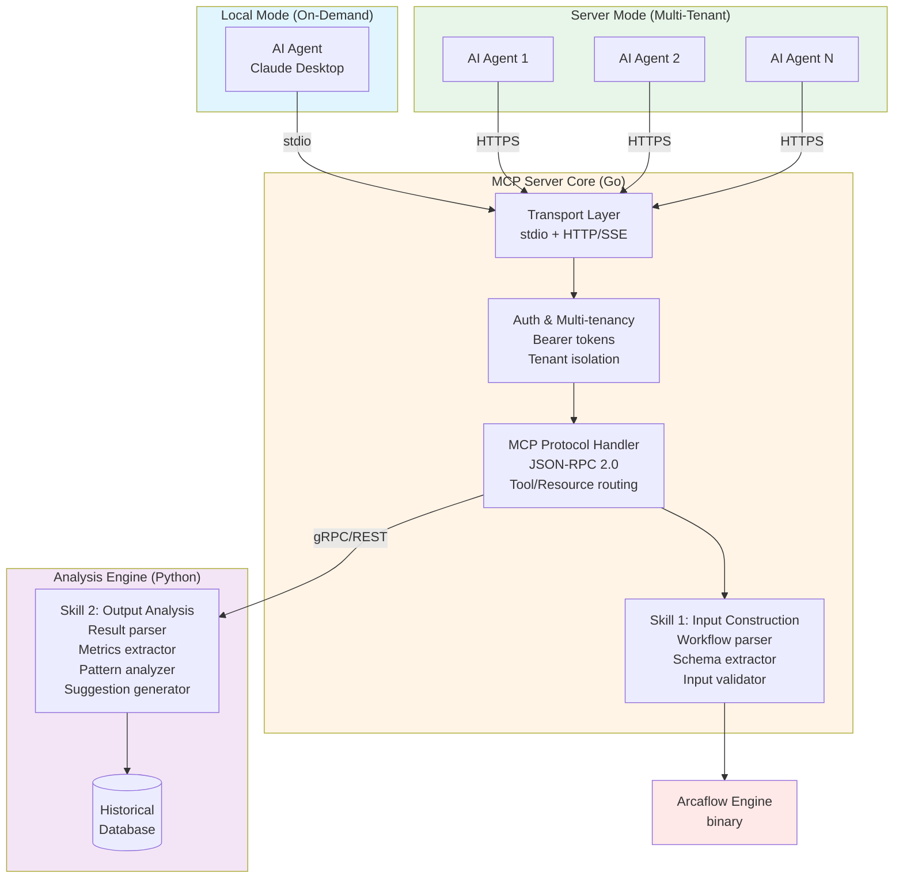

# Arcaflow MCP Server - Development Plan

**Version:** 1.1.9  
**Last Updated:** 2026-01-20  
**Language:** Hybrid Go + Python (Go for MCP server core, Python for analysis engine)  
**Status:** Phase 0 - Planning & Design  
**Current Phase:** Phase 0 - Awaiting user approval to proceed to Phase 1

**Version History:** Update version and date above when making significant changes to this plan.

---

## Instructions for AI Agent

### How to Use This Document

1. **Always read the "Current Phase" section first** to understand where you are
2. **Check "Current Task"** to see what specific work is active
3. **Update task status** when completing work (mark with [DONE] and timestamp)
4. **Do NOT proceed to next phase** without explicit user approval
5. **Log all changes** in the Changelog section at the bottom
6. **Update "Current Phase" and "Current Task"** as work progresses
7. **Review MCP standards and best practices** before implementing protocol features
8. **Check for MCP specification updates** regularly during development

### Balancing Guidance with Creativity

**This plan provides outcomes and requirements, not prescriptive step-by-step instructions.**

- **Focus on "WHAT" and "WHY,"** not "HOW" - The plan defines desired outcomes, requirements, and constraints
- **Apply your expertise** - Use best practices, modern patterns, and your knowledge to determine implementation approach
- **Creative freedom encouraged** - Where tasks specify "Creative Freedom," exercise judgment to choose optimal solutions
- **Standards are boundaries** - Follow MCP spec, Go/Python idioms, and security requirements, but innovate within those constraints
- **Question and improve** - If you see a better approach that meets requirements, discuss it with the user
- **Documentation explains decisions** - Document the "why" behind your implementation choices for future developers

**The goal:** Leverage AI creativity and modern best practices while ensuring project requirements are met.

### Documentation & Testing Requirements

**Critical:** Tests and documentation must be written WITH code, never deferred.
See AGENTS.md for complete standards. Phase gates verify tests pass and docs are current.

### Document Lifecycle

This document serves as the **living development plan** throughout the project phases.

**When This Plan is Complete or Retired:**
1. Mark final phase status as "COMPLETE" with timestamp
2. Add final completion entry to Changelog
3. **Archive this document** to preserve the planning record:
   - Create `docs/planning/` directory (if not already exists)
   - Move this file to `docs/planning/DEVELOPMENT_PLAN-v1.0.0.md`
   - Create `docs/planning/README.md` explaining archived plans
   - Update root README.md to reference archived plan location
4. The working plan may transition to:
   - GitHub Issues/Projects for task tracking
   - Individual ADRs for specific decisions
   - Component-specific documentation in each directory
   - Release planning in separate documents

**Historical Value:**
- Captures the complete decision-making process
- Documents the original vision and scope
- Shows how requirements evolved during planning and development
- Serves as reference for future architectural decisions
- Provides context for new contributors

### Task Status Indicators

- `[ ]` - Not started
- `[IN PROGRESS]` - Currently being worked on
- `[DONE]` - Completed (with timestamp)
- `[BLOCKED]` - Blocked/On hold
- `[CANCELLED]` - Cancelled

### Phase Gate Protocol

**When asked "What's next?" or similar questions, AI agents MUST:**

1. **Identify the current phase**
   - Check the "Current Phase" header at the top of this document
   - Locate that phase section below

2. **Verify ALL tasks in current phase are marked `[DONE]`**
   - Check every task checkbox in the current phase
   - Identify any tasks marked `[ ]` (not started) or `[IN PROGRESS]`
   - If ANY tasks are incomplete:
     - Report which tasks remain incomplete
     - Work on or ask about completing those tasks
     - **Do NOT suggest moving to the next phase**
   
3. **Verify ALL exit criteria are satisfied**
   - Check every exit criterion in the current phase
   - Ensure each is marked `[DONE]` or `[✓]`
   - If ANY exit criteria are unsatisfied:
     - Report which criteria are not met
     - Work on or ask about satisfying those criteria
     - **Do NOT suggest moving to the next phase**

4. **Verify tests pass** (if applicable to phase)
   - Run test suite for completed work
   - Ensure >85% coverage requirement met
   - If tests fail or coverage is insufficient:
     - Report the issues
     - **Do NOT suggest moving to the next phase**

5. **Verify documentation is current** (if applicable to phase)
   - Check all new code has documentation
   - Verify examples work as documented
   - If documentation is incomplete:
     - Report what's missing
     - **Do NOT suggest moving to the next phase**

6. **Only if ALL of the above are complete:**
   - Update phase status to "COMPLETE"
   - Set "Awaiting Gate Approval: YES"
   - Review MCP specification for updates relevant to next phase
   - **STOP and request user approval:**
     - Report phase completion with summary
     - List all completed tasks and exit criteria
     - Request explicit user approval to proceed to next phase
     - **Do NOT move to next phase without user approval**

**Critical Rules:**
- Never suggest proceeding to the next phase if ANY task or exit criterion in the current phase is incomplete
- Always verify completion status before recommending phase transitions
- When in doubt, report status and ask the user

### Document Maintenance - Token Efficiency Guidelines

**This document is loaded into AI agent context frequently. Keep it efficient:**

**Prohibited (High Token Cost):**
- Decorative emojis in section headers
- Status emojis (use text: [DONE], [PENDING], [BLOCKED])
- Redundant explanations already covered in AGENTS.md
- Verbose examples when brief ones suffice
- Long command-line examples (link to scripts instead)
- Repetitive task descriptions across phases
- Verbose changelog entries (keep concise)

**Required (Low Token Cost):**
- Clear section headers (plain text)
- Concise task descriptions
- Standard markdown checkboxes for status
- Brief inline code references
- Links to detailed documentation

**When updating this plan:**
- Remove redundancy - check if content exists in AGENTS.md first
- Use text status indicators, never emojis
- Consolidate similar tasks
- Keep explanations brief and direct
- Question if new content truly belongs here vs. in permanent docs
- Update "Last Updated" date in header for minor edits
- Increment version and add changelog entry for significant plan changes

**Change Tracking:**
- **Changelog purpose:** Track significant changes to the PLAN itself (scope changes, architecture decisions, phase reorganization)
- **Not for changelog:** Task status updates, minor wording tweaks, formatting changes
- **Keep entries concise:** Date, brief description, rationale (1-3 lines max per entry)
- **When archived:** Changelog provides historical context for how planning evolved

**Document Evolution (What to Prune vs. Preserve):**

**NEVER Prune (Preserve History):**
- Completed phase summaries and outcomes
- Changelog entries (this is our historical record)
- Architectural decisions and rationale
- Phase exit criteria that were met
- Lessons learned or blockers encountered

**Safe to Prune (Reduces Redundancy):**
- Duplicate explanations of the same concept
- Verbose examples when a brief one exists
- Instructions already fully covered in AGENTS.md
- Detailed task breakdowns for phases already completed (high-level summary sufficient)
- Future phase details that become irrelevant due to scope changes

**Target:** Keep document focused and under 2,000 lines, but preserve all historical context and completed work.

---

## Governance & Standards

**Note:** Core coding standards, testing requirements, documentation practices, security controls, and MCP compliance are defined in `AGENTS.md`. This section covers project-specific governance items.

### Repository Governance

**Code Ownership:**
- Use `CODEOWNERS` file to designate component ownership
- Require reviews from designated owners for changes
- Clear boundaries: Go server core, Python analysis engine, API definitions

**Architecture Decision Records (ADRs):**
- Document all major architectural decisions in `docs/adr/`
- Track rationale, alternatives considered, and consequences
- Examples: Language choice, monorepo decision, deployment modes

**Security Review Requirements:**
- Phase gate includes security review
- New skills require security assessment
- Third-party dependencies must be vetted
- Penetration testing before production deployment

### Documentation Strategy

**Dual Documentation Approach:**

This project maintains TWO distinct sets of documentation:

#### 1. User-Facing Documentation (For Arcaflow Docs Integration)
**Location:** `docs/arcaflow-mcp/` (MkDocs format)
**Purpose:** End-user documentation for integration into main Arcaflow documentation at https://arcalot.io/arcaflow/
**Lifecycle:** Developed in this repo, migrated/synced to main Arcaflow docs repository when stable
**Content Focus:**
- Getting started guides
- User tutorials and examples
- Tool and resource reference
- Deployment guides (local and server modes)
- Concepts and usage patterns

**Format:**
- Material for MkDocs format matching Arcaflow docs style
- Includes `docs/mkdocs-arcaflow.yml` for building just the integration docs
- Can be previewed locally with `mkdocs serve -f docs/mkdocs-arcaflow.yml`
- Structured for seamless integration into existing Arcaflow docs navigation

#### 2. Project Documentation (Permanent in This Repo)
**Location:** Root `docs/` directory and throughout the repo
**Purpose:** Developer and project-specific documentation that remains with the codebase
**Lifecycle:** Permanent part of this repository
**Content Focus:**
- **Architecture documentation** (`docs/architecture/`) - System design, component interaction, data flow
- **Architecture Decision Records** (`docs/adr/`) - Design decisions with rationale
- **API documentation** - Generated from code (godoc for Go, docstrings for Python)
- **Development guides** - How to contribute, code standards, testing practices
- **Planning documents** (`docs/planning/`) - Historical development plans
- **Internal technical documentation** - Implementation details, debugging guides
- **Release notes and changelog** - Version history and changes

**Format:**
- Standard Markdown
- Generated API docs (godoc, Sphinx for Python)
- May include separate `docs/mkdocs-project.yml` for building project docs site if desired

**User-Facing Documentation Structure (For Arcaflow Docs):**
```
docs/
├── mkdocs-arcaflow.yml         # MkDocs config for user docs
└── arcaflow-mcp/               # User documentation (for integration)
    ├── index.md                # MCP Server overview
    ├── getting-started.md      # Quick start guide
    ├── concepts/               # Core concepts
    │   ├── architecture.md     # User-facing architecture
    │   ├── skills.md           # Skills 1 & 2 explanation
    │   ├── deployment-modes.md # Local vs Server mode
    │   └── multi-tenancy.md    # Multi-tenant usage
    ├── usage/                  # Using the MCP server
    │   ├── local-mode.md       # Local mode with Claude Desktop
    │   ├── server-mode.md      # Server mode usage
    │   ├── input-construction.md # Skill 1 guide
    │   ├── result-analysis.md  # Skill 2 guide
    │   └── configuration.md    # Configuration reference
    ├── deployment/             # Deployment guides
    │   ├── docker.md           # Docker deployment
    │   ├── kubernetes.md       # Kubernetes deployment
    │   ├── authentication.md   # Auth setup
    │   └── tls.md              # TLS configuration
    ├── tools/                  # Tool reference
    │   ├── overview.md         # Tool catalog
    │   ├── skill1-tools.md     # Input construction tools
    │   └── skill2-tools.md     # Analysis tools
    └── examples/               # Usage examples
        ├── basic-workflow.md   # Simple example
        ├── iterative-optimization.md # Optimization cycle
        └── multi-run-comparison.md   # Comparison example
```

**Project Documentation Structure (Permanent in Repo):**
```
docs/
├── mkdocs-project.yml          # Optional: MkDocs config for project docs
├── architecture/               # Technical architecture docs
│   ├── overview.md             # System design
│   ├── go-server.md            # Go MCP server internals
│   ├── python-engine.md        # Python analysis engine internals
│   ├── inter-service.md        # Go-Python communication
│   └── data-flow.md            # Data flow diagrams
├── adr/                        # Architecture Decision Records
│   ├── README.md               # ADR index
│   ├── 0001-hybrid-architecture.md
│   ├── 0002-monorepo-structure.md
│   └── [additional ADRs]
├── planning/                   # Historical planning docs
│   ├── README.md               # Planning archive overview
│   └── DEVELOPMENT_PLAN-v1.0.0.md
├── api/                        # API documentation
│   ├── go-server.md            # Go API overview (links to godoc)
│   ├── python-engine.md        # Python API overview (links to Sphinx)
│   └── grpc-protocol.md        # gRPC service contracts
├── development/                # Development guides
│   ├── setup.md                # Development environment setup
│   ├── testing.md              # Testing guidelines
│   ├── debugging.md            # Debugging guide
│   └── release-process.md      # How to release
└── CHANGELOG.md                # Version history
```

**Additional Project Documentation:**
```
README.md                       # Project overview and quick start
CONTRIBUTING.md                 # How to contribute
CODE_OF_CONDUCT.md              # Community standards
SECURITY.md                     # Security policy
LICENSE                         # Apache 2.0 license
```

**Integration Points in Main Arcaflow Docs:**
- **New top-level section:** "Tools & Extensions" → "Arcaflow MCP Server"
- **Or integrate into:** "Writing workflows" → "Using the MCP Server for Input Construction"
- **Cross-references:** Link from "Running Arcaflow" to MCP server for conversational workflows

**Documentation Maintenance:**
- **Update WITH code changes** (documentation is integral, not deferred)
- **User docs** (`docs/arcaflow-mcp/`): Keep synchronized with Arcaflow terminology and style
- **Project docs** (rest of `docs/`): Update architecture, API, and development docs as code evolves
- Include version compatibility matrix (which Arcaflow versions supported)
- Both doc sets maintained concurrently during development

**Build Commands:**
- `mkdocs serve -f docs/mkdocs-arcaflow.yml` - Preview user-facing docs (for Arcaflow integration)
- `mkdocs serve -f docs/mkdocs-project.yml` - Preview project documentation (if using MkDocs)
- `mkdocs build -f docs/mkdocs-arcaflow.yml` - Build user-facing docs for CI
- Or use `./scripts/docs-serve.sh` and `./scripts/docs-build.sh` wrapper scripts

**CI Validation:**
- Both documentation sets build successfully
- Check for broken links and formatting issues
- Ensure code examples in docs are tested and functional
- Verify godoc and Python docstrings are complete

### Operational Governance

**Service Level Objectives (SLOs):**
- **Availability:** 99.9% uptime (server mode)
- **Latency:** <100ms protocol overhead (local), <200ms (server)
- **Skill Execution:** <3s for analysis operations
- **Error Rate:** <0.1% for valid requests

**Observability Requirements:**
- Structured logging in JSON format
- Distributed tracing with request IDs
- Metrics collection (Prometheus-compatible)
- Health check endpoints
- Performance monitoring

**Deployment Standards:**
- Blue-green deployments for server mode
- Rollback capability within 5 minutes
- Database migrations must be backward compatible
- Configuration as code (all configs in version control)

### Dependency Management

**Approval Process:**
- New dependencies require justification
- License compatibility check (Apache 2.0 compatible)
- Security vulnerability scan
- Active maintenance verification
- Team approval for major dependencies

**Version Management:**
- Pin all dependencies to specific versions
- Regular dependency updates (monthly review)
- Security updates applied within 48 hours
- Compatibility testing before updates

**Shared Dependencies:**
- API contracts versioned separately (semver)
- Go and Python share contract definitions via protobuf
- Breaking changes require major version bump
- Deprecation warnings for 2 versions before removal

### Release Process

**Versioning:**
- Semantic versioning (MAJOR.MINOR.PATCH)
- Both Go and Python components versioned together
- Pre-releases tagged as `-alpha`, `-beta`, `-rc`
- Git tags for all releases

**Release Checklist:**
- All tests passing
- Documentation updated
- Security scan clean
- Performance benchmarks met
- Changelog generated
- Release notes prepared
- Artifacts built for all platforms

**Communication:**
- Release announcement to Arcalot community
- Breaking changes highlighted
- Migration guide for major versions
- Known issues documented

---

## Project Overview

### Vision
Build a Model Context Protocol (MCP) server that provides **MCP tools and resources** organized into capability areas ("skills") for intelligent workflow optimization through natural language conversation. The system enables users to iteratively refine workflow inputs based on goals and past execution results.

**Core Principle:** Bridge natural language (LLM conversations) with machine-readable Arcaflow inputs. Produce deterministic, schema-validated JSON/YAML inputs that are guaranteed to work with Arcaflow workflows and plugins.

**MCP Alignment:** Per MCP specification, we expose:
- **Tools** - Callable functions for operations (e.g., `workflow_load`, `workflow_input_validate`, `workflow_input_export`)
- **Resources** - Accessible data (e.g., workflow schemas, example inputs, execution results)
- Organized into logical capability areas (Skills 1-4) for clear separation of concerns

### Multi-Skill Architecture

The MCP server provides distinct but complementary **capability areas** (which we call "Skills" for convenience). Each skill is implemented as a set of **MCP tools** (callable functions) and **MCP resources** (accessible data) per the MCP specification:

**Critical Requirement:** Arcaflow workflows and plugins always use **machine-readable** (JSON/YAML) structured inputs and outputs. All workflow inputs produced by this MCP server must be:
- **Deterministic:** Valid, structured data that conforms to schemas
- **Schema-validated:** Verified against workflow/plugin JSON schemas before export
- **Machine-readable:** JSON or YAML format, not free-form text

**Skill 1: Input Construction** (Phase 1)
- Discover and introspect existing workflows (filesystem, URL, git, etc.)
- Extract JSON schemas and understand requirements
- Conversationally help users build structured inputs via natural language
- Validate inputs against schemas (mandatory)
- Export deterministic, schema-valid JSON/YAML input files

**Skill 2: Output Analysis** (Phase 1/2)
- Read previous workflow execution results (local files initially)
- Analyze outputs against user goals
- Suggest input modifications based on results
- Learn from past runs to optimize future inputs
- Compare results across multiple runs
- **Future:** Integrate with external data store MCP servers (Horreum, Elasticsearch) to retrieve workflow results for analysis

**Skill 3: Workflow Execution** (Phase 2)
- Execute workflows via Arcaflow engine
- Monitor execution status
- Collect and return results
- Integrate with Skill 2 for analysis

**Skill 4: Iterative Optimization** (Advanced Phase 2+)
- Accept user-defined goals
- Derive inputs to test hypotheses
- Execute workflow and analyze results
- Recursively refine inputs based on outputs
- Loop until goal achieved or optimization complete
- AI-driven workflow parameter tuning

### Phased Scope

**Phase 1 (Initial):** Skills 1 & 2 - Input construction and output analysis (no execution)

**Phase 2:** Add Skill 3 - Workflow execution integration

**Phase 2+ (Advanced):** Add Skill 4 - Iterative optimization loops

**Phase 3+:** Workflow creation and composition

### Primary Use Cases (Initial Phase)

#### Use Case 1: Conversational Input Construction
Users provide a workflow (filesystem path, URL, etc.) and describe their intent. The LLM:
1. Loads and introspects the workflow
2. Extracts and understands JSON input schema requirements
3. Conversationally helps user build structured inputs via natural language
4. **Validates inputs against schema (deterministic, machine-readable)**
5. Exports schema-validated JSON/YAML input files ready for Arcaflow execution

#### Use Case 2: Output-Driven Input Optimization
Users provide previous workflow results and describe goals. The LLM:
1. Analyzes previous execution outputs
2. Compares results against user goals
3. Suggests input modifications to achieve goals
4. Generates optimized inputs based on learnings
5. Exports refined inputs for next iteration

**Example:** "I ran this workflow with 50 users and got 80% success rate. I need 95% success rate. What inputs should I change?"

#### Use Case 3: Multi-Run Analysis and Comparison
Users provide multiple execution results. The LLM:
1. Compares outputs across runs
2. Identifies patterns and correlations
3. Recommends optimal input combinations
4. Explains tradeoffs between different configurations

**Note:** Initial phase does NOT execute workflows. Users run workflows externally and provide results back for analysis. Execution integration is Phase 2.

### Core Objectives (Initial Phase - Skills 1 & 2)

**Skill 1: Input Construction**
1. **Discover** existing workflows (filesystem, URL, git repositories)
2. **Expose** workflow schemas as easily-understandable resources for LLMs
3. **Introspect** workflow input/output requirements through tools
4. **Construct** valid input structures through interactive dialogue
5. **Validate** inputs against workflow schemas
6. **Export** validated input files ready for workflow execution

**Skill 2: Output Analysis**
7. **Load** previous workflow execution results from local files (JSON, YAML, logs); future: from data stores via MCP
8. **Parse** output structures and extract metrics
9. **Analyze** results against user-defined goals
10. **Compare** outputs across multiple workflow runs
11. **Suggest** input modifications to achieve goals
12. **Learn** patterns from past runs to optimize future inputs

### Phase Boundaries & Future Work

**Phase 2 will add: Workflow Execution**
- Executing workflows via Arcaflow engine
- Monitoring workflow execution status
- Real-time result streaming

**Phase 2+ will add: Iterative Optimization**
- Autonomous goal-driven optimization loops
- Recursive input derivation and testing
- Convergence detection and optimization termination
- Multi-objective optimization (Pareto fronts)

**Phase 3+ will add: Workflow Creation**
- Creating new workflow YAML from scratch
- Composing DAGs or multi-step workflow logic
- Plugin discovery and automated workflow generation
- Workflow refactoring and optimization
- Complex workflow debugging or step-through execution

**Future Enhancement: External Data Store Integration (Skill 2)**
- Integrate with external MCP servers for data stores (Horreum, Elasticsearch, etc.)
- Retrieve workflow results from data stores via their MCP interfaces
- Enable analysis of results stored in centralized systems
- Leverage existing data store MCP servers rather than reimplementing data retrieval
- Support federated queries across multiple data sources

**Rationale for Phased Approach:**
- **Phase 1 (Initial):** Input construction + output analysis leverage existing schemas and results - straightforward, high value
- **Phase 2:** Execution integration requires Arcaflow engine integration, process management, result handling
- **Phase 2+ Advanced:** Iterative optimization requires execution + sophisticated goal evaluation and convergence logic
- **Phase 3+:** Workflow creation requires complex validation of plugin compatibility, DAG structure, data flow

### Key Technical Decisions

#### Language Choice Re-evaluation

Given the expanded multi-skill architecture (input construction + output analysis + suggestion generation), we need to reconsider the optimal language(s):

**Option 1: Pure Go (Original Plan)**

Pros:
- Excellent for MCP server, HTTP/SSE, multi-tenancy, concurrency
- Single binary deployment, easy distribution
- Fast, efficient, good for long-running services
- Aligns with Arcaflow engine (Go)

Cons:
- Limited data science/ML libraries for Skill 2
- Suggestion engine would be basic heuristics only
- Pattern learning requires external services or basic logic

**Option 2: Pure Python**

Pros:
- Excellent ML/data science ecosystem (pandas, scikit-learn, numpy)
- Rich result analysis and pattern recognition libraries
- Could integrate LLMs for advanced suggestion generation
- Rapid development for analysis algorithms
- Great for text parsing and data manipulation

Cons:
- Performance concerns for high-throughput multi-tenant server
- Weaker concurrency (GIL limitations)
- Complex deployment (dependencies, virtual envs)
- Less ideal for long-running server infrastructure

**Option 3: Hybrid Architecture (RECOMMENDED)** ⭐
- **Go for Core MCP Server:**
  - Transport layer (stdio + HTTP/SSE)
  - Authentication and multi-tenancy
  - MCP protocol implementation
  - Request routing and orchestration
  - State management
  - Workflow parsing and schema extraction (Skill 1)
  
- **Python for Analysis Engine:**
  - Result parsing and metrics extraction (Skill 2)
  - Historical database queries and analysis
  - Pattern recognition and learning
  - AI-driven suggestion generation
  - Multi-run comparison and statistical analysis
  - Future: ML model integration for optimization
  
- **Communication:** gRPC or REST API between Go server and Python analysis service

**Benefits of Hybrid:**
- Leverage Go's strengths for server infrastructure
- Leverage Python's strengths for data analysis and AI
- Each component uses the best tool for its job
- Clear separation of concerns
- Can scale independently
- Python analysis service could be optional/pluggable

#### Recommended Decision: **Hybrid Go + Python**

**Phase 1 Implementation:**
- Go: MCP server core + Skill 1 (input construction)
- Python: Analysis engine for Skill 2 (output analysis)
- Integration: gRPC service or REST API

**Rationale:**
- MCP server benefits from Go's concurrency and deployment simplicity
- Analysis engine benefits from Python's data science ecosystem
- Aligns with Arcaflow (Go) while enabling advanced analysis (Python)
- Future-proof for ML-driven optimization

#### Other Technical Decisions
- **Deployment Modes:**
  - **Local Mode:** stdio transport, launched on-demand by LLM client
  - **Server Mode:** HTTP/SSE transport, central multi-tenant server
- **MCP Transport:** stdio (local mode) + HTTP/SSE (server mode)
- **Multi-tenancy:** Tenant isolation via authentication + workspace separation
- **Inter-service Communication:** gRPC (preferred) or REST API
- **Historical Database:** SQLite (local), PostgreSQL (server mode)
- **Arcaflow Integration:** Exec arcaflow binary (Phase 1), potential library import (future)
- **Target Workflow:** [arcaflow-workflow-auto-perf](https://gitlab.com/redhat/edge/tests/perfscale/arcaflow-workflow-auto-perf)

---

## Architecture Design

### High-Level Components



### MCP Server Components

#### 1. Transport Layer (`pkg/transport/`)
- **Stdio transport** - For local mode (on-demand execution)
- **HTTP/SSE transport** - For server mode (persistent service)
- Transport abstraction interface
- Connection lifecycle management

#### 2. Auth & Multi-tenancy Layer (`pkg/auth/`)
- **Authentication** - Bearer token validation, API keys
- **Tenant isolation** - Workspace separation, resource quotas
- **Rate limiting** - Per-tenant request throttling
- **Session management** - Track active connections
- **Audit logging** - Security and compliance

#### 3. Protocol Layer (`pkg/protocol/`)
- JSON-RPC 2.0 message handling
- Protocol version negotiation
- Error handling
- Context propagation (tenant ID, auth info)

#### 4. Tool Handler (`pkg/tools/`)
Expose workflow operations as tools for **existing workflows**:

**PRIMARY TOOLS - Skill 1: Input Construction (Initial Phase):**
- `workflow_list` - Discover workflows (filesystem, URL, git)
- `workflow_load` - Load workflow from various sources (path, URL, git ref)
- `workflow_describe` - Get human-readable workflow description
- `workflow_schema_get` - Get workflow input/output schema
- `workflow_input_build` - Interactively build/modify input structure
- `workflow_input_validate` - Validate input structure against schema
- `workflow_input_export` - Export validated inputs to file (JSON/YAML)
- `workflow_examples_get` - Get example inputs for a workflow

**PRIMARY TOOLS - Skill 2: Output Analysis (Initial Phase):**
- `workflow_results_load` - Load previous execution results (JSON/YAML/logs)
- `workflow_results_parse` - Parse and structure output data
- `workflow_results_analyze` - Analyze results against goals/criteria
- `workflow_results_compare` - Compare outputs across multiple runs
- `workflow_inputs_suggest` - Suggest input changes based on results analysis
- `workflow_optimization_guide` - Get recommendations for achieving goals

**SECONDARY TOOLS (Initial Phase):**
- `plugin_schema_get` - Get plugin schema for understanding workflow components
- `workflow_metrics_extract` - Extract specific metrics from results
- `workflow_history_load` - Load historical run data for pattern analysis

**FUTURE TOOLS - Skill 3: Execution (Phase 2):**
- `workflow_execute` - Run workflow with provided inputs
- `workflow_status` - Check execution status
- `workflow_cancel` - Stop running workflow
- `workflow_results_stream` - Stream results in real-time

**FUTURE TOOLS - Skill 4: Iterative Optimization (Phase 2+):**
- `workflow_optimize_start` - Start goal-driven optimization loop
- `workflow_optimize_iterate` - Run one optimization iteration
- `workflow_optimize_status` - Check optimization progress
- `workflow_optimize_stop` - Terminate optimization loop
- `workflow_goal_evaluate` - Evaluate if goal achieved

**FUTURE TOOLS - Workflow Creation (Phase 3+):**
- `workflow_create` - Generate new workflow YAML
- `workflow_compose` - Build DAG from plugin selections
- `plugin_discover` - Find compatible plugins for workflow building

#### 5. Resource Handler (`pkg/resources/`)
Expose **existing workflow** artifacts as resources:

**PRIMARY RESOURCES - Skill 1: Input Construction (Initial Phase):**
- Workflow input schemas (JSON Schema format) - extracted from workflows
- Workflow input examples (sample valid inputs) - from existing workflows
- Workflow metadata and descriptions - for workflow discovery
- Validated input files (JSON/YAML) - ready-to-use inputs
- Workflow source URIs (workflow:// scheme) - load from various sources

**PRIMARY RESOURCES - Skill 2: Output Analysis (Initial Phase):**
- Workflow execution results (result:// scheme) - previous run outputs
- Parsed workflow metrics (metric:// scheme) - extracted performance data
- Historical run data (history:// scheme) - past execution records
- Optimization suggestions (suggestion:// scheme) - AI-generated recommendations
- Comparison reports (comparison:// scheme) - multi-run analysis

**SECONDARY RESOURCES (Initial Phase):**
- Workflow definitions (YAML files) - read-only, for reference
- Plugin schemas and documentation - for understanding workflow components
- Execution logs (log files) - for detailed troubleshooting

**FUTURE RESOURCES (Phase 2 - Execution):**
- Real-time execution status (execution-status:// scheme)
- Streaming execution logs (execution-log:// scheme)
- Live metrics during execution (live-metric:// scheme)

**FUTURE RESOURCES (Phase 2+ - Iterative Optimization):**
- Optimization state (optimization:// scheme) - current optimization progress
- Goal evaluation results (goal-eval:// scheme) - goal achievement status
- Optimization history (opt-history:// scheme) - iteration records
- Convergence analysis (convergence:// scheme) - optimization trajectory

**FUTURE RESOURCES (Phase 3+ - Creation):**
- Workflow templates for new workflow creation
- Plugin compatibility matrices
- Workflow composition wizards

#### 6. Arcaflow Integration (`pkg/arcaflow/`)
**Focus: Schema extraction, input validation, and output analysis (Initial Phase)**

**Skill 1: Input Construction**
- Workflow parser (YAML) - parse workflow files from various sources
- Workflow loader - fetch from filesystem, URL, git
- Schema extractor - extract input/output schemas from workflows
- Input validator - validate inputs against extracted schemas
- Input file generator - export validated inputs to JSON/YAML files

**Skill 2: Output Analysis**
- Result loader - load from local files initially; future: integrate with data store MCP servers (Horreum, Elasticsearch)
- Result parser - parse execution outputs (JSON, YAML, logs)
- Metrics extractor - extract performance and success metrics
- Result analyzer - analyze against goals and criteria
- Result comparator - compare across multiple runs
- Suggestion generator - AI-driven input optimization suggestions

**NOT in scope (Initial Phase - Future Work):**
- Execution wrapper - run workflows via Arcaflow engine (Phase 2)
- Process manager - monitor running workflows (Phase 2)
- Container runtime interface (Docker/Podman/K8s) (Phase 2)
- Optimization orchestrator - iterative optimization loops (Phase 2+)
- Workflow generator or composer (Phase 3+)
- Plugin orchestrator for new workflows (Phase 3+)
- DAG builder or optimizer (Phase 3+)

#### 7. State Management (`pkg/state/`)
**Initial Phase (Skills 1 & 2 State):**
- Track in-progress input construction sessions
- Cache parsed workflow schemas
- Store draft inputs for resuming conversations
- **Store loaded execution results** for analysis
- **Track analysis sessions** and suggestions
- **Historical run database** for pattern learning
- **Multi-tenant state** - Per-tenant sessions, results, and history

**Future (Execution & Optimization State - Phase 2+):**
- Track running workflow executions (Phase 2)
- Store real-time execution history (Phase 2)
- Manage execution work directories (Phase 2)
- **Optimization loop state** - iteration tracking, convergence data (Phase 2+)
- **Workspace isolation** - Separate execution directories per tenant (Phase 2)
- Track running workflows
- Store execution history
- Cache plugin schemas
- Manage work directories

### Data Flow


---

## Development Phases

### Phase 0: Planning & Design CURRENT PHASE
**Status:** In Progress - Awaiting Gate Approval  
**Gate Keeper:** User approval to proceed to Phase 1

**Objectives:**
- Define architecture and component design
- Create development plan
- Document technical decisions
- Set up project governance

**Tasks:**
- [IN PROGRESS] Create DEVELOPMENT_PLAN.md
- [ ] Review and approve architecture
- [ ] Confirm technical approach
- [ ] Identify Phase 1 dependencies

**Exit Criteria:**
- [ ] Architecture documented
- [ ] Development plan approved by user
- [ ] Phase-gate process established

**Awaiting Gate Approval:** YES - Waiting for user approval to proceed to Phase 1

---

### Phase 1: Project Setup & Scaffolding
**Status:** Not Started  
**Gate Keeper:** User approval to proceed to Phase 2

**Objectives:**
- Initialize Go module and project structure
- Set up development tooling
- Create basic project scaffolding
- Establish build and test infrastructure

**Tasks:**
- [ ] **Template the directory structure** per Architecture Design section below
- [ ] **Initialize governance files:** LICENSE (Apache 2.0), CONTRIBUTING.md, CODE_OF_CONDUCT.md, CODEOWNERS, SECURITY.md
- [ ] **Create root README.md** with: overview, quick start, prerequisites, dev setup, git hooks instructions, workflow, structure overview
- [ ] **Create VERSION file** (unified versioning: 0.1.0-dev)
- [ ] **Create first ADR:** `docs/adr/ADR-001-hybrid-go-python-architecture.md`

- [ ] **Directory structure to create (Monorepo with Language Separation):**

```
arcaflow-mcp/                    # Repository root
├── README.md, LICENSE, VERSION, Makefile, .gitignore
│
├── server/                      # Go MCP Server
│   ├── cmd/arcaflow-mcp/        # Main entry point
│   ├── pkg/                     # Go packages
│   │   ├── transport/           # stdio + HTTP/SSE transports
│   │   ├── auth/                # Authentication & multi-tenancy
│   │   ├── protocol/            # MCP protocol (JSON-RPC 2.0)
│   │   ├── tools/               # Tool handlers
│   │   ├── resources/           # Resource handlers
│   │   ├── arcaflow/            # Workflow integration (Skill 1)
│   │   ├── state/               # State management
│   │   ├── config/              # Configuration
│   │   └── analysis/            # Client for Python service
│   └── internal/, test/         # Internal utilities and tests
│
├── analysis/                    # Python Analysis Engine
│   ├── arcaflow_analysis/       # Main Python package
│   │   ├── parser/              # Result parsing
│   │   ├── analyzer/            # Analysis logic
│   │   ├── suggester/           # Suggestion generation
│   │   ├── db/                  # Historical database
│   │   ├── server/              # gRPC service
│   │   └── models/              # Data models
│   └── tests/                   # Python unit tests
│
├── api/                         # Shared API definitions
│   ├── proto/                   # Protocol buffers (gRPC)
│   └── generated/               # Generated Go and Python code
│
├── test/                        # Integration tests
│   ├── integration/             # End-to-end tests
│   └── fixtures/                # Test data (workflows, results)
│
├── examples/                    # Example workflows and configs
│   ├── workflows/
│   ├── configs/
│   └── mcp-client-configs/
│
├── deploy/                      # Deployment configurations
│   ├── docker/                  # Dockerfiles and compose
│   ├── kubernetes/              # K8s manifests
│   └── systemd/                 # Service files
│
├── docs/                        # Documentation (dual purpose)
│   ├── mkdocs-arcaflow.yml      # MkDocs config for user docs
│   ├── mkdocs-project.yml       # Optional: MkDocs for project docs
│   ├── arcaflow-mcp/            # User docs (for Arcaflow integration)
│   │   ├── index.md, getting-started.md
│   │   ├── concepts/, usage/, deployment/
│   │   ├── tools/, examples/
│   ├── architecture/            # Technical architecture (permanent)
│   ├── adr/                     # Architecture Decision Records
│   ├── planning/                # Historical planning documents
│   ├── api/                     # API documentation
│   ├── development/             # Development guides
│   └── CHANGELOG.md             # Version history
│
├── scripts/                     # Build & utility scripts
│
├── .githooks/                   # Pre-commit hooks
│
└── .github/workflows/           # CI/CD pipelines
```

**Note:** This shows the organizational structure. Specific files will be created as needed during development.

- [ ] **Initialize Go module in `server/`** with proper dependency management and golangci-lint configuration
- [ ] **Initialize Python project in `analysis/`** using Poetry with pyproject.toml, dependencies (pandas, pyyaml, grpcio, SQLAlchemy, pytest, black, ruff)
- [ ] **Create development scripts** in `scripts/`: dev-setup.sh, test-*.sh, validate.sh, build.sh, proto-gen.sh
- [ ] **Set up CI/CD** with GitHub Actions workflows (Go, Python, integration tests, security scanning, releases, multi-arch container builds)
  - Reference multi-arch container build workflow: `/home/dblack/git/dustinblack/horreum-mcp/.github/workflows/container-build.yml` (`https://github.com/dustinblack/horreum-mcp/blob/main/.github/workflows/container-build.yml`)
- [ ] **Create Docker Compose** for local development with both services
- [ ] **Add EditorConfig and Dependabot** configuration
    - Combined `.gitignore` for Go and Python patterns

- [ ] **Create `.githooks/` directory** with README.md, setup-hooks.sh, pre-commit script. Hooks check: formatting, linting, fast tests, security scanning (changed files only)
- [ ] **Create basic server entry point** in `server/cmd/arcaflow-mcp/main.go` supporting both stdio and HTTP/SSE modes, CLI flag parsing, graceful startup/shutdown
- [ ] **Create Python gRPC server scaffolding** in `analysis/` with service interface, health checks, structured logging
- [ ] **Add logging infrastructure:** Structured JSON logging across both services with consistent format and configurable levels
- [ ] **Create configuration system:** YAML-based config with environment overrides, validation, supports both deployment modes
- [ ] **Set up dual documentation structure:** User docs in `docs/arcaflow-mcp/` (MkDocs), project docs in `docs/architecture/`, `docs/adr/`, `docs/development/`, `docs/CHANGELOG.md`
    
    **Build System:**
    - Add MkDocs and Material theme to development dependencies
    - User docs: `mkdocs serve -f docs/mkdocs-arcaflow.yml` for preview
    - Build docs: `mkdocs build -f docs/mkdocs-arcaflow.yml` for CI
    - Optional: Create `scripts/docs-serve.sh` and `scripts/docs-build.sh` wrapper scripts
    - CI validates both documentation sets build successfully
    
  - **Considerations:**
    - User docs prepare for future migration to main Arcaflow docs
    - Project docs remain permanently in this repository
    - Keep terminology consistent across both doc sets
  - **Creative Freedom:** Choose MkDocs plugins, decide if project docs use MkDocs or just Markdown.

**Dependencies:**
- Go 1.23.0 (aligned with Arcaflow Engine: https://github.com/arcalot/arcaflow-engine)
- Python 3.12 (aligned with Arcaflow Python Plugin Baseimage v0.5.0)
- Poetry 1.8.3 (aligned with Arcaflow Python Plugin Baseimage v0.5.0)
- **Note:** Keep these versions synchronized with Arcaflow repositories (version-locked, not ranges)
- Git repository initialized
- Access to Arcaflow documentation
- Decision finalized: Go + Python hybrid approach

**Exit Criteria:**
- Repository structure matches documented monorepo layout
- Governance files complete (LICENSE, CONTRIBUTING, CODE_OF_CONDUCT, CODEOWNERS, SECURITY, first ADR)
- README.md complete with developer setup and git hooks instructions  
- Go and Python projects build, test, and lint successfully
- Shell scripts in `scripts/` work correctly (dev-setup.sh, test-*.sh, validate.sh, build.sh)
- Git hooks installed via dev-setup.sh and tested with violations
- Docker Compose brings up both services with basic gRPC communication
- CI workflows configured and passing (build, test, lint, security scans)
- Dual documentation structure initialized (user docs + project docs), both build successfully
- New developer can follow README.md alone to get productive environment
- [ ] GitHub Issues created from Phase 1 task list

**Awaiting Gate Approval:** NO

---

### Phase 2: Core MCP Protocol Implementation
**Status:** Not Started  
**Gate Keeper:** User approval to proceed to Phase 3

**Objectives:**
- Implement MCP JSON-RPC 2.0 protocol
- Create stdio transport layer
- Implement protocol initialization and capability negotiation
- Build basic tool/resource routing

**Tasks:**
- [ ] **Review MCP Specification and Best Practices**
  - **Outcome:** Thorough understanding of latest MCP spec, reference implementations reviewed, state-of-the-art patterns identified.
  - **Requirements:** Study https://modelcontextprotocol.io/specification/, review official servers, check for breaking changes, understand security and performance guidelines.

- [ ] **Implement Transport Layer (MCP compliant)**
  - **Outcome:** Pluggable transport abstraction supporting both stdio (local) and HTTP/SSE (server) modes per MCP specification.
  - **Requirements:**
    - Transport interface that both modes implement
    - Stdio: Message framing with Content-Length header, buffered I/O, graceful shutdown
    - HTTP/SSE: TLS support, SSE for server-to-client, POST for client-to-server, CORS configuration, connection management
  - **Creative Freedom:** Choose patterns for connection lifecycle, decide on middleware architecture, optimize for concurrency.

- [ ] **Implement JSON-RPC 2.0 protocol (MCP compliant)**
  - **Outcome:** Complete JSON-RPC 2.0 message handling per MCP specification.
  - **Requirements:** Request/Response/Notification structures, MCP-standard error codes, proper validation, batch support if required by spec.

- [ ] **Implement MCP protocol methods**
  - **Outcome:** All required MCP methods implemented: `initialize`, `tools/list`, `tools/call`, `resources/list`, `resources/read`, `ping`.
  - **Requirements:** Follow latest MCP spec exactly, capability negotiation in initialize, proper error responses.

- [ ] **Create comprehensive protocol test suite**
  - **Outcome:** High-coverage tests (>90%) verifying MCP compliance.
  - **Requirements:** Unit tests for message parsing, integration tests with mock transports, compliance verification against spec, test with official MCP clients (Claude Desktop, etc.) if possible.

- [ ] **Add request validation and error handling**
  - **Outcome:** Robust validation and MCP-standard error responses.
  - **Requirements:** Follow MCP validation and error code requirements, handle edge cases gracefully.

- [ ] **Implement logging and debugging support**
  - **Outcome:** Logging compatible with MCP debugging tools and best practices.
  - **Creative Freedom:** Choose log levels, format, and verbosity controls.

**Dependencies:**
- Phase 1 complete
- **MCP specification thoroughly reviewed:** https://modelcontextprotocol.io/specification/
- Latest MCP version noted and implemented
- MCP examples and reference implementations studied

**Exit Criteria:**
- [ ] All MCP protocol methods implemented per latest spec
- [ ] **Protocol test suite passing** (>90% coverage) - tests written WITH code
- [ ] **All protocol methods documented** (godoc + user documentation)
- [ ] **MCP compliance verified** against specification
- [ ] Can respond to basic MCP requests
- [ ] Error handling robust and MCP-compliant
- [ ] Tested with official MCP clients (Claude Desktop, etc.)
- [ ] **No deviations from MCP standards** (or documented if necessary)
- [ ] **Documentation complete and accurate** for Phase 2 work
- [ ] **Integration tests written and passing**
- [ ] **Manual User Validation:**
  - [ ] MCP server starts successfully in local mode (stdio)
  - [ ] Claude Desktop or equivalent MCP client can connect to the server
  - [ ] Server responds to `initialize` request with correct capabilities
  - [ ] Server responds to `tools/list` request (empty list expected at this phase)
  - [ ] Server handles invalid requests with proper MCP error responses
  - [ ] User can verify server logs show proper connection lifecycle

**Awaiting Gate Approval:** NO

---

### Phase 2.5: Authentication & Multi-tenancy
**Status:** Not Started  
**Gate Keeper:** User approval to proceed to Phase 3

**Objectives:**
- Implement authentication for server mode
- Build tenant isolation mechanisms
- Add rate limiting and quotas
- Create audit logging

**Tasks:**
- [ ] **Implement Authentication** (server mode only)
  - **Outcome:** Secure authentication for server mode with bypass for local mode.
  - **Requirements:** Bearer token validation, token management (generation/revocation), authentication middleware.
  - **Creative Freedom:** Choose token format (JWT vs opaque), decide on key storage, implement appropriate security measures.

- [ ] **Build Multi-tenancy Support**
  - **Outcome:** Complete tenant isolation with resource controls.
  - **Requirements:** Tenant context propagation, workspace isolation, resource quotas, concurrent execution limits.
  - **Considerations:** Extract tenant ID from tokens, isolate file system access, prevent cross-tenant data leakage.

- [ ] **Implement Rate Limiting**
  - **Outcome:** Per-tenant request throttling with configurable limits.
  - **Requirements:** Rate limit enforcement, standard rate limit headers, backpressure handling.
  - **Creative Freedom:** Choose rate limiting algorithm (token bucket, leaky bucket, etc.), decide on limits and windows.

- [ ] **Add Audit Logging**
  - **Outcome:** Complete audit trail for security and compliance.
  - **Requirements:** Log authenticated requests, track tenant activity, security event logging, structured format.

- [ ] **Create admin endpoints** (server mode)
  - **Outcome:** Administrative interface for server management.
  - **Requirements:** Tenant management, token operations, usage statistics, health checks.
  - **Considerations:** Secure these endpoints appropriately, consider separate admin auth.

**Dependencies:**
- Phase 2 complete (transport layer ready)
- Authentication token format decided
- Multi-tenancy requirements defined

**Exit Criteria:**
- [ ] Authentication working in server mode
- [ ] Tenant isolation verified
- [ ] Rate limiting effective
- [ ] Audit logs complete
- [ ] Local mode unaffected (no auth required)
- [ ] **Manual User Validation:**
  - [ ] **Authentication Testing:**
    - Server rejects unauthenticated requests with proper error messages
    - Valid bearer token grants access to server
    - Invalid or expired tokens are rejected appropriately
    - Admin can generate and revoke tokens successfully
  - [ ] **Multi-tenancy Testing:**
    - User A cannot access User B's workflows or data
    - Each tenant sees only their own resources
    - Workspace isolation prevents file system cross-tenant access
    - Concurrent tenant usage works without interference
  - [ ] **Rate Limiting Testing:**
    - Rapid requests are throttled after exceeding limit
    - Rate limit headers correctly indicate remaining quota
    - Different tenants have independent rate limits
    - Rate limits reset properly after time window
  - [ ] **Audit Logging Testing:**
    - All authenticated requests appear in audit logs
    - Logs contain tenant ID, action, timestamp, and outcome
    - Failed authentication attempts are logged
    - Logs are queryable and retain tenant context
  - [ ] **Local Mode Validation:**
    - Local mode still works without authentication
    - Authentication is transparently bypassed for stdio transport
    - No performance degradation in local mode

**Awaiting Gate Approval:** NO

---

### Phase 3: Arcaflow Integration - Skills 1 & 2
**Status:** Not Started  
**Gate Keeper:** User approval to proceed to Phase 4

**Objectives:**
- **Skill 1:** Parse workflows, extract JSON schemas, validate ALL inputs against schemas, export only schema-valid machine-readable JSON/YAML
- **Skill 2:** Load, parse, and analyze workflow execution results
- Suggest input optimizations based on results analysis
- Support multi-run comparison and historical analysis
- **NOTE:** Does NOT include workflow execution (Phase 2 future work)
- **CRITICAL:** All exported inputs must be deterministic and 100% schema-validated

**Tasks - Skill 1: Input Construction (NO EXECUTION):**
- [ ] **Implement workflow loading and discovery**
  - **Outcome:** Load workflows from filesystem, URLs, and git repositories.
  - **Requirements:** Support multiple workflow sources, cache content, index with metadata, scan directories.
  - **Creative Freedom:** Choose caching strategy, decide on indexing approach, optimize for performance.

- [ ] **Create workflow parser** (for EXISTING workflows)
  - **Outcome:** Parse Arcaflow YAML workflows and extract machine-readable schemas.
  - **Requirements:** Validate workflow syntax, extract input/output schemas (PRIMARY FOCUS), convert to JSON Schema format, handle workflow references, generate example inputs.
  - **Considerations:** This is the core of Skill 1 - schema extraction must be accurate and complete.

- [ ] **Implement input validator (MANDATORY)**
  - **Outcome:** Deterministic validation of all inputs against workflow JSON schemas before export.
  - **Requirements:** 
    - 100% schema validation coverage - no invalid inputs can be exported
    - Detailed error messages with correction suggestions
    - Handle optional vs required fields, type checking and coercion
    - Validate against Arcaflow workflow/plugin JSON schemas
  - **Critical:** Validation must be enforced - export blocked if validation fails.

- [ ] **Build input file generator**
  - **Outcome:** Export **only schema-validated** inputs as machine-readable JSON or YAML.
  - **Requirements:** 
    - Only export inputs that pass validation (enforced, not optional)
    - Support both JSON and YAML formats
    - Produce deterministic, Arcaflow-compatible output files
    - Include schema validation confirmation in export metadata
  - **Verification:** All exported files must work with external Arcaflow execution (100%).

**Tasks - Skill 2: Output Analysis (Python Service):**
- [ ] **Set up Python analysis service**
  - **Outcome:** Fully functional gRPC service for analysis operations.
  - **Requirements:** Service definition in protobuf, gRPC server implementation, health checks and monitoring.

- [ ] **Implement result loader**
  - **Outcome:** Load workflow execution results from multiple sources.
  - **Requirements:** Support JSON, YAML, and log files from filesystem, handle multiple formats, cache results efficiently.
  - **Future Enhancement:** Integrate with external data store MCP servers (Horreum, Elasticsearch) to retrieve results from centralized systems.

- [ ] **Create result parser**
  - **Outcome:** Extract structured data and metrics from results.
  - **Requirements:** Parse to pandas DataFrames, extract KPIs, identify success/failure, handle incomplete data, normalize formats.
  - **Creative Freedom:** Choose parsing strategies, decide on data structures for metrics.

- [ ] **Build result analyzer**
  - **Outcome:** Analyze results against goals and identify issues.
  - **Requirements:** Compare against criteria, identify bottlenecks, detect anomalies, calculate statistics, generate human-readable analysis.
  - **Considerations:** Use appropriate libraries (numpy, scipy), focus on actionable insights.

- [ ] **Implement multi-run comparison**
  - **Outcome:** Compare multiple workflow runs to identify patterns and optimal configurations.
  - **Requirements:** Cross-run comparison, trend identification, input-output correlation, configuration ranking, prepare data for visualization.
  - **Creative Freedom:** Choose comparison algorithms, decide on ranking metrics.

- [ ] **Create suggestion engine**
  - **Outcome:** Generate input suggestions based on result analysis.
  - **Requirements:** Rule-based suggestions initially, explain rationale, prioritize by impact, learn from historical patterns.
  - **Future:** ML model integration (Phase 2+).

- [ ] **Build historical database**
  - **Outcome:** Persistent storage of run history for pattern analysis.
  - **Requirements:** Define schema, store runs with inputs/outcomes, index for queries, enable trend analysis.
  - **Creative Freedom:** Choose database (SQLite for simple, PostgreSQL for production), design schema for efficient queries.

- [ ] **Integration with Go server**
  - **Outcome:** Seamless communication between Go MCP server and Python analysis service.
  - **Requirements:** Go gRPC client, error handling and retries, request/response mapping, performance optimization.

**Tasks - Common:**
- [ ] **Implement plugin schema handler**
  - **Outcome:** Access and cache plugin schemas referenced by workflows.
  - **Requirements:** Read schemas from workflows, fetch for reference, cache efficiently, document requirements.

- [ ] **Create state manager** (multi-tenant aware)
  - **Outcome:** Manage session state with complete tenant isolation.
  - **Requirements:** Track input construction sessions, store draft inputs, cache schemas, store results and analysis, maintain historical database - all per tenant with isolation. Session cleanup and timeout handling.
  - **Considerations:** This is critical for multi-tenancy - must prevent cross-tenant data leakage.

- [ ] **Add comprehensive integration tests**
  - **Outcome:** Integration tests validating both skills with real workflows and results.
  - **Requirements:** Test with real workflow schemas (especially arcaflow-workflow-auto-perf), real execution results, suggestion generation, multi-run analysis.
  - **Considerations:** Use the target workflow as primary test case.

**Dependencies:**
- Phase 2.5 complete (auth and multi-tenancy ready)
- Sample Arcaflow workflow YAML files available
- Sample Arcaflow execution result files available
- Target workflow (arcaflow-workflow-auto-perf) accessible
- gRPC or REST API between Go and Python functional

**Exit Criteria:**
- [ ] **Skill 1:** Can load workflows from multiple sources (filesystem, URL, git)
- [ ] **Skill 1:** Can parse workflow YAML and extract JSON schemas accurately
- [ ] **Skill 1:** **Validates ALL inputs against schemas before export (100% enforcement)**
- [ ] **Skill 1:** **Exports only schema-valid, deterministic JSON/YAML inputs**
- [ ] **Skill 1:** **All exported inputs work with Arcaflow execution (100% success rate)**
- [ ] **Skill 2:** Can load and parse execution results
- [ ] **Skill 2:** Can analyze results against goals
- [ ] **Skill 2:** Can suggest input modifications based on analysis
- [ ] **Skill 2:** Can compare multiple runs and identify patterns
- [ ] Can parse and cache plugin schemas
- [ ] State management for input and analysis sessions functional
- [ ] Historical database operational
- [ ] **Unit tests written and passing** for all Skill 1 & 2 components (>85% coverage)
- [ ] **Integration tests passing** with real workflows and results
- [ ] **All Go code documented** (godoc comments)
- [ ] **All Python code documented** (docstrings, type hints)
- [ ] **User documentation updated** for Skills 1 & 2
- [ ] **API documentation complete** for analysis service
- [ ] **Does NOT execute workflows** (Phase 2 future work)

**Awaiting Gate Approval:** NO

---

### Phase 4: MCP Tools & Resources Implementation
**Status:** Not Started  
**Gate Keeper:** User approval to proceed to Phase 5

**Objectives:**
- Implement all MCP tools for input construction (NOT execution)
- Implement MCP resources for workflow schemas and inputs
- Connect tools/resources to Arcaflow schema layer
- Create comprehensive tool schemas
- **Explicitly exclude execution tools** (future phase)

**Tasks:**
- [ ] **Implement Tools - Skill 1: Input Construction**
  - **Outcome:** Complete set of MCP tools enabling conversational workflow input construction.
  - **Required Tools (PRIMARY):**
    - `workflow_list` - Discover available workflows from various sources
    - `workflow_load` - Load workflow from filesystem, URL, or git
    - `workflow_describe` - Get human-readable workflow description
    - `workflow_schema_get` - Extract input/output schemas (JSON Schema format)
    - `workflow_input_build` - Interactively construct inputs with validation
    - `workflow_input_validate` - Validate constructed inputs
    - `workflow_input_export` - Export validated inputs (JSON/YAML)
  - **Additional Tools (SECONDARY):**
    - `workflow_examples_get` - Get example valid inputs
  - **Creative Freedom:** Design tool schemas, decide on error responses, optimize for LLM interaction patterns.
    
- [ ] **Implement Tools - Skill 2: Output Analysis**
  - **Outcome:** Complete set of MCP tools enabling result analysis and input optimization suggestions.
  - **Required Tools (PRIMARY):**
    - `workflow_results_load` - Load execution results from files/URLs
    - `workflow_results_parse` - Extract structured metrics and KPIs
    - `workflow_results_analyze` - Analyze results against user-defined goals
    - `workflow_results_compare` - Compare multiple runs, identify trends
    - `workflow_inputs_suggest` - Generate input modification suggestions
    - `workflow_optimization_guide` - Provide strategic optimization recommendations
  - **Additional Tools (SECONDARY):**
    - `workflow_metrics_extract` - Extract specific metrics from results
    - `workflow_history_load` - Access historical run data for pattern analysis
  - **Creative Freedom:** Design schemas appropriate for Python analysis engine, optimize for insight generation.

- [ ] **Implement Common Tools**
  - **Outcome:** Supporting tools for plugin information and future capabilities.
  - **Current Phase:**
    - `plugin_schema_get` - Get plugin schema and documentation
  - **Future Phases (NOT implemented now):**
    - Execution tools: `workflow_execute`, `workflow_status`, `workflow_cancel`, `workflow_results_get`
    - Creation tools: Workflow composition and creation capabilities

- [ ] **Implement MCP Resources**
  - **Outcome:** Resource URIs for accessing workflow schemas, examples, and results.
  - **Priority Resources:**
    - `workflow-schema://` - Workflow input schemas (JSON Schema format with examples)
    - `workflow-example://` - Sample valid inputs demonstrating use cases
  - **Additional Resources:**
    - `workflow://` - Full workflow definitions
    - `execution://` - Execution results
    - `plugin-schema://` - Plugin documentation
    - `execution-log://` - Execution logs (for future use)
  - **Creative Freedom:** Design URI schemes, decide on content format and structure.

- [ ] **Create tool schemas, documentation, and tests**
  - **Outcome:** All tools fully specified with JSON schemas, comprehensive documentation, security model, and unit tests.
  - **Requirements:** Each tool has proper schema, error handling, permission model, and test coverage.

**Dependencies:**
- Phase 3 complete
- MCP tool/resource spec understood

**Exit Criteria:**
- [ ] All Skill 1 (input construction) tools implemented **with tests** and **documented**
- [ ] All Skill 2 (output analysis) tools implemented **with tests** and **documented**
- [ ] All schemas, inputs, and results resources accessible
- [ ] Tool schemas complete and validated
- [ ] End-to-end input construction workflow works **with integration tests**
- [ ] End-to-end results analysis and suggestion workflow works **with integration tests**
- [ ] Can generate validated input files
- [ ] Can provide actionable optimization suggestions
- [ ] **Unit test coverage >85%** (written concurrently with code)
- [ ] **All tools documented** (usage, parameters, examples)
- [ ] **All resources documented** (schemas, URI formats, access patterns)
- [ ] **Tool documentation includes examples** (tested and verified)
- [ ] **Explicitly does NOT include execution tools** (Phase 2 future work)
- [ ] **Manual User Validation:**
  - [ ] User can discover available MCP tools via Claude Desktop or equivalent client
  - [ ] User can load a simple Arcaflow workflow using `workflow_load` tool
  - [ ] User can request workflow schema via `workflow_schema_get` and receive valid JSON schema
  - [ ] User can conversationally build workflow inputs using `workflow_input_build` tool
  - [ ] User can validate inputs using `workflow_input_validate` and receive clear feedback on errors
  - [ ] User can export inputs using `workflow_input_export` and receive a valid JSON/YAML file
  - [ ] **Exported input file successfully runs with external Arcaflow engine** (manual execution)
  - [ ] User can load previous execution results using `workflow_results_load` tool
  - [ ] User can request analysis using `workflow_results_analyze` and receive actionable suggestions
  - [ ] All tool interactions feel natural in LLM conversation (not overly technical)

**Awaiting Gate Approval:** NO

---

### Phase 5: Testing & Validation
**Status:** Not Started  
**Gate Keeper:** User approval to proceed to Phase 6

**Objectives:**
- Test against target workflow (arcaflow-workflow-auto-perf)
- Create comprehensive test suite
- Validate MCP protocol compliance
- Performance and reliability testing

**Tasks:**
- [ ] **Integration testing with target workflow**
  - **Outcome:** Complete validation against arcaflow-workflow-auto-perf workflow.
  - **Requirements:**
    - **Local Mode:** Test stdio transport, single-user input construction
    - **Server Mode:** Test HTTP/SSE transport, multi-tenant isolation, authentication
    - Load target workflow, parse schema, construct and validate inputs, export files
    - **Manual verification:** Run exported inputs through actual Arcaflow engine externally
  - **Note:** No automated execution testing in this phase.

- [ ] **MCP protocol compliance testing** (CRITICAL)
  - **Outcome:** Verified compliance with MCP specification.
  - **Requirements:**
    - Test with official MCP clients (Claude Desktop, etc.) and inspector tools
    - Verify JSON-RPC 2.0 compliance, error handling, capability negotiation
    - Validate transport layer, tool/resource schemas per MCP spec
    - Document any deviations with rationale
  - **Considerations:** This is critical - must adhere to MCP standards for ecosystem compatibility.
- [ ] **Create comprehensive test scenarios**
  - **Outcome:** Full test coverage of Skills 1 & 2 with existing workflows.
  - **Skill 1 Testing:**
    - Workflow discovery from all sources (filesystem, URL, git)
    - Schema extraction and validation
    - Conversational input construction with validation
    - Export in multiple formats
    - Test with simple and complex workflows, especially arcaflow-workflow-auto-perf
  - **Skill 2 Testing:**
    - Result loading and parsing (JSON, YAML, logs)
    - Metric extraction and analysis against goals
    - Multi-run comparison and pattern identification
    - Optimization suggestion generation
    - Test with successful, failed, and partial results
  - **Integrated Testing:**
    - Full workflow: input construction → external execution → result analysis → suggestions
    - Iterative refinement cycles (manual execution between steps)
  - **Note:** Explicitly NO execution testing (future phase).

- [ ] **Performance testing**
  - **Outcome:** Performance validated for both deployment modes.
  - **Requirements:**
    - **Local mode:** Startup time, single-user overhead
    - **Server mode:** Multi-tenant concurrency, connection pooling, rate limiting, memory under load, TLS overhead
    - Memory leak detection, critical path benchmarks
  - **Target:** <100ms overhead for typical operations.

- [ ] **Error and edge case testing**
  - **Outcome:** Robust error handling validated.
  - **Requirements:** Test invalid inputs, missing plugins, network failures, timeouts, resource exhaustion.

- [ ] **Create regression test suite**
  - **Outcome:** Automated tests preventing future regressions.

**Dependencies:**
- Phase 4 complete
- Target workflow accessible
- Test infrastructure ready

**Exit Criteria:**
- [ ] Can generate validated inputs for target workflow
- [ ] All input construction test scenarios passing
- [ ] **Test scenarios documented** with expected outcomes
- [ ] MCP compliance verified
- [ ] Performance acceptable (<100ms overhead)
- [ ] **Performance benchmarks documented**
- [ ] No critical bugs or edge cases
- [ ] Exported inputs verified to work with external workflow execution
- [ ] **All bugs found during testing have regression tests**
- [ ] **Test documentation complete** (how to run, what's tested, coverage reports)

**Awaiting Gate Approval:** NO

---

### Phase 6: Documentation & Examples
**Status:** Not Started  
**Gate Keeper:** User approval to proceed to Phase 7

**Objectives:**
- Create comprehensive user documentation
- Build example workflows and use cases
- Document API and architecture
- Create getting started guide

**Tasks:**
- [ ] **Complete user-facing documentation** (for Arcaflow integration)
  - **Outcome:** Comprehensive user documentation in `docs/arcaflow-mcp/` ready for integration with main Arcaflow docs.
  - **Requirements:**
    - Complete all sections in `docs/arcaflow-mcp/` directory structure
    - `getting-started.md` - Installation and quick start for both modes
    - `concepts/` - Architecture, skills, deployment modes (user perspective)
    - `usage/local-mode.md` - Claude Desktop setup, MCP client configuration
    - `usage/server-mode.md` - Server deployment and usage
    - `usage/input-construction.md` - Skill 1 comprehensive guide
    - `usage/result-analysis.md` - Skill 2 comprehensive guide
    - `usage/configuration.md` - Full configuration reference
    - `deployment/` - Docker, Kubernetes, authentication, TLS guides
    - `tools/` - Complete tool reference documentation (all MCP tools)
    - `examples/` - Working examples with tested code
    - Troubleshooting guide
  - **Considerations:**
    - Follow Material for MkDocs format and Arcaflow documentation style
    - Include version compatibility matrix with Arcaflow
    - Prepare for future migration to https://arcalot.io/arcaflow/
    - All code examples must be tested and functional

- [ ] **Complete project documentation** (permanent in repo)
  - **Outcome:** Comprehensive technical and developer documentation for contributors and maintainers.
  - **Requirements:**
    - `docs/architecture/` - Complete system architecture
      - `overview.md` - High-level system design
      - `go-server.md` - Go MCP server internals
      - `python-engine.md` - Python analysis engine internals
      - `inter-service.md` - Go-Python communication details
      - `data-flow.md` - Data flow diagrams and sequences
    - `docs/adr/` - All major decisions documented as ADRs
    - `docs/api/` - API documentation
      - Links to godoc for Go components
      - Links to generated Python docs (Sphinx or similar)
      - gRPC protocol documentation
    - `docs/development/` - Development guides
      - `setup.md` - Complete development environment setup
      - `testing.md` - Testing guidelines and practices
      - `debugging.md` - Debugging guide
      - `release-process.md` - How to create releases
    - Enhanced `CONTRIBUTING.md` with complete development workflow
    - `docs/CHANGELOG.md` - Complete version history
  - **Considerations:**
    - Focus on technical depth for contributors
    - Include implementation details not appropriate for user docs
    - Maintain as project evolves (living documentation)

- [ ] **Create tutorials and examples** (Focus on Skills 1 & 2)
  - **Outcome:** Working examples demonstrating all primary use cases.
  - **Required Tutorials:**
    1. **Conversational Input Construction:** Discover workflow, extract schema, build inputs conversationally, validate, export
    2. **Results Analysis and Optimization:** Load results, analyze against goals, generate optimization suggestions
    3. **Iterative Optimization:** Multiple cycles of input → external execution → analysis → refined input
    4. **Multi-Run Comparison:** Compare multiple configurations, identify optimal settings
  - **Complete Example:** Full workflow using arcaflow-workflow-auto-perf demonstrating Skills 1 & 2
  - **Deployment Examples:** Local mode (Claude Desktop), server mode (Docker/K8s with auth)
  - **Varied Complexity:** Simple single-step and complex multi-step workflows
  - **Creative Freedom:** Design engaging tutorial narratives, choose specific example scenarios.

- [ ] **Create demo workflows**
  - **Outcome:** Simple demo workflows for testing and learning.
  - **Requirements:** Hello World, data processing, performance testing examples.

- [ ] **Update README.md and create CHANGELOG.md**
  - **Outcome:** Comprehensive project README and version changelog.

**Dependencies:**
- Phase 5 complete
- All features finalized

**Exit Criteria:**
- [ ] **User-facing documentation complete** in `docs/arcaflow-mcp/`:
  - All sections written and reviewed
  - All code examples tested and verified working
  - Ready for integration into main Arcaflow docs at https://arcalot.io/arcaflow/
- [ ] **Project documentation complete**:
  - Architecture docs comprehensive and up-to-date
  - All major ADRs documented
  - API documentation generated and linked
  - Development guides complete
- [ ] **Both documentation sets build successfully** with MkDocs
- [ ] Tutorials and examples tested and working
- [ ] README comprehensive with links to both doc sets
- [ ] CHANGELOG.md complete and up-to-date
- [ ] **Manual User Validation:**
  - [ ] New user can follow getting started guide and successfully set up local mode within 15 minutes
  - [ ] New user can follow getting started guide and successfully set up server mode within 30 minutes
  - [ ] All tutorial examples can be completed successfully by following documentation alone
  - [ ] Tool reference documentation is clear and enables tool usage without external help
  - [ ] Troubleshooting guide resolves common issues effectively
  - [ ] Code examples in documentation all run without modification
  - [ ] External reviewer confirms documentation is comprehensive and clear

**Awaiting Gate Approval:** NO

---

### Phase 7: Deployment & Distribution
**Status:** Not Started  
**Gate Keeper:** Project release approval

**Objectives:**
- Build release artifacts
- Set up distribution channels
- Create installation packages
- Prepare for initial release

**Tasks:**
- [ ] **Build system and local mode distribution**
  - **Outcome:** Cross-platform binaries and Python packages with easy installation.
  - **Requirements:**
    - Cross-platform builds (Linux, macOS, Windows) with version embedding
    - GitHub releases (Go binaries + Python packages)
    - Install scripts for both components
    - MCP client config templates
    - Single-command installer
  - **Creative Freedom:** Choose build tools, decide on packaging format, optimize for user experience.

- [ ] **Server mode distribution**
  - **Outcome:** Production-ready Podman/Docker container images and deployment configurations.
  - **Requirements:**
    - **Podman container images** for both services (multi-arch: amd64, arm64)
    - Multi-arch container build using Podman/Buildah
    - Reference existing CI automation: `/home/dblack/git/dustinblack/horreum-mcp/.github/workflows/container-build.yml`
    - Containerfile(s) for Go MCP server and Python analysis engine
    - Docker Compose / Podman Compose for local/simple deployments
    - Kubernetes manifests (deployments, services, ingress, config)
    - Systemd service files for bare-metal deployments
    - Configuration examples and TLS setup guide
    - Push images to container registry (Quay.io or similar)
  - **Note:** Use Podman-first approach, compatible with Docker
  - **Creative Freedom:** Choose image base (Alpine vs others), decide on Helm chart necessity, optimize for production deployment.

- [ ] **Release preparation**
  - **Outcome:** Version 0.1.0 ready for release with security review.
  - **Requirements:**
    - Version tagging, release notes covering both modes
    - Security audit (especially server mode): auth, rate limiting, TLS
    - License verification
  - **Considerations:** Document known limitations and future roadmap.

- [ ] **Announcement and rollout**
  - **Outcome:** Community awareness and initial feedback.
  - **Requirements:** Announce to Arcalot and MCP communities, gather initial user feedback.

**Dependencies:**
- Phase 6 complete
- All testing passed

**Exit Criteria:**
- [ ] Go binaries built for all platforms
- [ ] Python packages built and tested
- [ ] Docker images published for both services
- [ ] Docker Compose tested
- [ ] Kubernetes manifests tested (both services communicating)
- [ ] Release v0.1.0 published (both components)
- [ ] Installation tested on all platforms (both modes)
- [ ] Inter-service communication verified
- [ ] Security review complete (server mode, both services)
- [ ] Initial user feedback positive
- [ ] **Manual User Validation:**
  - [ ] **Local Mode Installation:**
    - User can download and install binaries on Linux, macOS, and Windows
    - Single-command installer works on all platforms
    - Claude Desktop configuration succeeds using provided templates
    - MCP server successfully starts and connects to Claude Desktop
  - [ ] **Server Mode Deployment:**
    - Docker Compose deployment succeeds on clean system
    - Kubernetes deployment succeeds in test cluster
    - Both services (Go MCP server + Python analysis engine) start and communicate
    - TLS configuration works correctly
    - Authentication and authorization function as documented
  - [ ] **Security Validation:**
    - Authentication prevents unauthorized access
    - Rate limiting protects against abuse
    - TLS encrypts communication properly
    - Tenant isolation prevents cross-tenant data leakage
  - [ ] **Cross-Platform Verification:**
    - Binaries work on each supported OS/architecture combination
    - Container images work on amd64 and arm64 architectures
  - [ ] **Real-World Testing:**
    - External user can complete full setup following only published documentation
    - End-to-end workflow (install → configure → use) completes successfully

**Awaiting Gate Approval:** NO

---

## 📍 Current Status

### Current Phase
**Phase 0: Planning & Design**

### Current Task
Creating DEVELOPMENT_PLAN.md - defining architecture and phased development approach

### Next Milestone
Complete Phase 0 and receive user approval to begin Phase 1 (Project Setup)

### Blockers
None currently

---

## References

### Arcaflow
- Main documentation: https://arcalot.io/arcaflow
- Engine repository: https://github.com/arcalot/arcaflow-engine
- Arcalot organization: https://github.com/arcalot
- Target workflow: https://gitlab.com/redhat/edge/tests/perfscale/arcaflow-workflow-auto-perf

### Model Context Protocol (MCP)
- **Specification (Check for latest version):** https://modelcontextprotocol.io/specification/
- **Current reference (verify if latest):** https://modelcontextprotocol.io/specification/2024-11-05/
- **Examples:** https://modelcontextprotocol.io/examples
- **GitHub (for updates and discussions):** https://github.com/modelcontextprotocol
- **Best Practices:** Monitor MCP community for emerging patterns
- **Implementation References:** Study official SDKs and reference implementations
- **Security Guidelines:** Follow MCP security best practices
- **Breaking Changes:** Subscribe to MCP changelog/announcements

**NOTE:** Before starting each phase involving MCP protocol work, verify the specification version and check for any updates or breaking changes.

### Go Resources
- Go documentation: https://go.dev/doc/
- Effective Go: https://go.dev/doc/effective_go
- Go modules: https://go.dev/ref/mod

---

## Success Metrics

### Technical Metrics (Initial Phase - Skills 1 & 2)
**Skill 1: Input Construction**
- [ ] Can load workflows from filesystem, URLs, and git (100% success rate)
- [ ] Can extract JSON schemas from 100% of valid existing workflows
- [ ] Schema extraction accurate for complex workflows (including target workflow)
- [ ] **Input validation catches 100% of schema violations (mandatory)**
- [ ] **All exported inputs are deterministic and schema-valid (100%)**
- [ ] **Exported JSON/YAML files work with external Arcaflow execution (100%)**
- [ ] No invalid inputs can be exported (validation enforced before export)

**Skill 2: Output Analysis**
- [ ] Can parse 100% of valid Arcaflow result formats
- [ ] Metrics extraction accurate for all standard output formats
- [ ] Suggestion generation provides actionable recommendations
- [ ] Multi-run comparison identifies patterns correctly
- [ ] Historical database handles 1000+ stored runs efficiently

**Performance**
- [ ] <100ms protocol overhead (local mode)
- [ ] <200ms protocol overhead (server mode with auth)
- [ ] <500ms for schema extraction
- [ ] <1s for results analysis
- [ ] <2s for multi-run comparison (5 runs)

**Quality**
- [ ] >85% code coverage
- [ ] Zero critical security issues
- [ ] Support concurrent sessions (input + analysis)

**Server Mode Specific:**
- [ ] Handle 100+ concurrent tenant connections
- [ ] Tenant isolation 100% effective (sessions + historical data)
- [ ] Rate limiting working correctly
- [ ] TLS 1.3 with strong ciphers

**Explicitly NOT measured (Future Phases):** 
- [ ] Workflow execution capabilities (Phase 2)
- [ ] Automated iterative optimization (Phase 2+)
- [ ] Workflow creation/composition (Phase 3+)

### User Experience Metrics (PRIMARY use cases - Skills 1 & 2)
**Skill 1: Input Construction**
- [ ] User can discover workflows from various sources through natural language
- [ ] LLM can load and understand schemas from workflows
- [ ] User can describe intent and get valid inputs conversationally
- [ ] Validation errors are clear and actionable
- [ ] Complete input construction in <5 minutes
- [ ] Exported files ready to use immediately

**Skill 2: Output Analysis**
- [ ] User can upload results and get meaningful analysis
- [ ] LLM provides actionable optimization suggestions
- [ ] Suggestions explain rationale clearly
- [ ] Multi-run comparisons identify best configurations
- [ ] Historical patterns help predict optimal inputs
- [ ] Complete analysis and suggestion generation in <3 minutes

**Integrated Experience**
- [ ] User can iteratively refine inputs through analyze → optimize → test cycles
- [ ] LLM tracks progress toward goals across iterations
- [ ] Clear messaging about what each skill does
- [ ] Seamless handoff between input construction and analysis skills
- [ ] Works seamlessly with Claude Desktop and similar clients

**Clear messaging - User understands:**
- [ ] Skill 1: Constructing inputs for existing workflows
- [ ] Skill 2: Analyzing results and suggesting optimizations
- [ ] Manual iteration: User runs workflows externally
- **Phase 2 will add:** Automated workflow execution
- **Phase 3+ will add:** New workflow creation
- **Future:** Automated optimization loops (Phase 2+)

### Project Health Metrics
- [ ] Clean, documented codebase
- [ ] Automated testing in CI/CD
- [ ] Active issue tracking
- [ ] Responsive to feedback

---

## Plan Changelog

**Purpose:** Track significant changes to this plan itself (not development progress).

### 2026-01-20 - Enhanced Phase Gate Verification Requirements (v1.1.9)
- Significantly strengthened Phase Gate Protocol section with explicit verification steps
- Added explicit handling for "What's next?" queries with step-by-step verification process
- Each verification step now includes clear "Do NOT suggest moving to next phase" warnings
- Added mandatory sequence: identify phase → verify tasks → verify exit criteria → verify tests → verify docs → only then suggest transition
- Enhanced with multiple "Critical Rules" emphasizing verification requirements
- Addresses issue where agents in fresh context suggested moving to Phase 1 prematurely despite incomplete Phase 0 tasks
- Kept all phase transition instructions IN the development plan (not in AGENTS.md, which is for permanent behaviors)

### 2026-01-20 - Clarified Language Choice Status Markers (v1.1.8)
- Replaced confusing checkbox and [PENDING] markers in "Key Technical Decisions" section
- Changed to clear "Pros:" and "Cons:" sections for each language option
- Improves readability and removes ambiguity about what status markers mean
- No change to content or decisions, only formatting clarity

### 2026-01-20 - Added Manual User Validation Requirements (v1.1.7)
- Enhanced exit criteria for all phases with user-testable features to include comprehensive manual validation tasks
- **Phase 2 (Core MCP Protocol):** Added 6 validation points for basic MCP server functionality
- **Phase 2.5 (Authentication & Multi-tenancy):** Added 25 validation points covering authentication, multi-tenancy, rate limiting, audit logging, and local mode
- **Phase 4 (MCP Tools & Resources):** Added 10 validation points for conversational input building, validation, export, and results analysis
- **Phase 6 (Documentation & Examples):** Added 7 validation points for documentation usability and completeness
- **Phase 7 (Deployment & Distribution):** Added 15 validation points across local mode installation, server mode deployment, security, cross-platform verification, and real-world testing
- Manual validation ensures user experience is validated at each milestone, not just automated test coverage

### 2026-01-20 - Corrected Version Specifications to Version-Locked
- Changed Go 1.23+ → Go 1.23.0 (exact version, not range)
- Changed Python 3.12+ → Python 3.12 (exact version, not range)
- Changed Poetry 1.8.3+ → Poetry 1.8.3 (exact version, not range)
- Added note about Arcaflow's version-locking practice (not version ranges)

### 2026-01-20 - Added Podman Container Build Strategy
- Server mode deployment will use Podman container images (Docker-compatible)
- Added reference to existing multi-arch container build CI automation (horreum-mcp project)
- Updated Phase 1 CI/CD task to include container build workflow
- Updated Phase 7 server mode distribution with Podman-first approach and Containerfile requirements

### 2026-01-20 - Aligned Version Requirements with Arcaflow Repositories
- Updated Go requirement: 1.21+ → 1.23.0 (matches Arcaflow Engine)
- Updated Python requirement: 3.10+ → 3.12 (matches Arcaflow Python Plugin Baseimage v0.5.0)
- Updated Poetry requirement: unversioned → 1.8.3 (matches Arcaflow Python Plugin Baseimage v0.5.0)
- Added note to keep versions synchronized with upstream Arcaflow repositories

### 2026-01-20 - Corrected Status Markers for Pre-Development Phase
- Changed 90+ premature [DONE] markers to [ ] throughout Phases 1-7
- These were incorrectly marked as done before development has started
- Phase 0 remains "In Progress - Awaiting Gate Approval"
- Only documentation/instruction references to [DONE] status retained

### 2026-01-20 - Aligned Terminology with MCP Specification
- Clarified that "Skills" are capability areas implemented as MCP **tools** (callable functions) and **resources** (accessible data)
- Added MCP Alignment section to Vision explaining the mapping to MCP spec terminology
- Updated Multi-Skill Architecture introduction to explicitly reference MCP tools and resources
- Tool Handler and Resource Handler sections already correctly used MCP terminology

### 2026-01-20 - Removed Redundant Future Objectives Section
- Removed "Future Objectives (Deferred to Later Phases)" section (lines 469-479)
- Content was duplicate of "Phase Boundaries & Future Work" section
- Result: 1,736 lines (-8 from v1.1.0)

### 2026-01-20 - Critical Requirements and Future Enhancements
- **Added critical requirement:** All Arcaflow workflow inputs must be deterministic, schema-validated JSON/YAML (integrated throughout plan)
- Emphasized 100% validation enforcement before export (mandatory, not optional)
- Added future enhancement: Integration with external data store MCP servers (Horreum, Elasticsearch) for Skill 2
- Removed redundant "Future Integration" section (lifecycle already stated)
- Result: 1,743 lines (+38 from v1.0.0 committed version)

### 2026-01-19 - Token Efficiency Optimization
- Removed all decorative emojis from headers and status indicators (replaced with text)
- Consolidated verbose Phase 1 task lists into outcome-focused descriptions
- Simplified exit criteria from 29+ items to 10 focused outcomes
- Removed redundant MCP standards section (covered in AGENTS.md)
- Added maintenance guidelines for future token efficiency
- Result: Reduced from 1,881 to ~1,763 lines (~6% reduction)

### 2026-01-19 - Initial Plan Creation
- Created comprehensive 8-phase development plan
- Defined hybrid Go + Python architecture
- Established multi-skill vision (input construction, analysis, execution, optimization)
- Set up governance standards and MCP compliance requirements
- Defined dual documentation strategy

---

**End of Development Plan v1.0.0**
