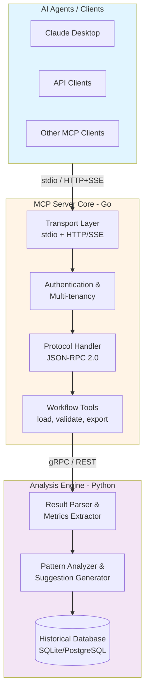

# Arcaflow MCP Server

[](https://opensource.org/licenses/Apache-2.0)
[](https://go.dev/doc/install)
[](https://www.python.org/downloads/)

A Model Context Protocol (MCP) server that enables natural language conversations
with AI agents to build, validate, and optimize Arcaflow workflow inputs, and
analyze workflow execution results.

## What is Arcaflow MCP?

Arcaflow MCP bridges the gap between natural language conversations and
machine-readable Arcaflow workflows. It provides:

- **Input Construction**: Conversationally build and validate workflow inputs
  through natural dialogue with AI agents
- **Result Analysis**: Analyze workflow execution outputs and receive AI-driven
  optimization suggestions
- **Schema Validation**: Ensure 100% deterministic, schema-valid inputs that
  work with Arcaflow workflows
- **Multi-Source Workflows**: Discover and load workflows from filesystem, URLs,
  and git repositories

**Key Principle:** Produce deterministic, schema-validated JSON/YAML inputs
guaranteed to work with Arcaflow workflows and plugins.

## Quick Start

### For End Users

Choose your deployment mode:

**Local Mode** (Recommended for desktop AI clients):
```bash
# 1. Build the server
cd server && go build -o arcaflow-mcp ./cmd/arcaflow-mcp

# 2. Configure your MCP client (Claude Desktop, etc.)
# See: docs/arcaflow-mcp/usage/local-mode.md

# 3. Client launches server automatically
```

**Server Mode** (For multi-user deployments):
```bash
# 1. Set data directory location (change this path if needed)
export DATA_DIR="./data"

# 2. Create data directory
mkdir -p "$DATA_DIR"

# 3. Set admin token (for testing; use secure random for production)
export ARCAFLOW_MCP_ADMIN_TOKEN="dev-admin-token-$(date +%s)"

# 4. Configure data storage paths (all use $DATA_DIR)
export ARCAFLOW_MCP_TOKEN_STORE_PATH="$DATA_DIR/tokens.json"
export ARCAFLOW_MCP_TENANT_STORE_PATH="$DATA_DIR/tenants.json"
export ARCAFLOW_MCP_AUDIT_STORE_PATH="$DATA_DIR/audit.json"
export ARCAFLOW_MCP_USAGE_STORE_PATH="$DATA_DIR/usage.json"
export ARCAFLOW_MCP_TENANT_WORKSPACE_ROOT="$DATA_DIR/tenants"

# 5. Start the server
./server/arcaflow-mcp --mode server --address 127.0.0.1:8080

# 5. Connect AI clients via HTTP/SSE
# See: docs/arcaflow-mcp/usage/server-mode.md
```

**Note:** For production, generate a secure token: `openssl rand -hex 32`

📖 **Detailed Setup**: See [Getting Started Guide](docs/arcaflow-mcp/getting-started.md)

### For Developers

```bash
# 1. Install git hooks and dependencies
./scripts/dev-setup.sh

# 2. Install Python dependencies
cd analysis && poetry install

# 3. Download Go dependencies
cd ../server && go mod download

# 4. Verify setup
cd .. && ./scripts/validate.sh

# 5. Run tests
./scripts/test-all.sh
```

📖 **Detailed Setup**: See [Development Setup](docs/development/setup.md)

## Documentation

📚 **[Project Documentation Index](docs/README.md)** - Complete technical documentation for contributors

### For Contributors and Developers

Project documentation for working on this codebase:

**Getting Started:**
- **[Development Setup](docs/development/setup.md)** - Environment setup and workflow
- **[Contributing Guide](CONTRIBUTING.md)** - How to contribute code and documentation
- **[Testing Guide](docs/development/testing.md)** - Testing standards and coverage requirements
- **[Debugging Guide](docs/development/debugging.md)** - Debugging techniques and common issues

**Technical Documentation:**
- **[Architecture Documentation](docs/architecture/README.md)** - System design and internals
- **[API Reference](docs/api/README.md)** - Go and Python API documentation
- **[Architecture Decisions (ADRs)](docs/adr/README.md)** - Design rationale and trade-offs

**Component Documentation:**
- **[Server Component](server/README.md)** - Go MCP server (protocol, transports, tools)
- **[Analysis Component](analysis/README.md)** - Python analysis engine (suggestions, optimization)
- **[Example Workflows](examples/README.md)** - Demo workflows for testing and learning

### For End Users

User-facing documentation is maintained separately for integration with the main Arcaflow documentation site:

- **[User Documentation](docs/arcaflow-mcp/)** - Complete user guides (MkDocs format)
  - Installation and getting started
  - Local mode and server mode setup
  - Configuration reference
  - Deployment guides (containers, Kubernetes)
  - Tool reference and usage examples
  - Troubleshooting and FAQ

**Note:** User documentation is built with MkDocs and published to [arcalot.io](https://arcalot.io/arcaflow). It covers the same functionality from an end-user perspective (installation, usage, deployment) rather than a contributor perspective (implementation, architecture, APIs).

## Features

### Current Features

✅ **Input Construction**
- Discover workflows from filesystem, URLs, and git repositories
- Extract JSON schemas from workflow definitions
- Build inputs conversationally through natural language
- Validate inputs against schemas (100% validation enforcement)
- Export deterministic, schema-validated JSON/YAML files

✅ **Result Analysis**
- Load workflow execution results (JSON, YAML, logs)
- Parse and extract metrics from results
- Analyze results against user-defined goals
- Compare outputs across multiple runs
- Generate AI-driven optimization suggestions

✅ **MCP Protocol**
- Full MCP 2025-11-25 specification compliance
- Stdio transport (local mode)
- HTTP/SSE transport (server mode)
- Bearer token authentication
- Multi-tenant workspace isolation
- Rate limiting and audit logging

✅ **Workflow Discovery**
- Smart workflow discovery with caching
- Selection guidance for multiple matches
- Progress feedback for long-running git operations

### Planned Features

📋 **In Progress**: Documentation & Examples  
📦 **Planned**: Deployment & Distribution  
📊 **Planned**: Advanced Analysis & Visualization  
🚀 **Future**: Workflow execution integration  
🔄 **Future**: Iterative optimization loops  
✨ **Future**: Workflow creation and composition

## Architecture

Hybrid Go + Python architecture:



📖 **Learn More**: [Architecture Overview](docs/architecture/overview.md)

## Repository Structure

```
arcaflow-mcp/
├── server/          # Go MCP server core
│   ├── cmd/         # Server binaries
│   ├── pkg/         # Go packages
│   └── test/        # Integration tests
├── analysis/        # Python analysis engine
│   ├── arcaflow_analysis/  # Python package
│   └── tests/       # Python tests
├── api/             # Shared API definitions (protobuf)
├── docs/            # Documentation
│   ├── arcaflow-mcp/   # User docs (for Arcaflow integration)
│   ├── architecture/   # Technical architecture
│   ├── adr/           # Architecture Decision Records
│   ├── api/           # API documentation
│   └── development/   # Development guides
├── examples/        # Example workflows and tutorials
├── scripts/         # Development and CI scripts
└── AGENTS.md        # AI agent behavioral guidelines
```

## Version Compatibility

| Arcaflow MCP | Arcaflow Engine | MCP Spec    |
|--------------|-----------------|-------------|
| 0.1.0 (dev)  | 0.20.0+         | 2025-11-25  |

**Arcaflow Resources:**
- [Arcaflow Documentation](https://arcalot.io/arcaflow)
- [Arcaflow Engine](https://github.com/arcalot/arcaflow-engine)
- [Arcalot Community](https://github.com/arcalot/arcalot-round-table)

**MCP Resources:**
- [MCP Specification](https://modelcontextprotocol.io/specification/2025-11-25/)
- [MCP Examples](https://modelcontextprotocol.io/examples)

## Prerequisites

### Runtime Requirements

- **Go**: 1.23.0 (exact version per Arcaflow standards)
- **Python**: 3.12 (exact version per Arcaflow standards)
- **Poetry**: 1.8.3 (Python dependency management)

### Development Requirements

- **protoc**: Protocol buffer compiler with Go and Python plugins
- **Podman/Buildah**: Container build tools (Docker-compatible)
- **golangci-lint**: Go linting (used by validation scripts)

### Optional

- **Claude Desktop** or similar MCP client for local mode testing
- **Kubernetes**: For server mode deployment in K8s
- **PostgreSQL**: For production server mode (SQLite used for dev)

## Contributing

We welcome contributions! Please see:

- **[Contributing Guide](CONTRIBUTING.md)** - How to contribute
- **[Code of Conduct](CODE_OF_CONDUCT.md)** - Community standards
- **[Development Setup](docs/development/setup.md)** - Get started developing

### Development Workflow

1. Read `AGENTS.md` for coding standards and AI agent behavior
2. Run `scripts/dev-setup.sh` to install git hooks
3. Write tests WITH code (not after)
4. Update documentation immediately (not deferred)
5. Ensure hooks pass before committing

### Testing

```bash
# Run all tests
./scripts/test-all.sh

# Run Go tests only
./scripts/test-go.sh

# Run Python tests only
./scripts/test-python.sh

# Run validation (linting, formatting)
./scripts/validate.sh
```

Minimum test coverage: 85%

## AI-Assisted Development

This project is developed with AI coding agents (Claude Sonnet, Gemini, etc.).
Agent behavior and quality standards are defined in `AGENTS.md`.

**For AI Agents:**
- Read `AGENTS.md` for coding standards and behavioral guidelines
- Keep tests and documentation in lockstep with code changes
- Require explicit confirmation before scope changes

**For Humans:**
- Require explicit confirmation before scope changes
- Request summaries of changes and follow-up commands

## Security

**Reporting Security Issues:**

Please report security vulnerabilities to the maintainers privately. See
[SECURITY.md](SECURITY.md) for details.

**Security Features:**
- Bearer token authentication (server mode)
- Multi-tenant workspace isolation
- Rate limiting per tenant
- TLS 1.3 support
- Audit logging for all operations
- Input validation at all boundaries

## License

Apache 2.0 - See [LICENSE](LICENSE) for details.

Aligned with Arcalot community licensing for seamless integration.

## Community

- **Arcalot Community**: [GitHub Organization](https://github.com/arcalot)
- **Arcalot Round Table**: [Community Hub](https://github.com/arcalot/arcalot-round-table)
- **Issue Tracker**: [GitHub Issues](https://github.com/arcalot/arcaflow-mcp/issues)

## Changelog

See [CHANGELOG.md](CHANGELOG.md) for version history and release notes.

## Acknowledgments

Built on the excellent work of:
- The Arcalot community and Arcaflow project
- The Model Context Protocol specification authors
- All contributors to this project

---

**Ready to get started?** → [Getting Started Guide](docs/arcaflow-mcp/getting-started.md)

**Need help?** → [Troubleshooting Guide](docs/arcaflow-mcp/troubleshooting.md)

**Want to contribute?** → [Contributing Guide](CONTRIBUTING.md)
