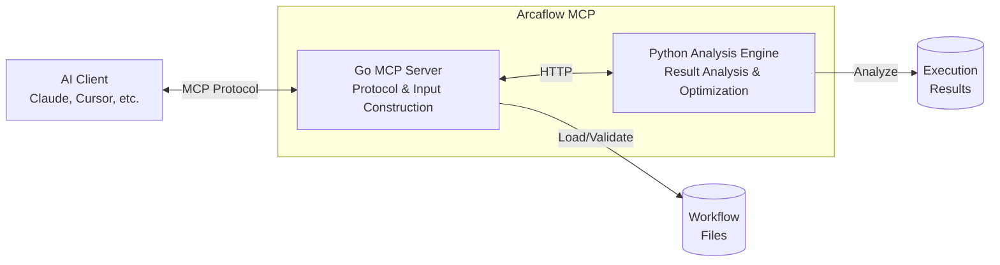

# Arcaflow MCP Server

[](https://opensource.org/licenses/Apache-2.0)
[](https://go.dev/doc/install)
[](https://www.python.org/downloads/)

A Model Context Protocol (MCP) server that enables natural language conversations
with AI agents to build, validate, and optimize Arcaflow workflow inputs, and
analyze workflow execution results.

## What is Arcaflow MCP?

Arcaflow MCP bridges the gap between natural language conversations and
machine-readable Arcaflow workflows. It provides:

- **Input Construction**: Conversationally build and validate workflow inputs
  through natural dialogue with AI agents
- **Result Analysis**: Analyze workflow execution outputs and receive AI-driven
  optimization suggestions
- **Schema Validation**: Ensure 100% deterministic, schema-valid inputs that
  work with Arcaflow workflows
- **Multi-Source Workflows**: Discover and load workflows from filesystem, URLs,
  and git repositories

**Key Principle:** Produce deterministic, schema-validated JSON/YAML inputs
guaranteed to work with Arcaflow workflows and plugins.

**Multi-Tenancy:** In server mode, create isolated workspaces for multiple
teams or users called "tenants." Each tenant has independent authentication
tokens and workspace directories, ensuring data isolation. See
[Multi-Tenancy Concepts](docs/arcaflow-mcp/concepts/multi-tenancy.md) and
[Authentication Setup](docs/arcaflow-mcp/deployment/authentication.md).

## Get Involved

- 💡 **[Request Features](https://github.com/arcalot/arcaflow-mcp/issues/new?template=feature_request.yml)** - Suggest new capabilities
- 🐛 **[Report Bugs](https://github.com/arcalot/arcaflow-mcp/issues/new?template=bug_report.yml)** - Help us improve quality
- 📋 **[View Roadmap](ROADMAP.md)** - See what's planned and in progress
- ✅ **[Feature Status](FEATURE_STATUS.md)** - Comprehensive list of all features
- 🔧 **[Contribute Code](CONTRIBUTING.md)** - Submit improvements and fixes
- 💬 **[Join Discussions](https://github.com/arcalot/arcalot-round-table/discussions)** - Community Q&A and ideas

## Architecture

Arcaflow MCP uses a **hybrid two-component architecture**:



**Component Responsibilities:**

| Component | Purpose | Required For |
|-----------|---------|--------------|
| **Go MCP Server** | MCP protocol handler, workflow loading, input validation | Workflow input construction (always required) |
| **Python Analysis Engine** | Result parsing, statistical analysis, optimization suggestions | Workflow result analysis and input refinement |

**When do you need both components?**
- **Input Construction Only**: Go server is sufficient
- **Result Analysis**: Both Go server AND Python engine required

## Prerequisites

### For End Users (Containerized Deployment)

- **Docker** or **Podman** - Container runtime for running pre-built images
- No language runtimes required when using containers

### For Developers (Building from Source)

- **Go**: 1.24+ - See badge above for current version
- **Python**: 3.12 or 3.13 - See badge above for supported versions
- **Poetry**: 1.8.3+ - Python dependency management
- **protoc**: Protocol buffer compiler (for API changes)
- **golangci-lint**: Go linting tool

**Version Details:** See [Version Management](docs/development/version-management.md)

**Architecture Note:** The Go server communicates with the Python analysis
engine via HTTP REST API (default: `http://localhost:8081`)

## Quick Start

### For End Users

Choose your deployment method:

#### Option 1: Use Pre-Built Containers (Fastest) ⚡

**Important**: Arcaflow MCP requires **TWO components**:
- **Go MCP Server** (protocol handler)
- **Python Analysis Engine** (result analysis)

> **🚨 Pre-Release Note (Before v0.1.0)**: Container tags change with each commit.
> Get the current tag: `export TAG=$(curl -s https://raw.githubusercontent.com/arcalot/arcaflow-mcp/main/scripts/get-container-tag.sh | bash)`
> After v0.1.0, use `:latest` or version tags like `:v1.0.0`

**Local Mode** (Desktop AI clients):

```bash
# Get current development tag
export TAG=$(curl -s https://raw.githubusercontent.com/arcalot/arcaflow-mcp/main/scripts/get-container-tag.sh | bash)

# Pull BOTH components
podman pull quay.io/arcalot/arcaflow-mcp-server:${TAG}
podman pull quay.io/arcalot/arcaflow-mcp-analysis:${TAG}

# Start COMPONENT 1: Analysis engine FIRST (background service)
podman run -d --name arcaflow-analysis \
  -p 8081:8081 \
  quay.io/arcalot/arcaflow-mcp-analysis:${TAG}

# Wait for startup and verify
sleep 2
curl http://localhost:8081/health
# Expected: {"status":"healthy"}
```

**Configure MCP Client** (Component 2):

Add to your MCP client settings (e.g., Claude Desktop `~/Library/Application Support/Claude/claude_desktop_config.json`).

**Replace `main-abc1234` with your actual tag:**

```json
{
  "mcpServers": {
    "arcaflow": {
      "command": "podman",
      "args": [
        "run", "--rm", "-i",
        "--network", "host",
        "-e", "ARCAFLOW_MCP_ANALYSIS_HTTP_URL=http://localhost:8081",
        "quay.io/arcalot/arcaflow-mcp-server:main-abc1234",
        "--mode", "local"
      ]
    }
  }
}
```

The client will launch Component 2 (MCP server) on-demand, which connects to Component 1 (analysis engine).

**Verify setup:** Open your AI client and ask: `"Can you see the Arcaflow MCP server?"`

**Server Mode** (Multi-tenant deployments):

```bash
# Step 1: Get compose file (deploys BOTH components together)
curl -O https://raw.githubusercontent.com/arcalot/arcaflow-mcp/main/deploy/container/compose.yml

# Step 2: Generate admin token (used for tenant management)
export ARCAFLOW_MCP_ADMIN_TOKEN="$(openssl rand -base64 32)"
echo "Save this admin token securely: $ARCAFLOW_MCP_ADMIN_TOKEN"

# Step 3: Start both services
docker compose up -d
# Or: podman-compose up -d

# Both components now running:
# - Analysis engine: localhost:8081
# - MCP server: localhost:8080

# Step 4: Create your first tenant
curl -X POST http://localhost:8080/admin/tenants \
  -H "Authorization: Bearer $ARCAFLOW_MCP_ADMIN_TOKEN" \
  -H "Content-Type: application/json" \
  -d '{"tenant_id":"my-team","display_name":"My Team"}'

# Step 5: Create tenant token (users will use this to access MCP)
curl -X POST http://localhost:8080/admin/tenants/my-team/tokens \
  -H "Authorization: Bearer $ARCAFLOW_MCP_ADMIN_TOKEN" \
  -H "Content-Type: application/json" \
  -d '{}' | tee tenant-token.json

# Step 6: Distribute tenant token to users for AI client configuration
echo "Give the token from tenant-token.json to your users"
```

**Next Steps:**
- 📖 **Complete tenant setup**: [Authentication Guide](docs/arcaflow-mcp/deployment/authentication.md)
- 📖 **Understand multi-tenancy**: [Multi-Tenancy Concepts](docs/arcaflow-mcp/concepts/multi-tenancy.md)
- 📖 **Container deployment details**: [Container Deployment](docs/arcaflow-mcp/deployment/container.md)

**Available Tags**: The `latest` tag tracks the main branch. After v0.1.0, use version tags (e.g., `v1.0.0`) for stability. Browse all tags at [quay.io/arcalot](https://quay.io/organization/arcalot).

#### Option 2: Download Pre-Compiled Binaries 📦

**Download from GitHub Releases** (available after v0.1.0):

**Go MCP Server:**
```bash
# Download latest release for your platform
# Linux x86_64
curl -L https://github.com/arcalot/arcaflow-mcp/releases/latest/download/arcaflow-mcp-linux-amd64 -o arcaflow-mcp
chmod +x arcaflow-mcp

# macOS arm64 (Apple Silicon)
curl -L https://github.com/arcalot/arcaflow-mcp/releases/latest/download/arcaflow-mcp-darwin-arm64 -o arcaflow-mcp
chmod +x arcaflow-mcp

# macOS x86_64 (Intel)
curl -L https://github.com/arcalot/arcaflow-mcp/releases/latest/download/arcaflow-mcp-darwin-amd64 -o arcaflow-mcp
chmod +x arcaflow-mcp

# Windows x86_64
curl -L https://github.com/arcalot/arcaflow-mcp/releases/latest/download/arcaflow-mcp-windows-amd64.exe -o arcaflow-mcp.exe
```

**Python Analysis Engine:**

The analysis engine requires installation from source or use containers. PyPI distribution planned.

```bash
# Current: Use containers (recommended)
podman pull quay.io/arcalot/arcaflow-mcp-analysis:latest

# Or install from source:
cd analysis && poetry install
poetry run python -m arcaflow_analysis.server.http_server
```

**Browse Releases**: [github.com/arcalot/arcaflow-mcp/releases](https://github.com/arcalot/arcaflow-mcp/releases)

**Note**: Go binaries available after v0.1.0. For now, use containers or build from source.

#### Option 3: Build from Source (For Development) 🔧

**Requires building BOTH components** (two-component architecture).

**Local Mode** (Recommended for desktop AI clients):
```bash
# Build COMPONENT 1: Go MCP server
cd server && go build -o arcaflow-mcp ./cmd/arcaflow-mcp

# Start COMPONENT 2: Python analysis engine (background service)
cd ../analysis
poetry install
poetry run python -m arcaflow_analysis.server.http_server &

# Configure your MCP client to launch Component 1 (Claude Desktop, etc.)
# Add ARCAFLOW_MCP_ANALYSIS_HTTP_URL=http://localhost:8081 to env
# See: docs/arcaflow-mcp/usage/local-mode.md

# Client launches MCP server (Component 1) which connects to
# analysis engine (Component 2) at http://localhost:8081
```

**Note:** Both components required. Analysis engine (Component 2) provides result analysis; MCP server (Component 1) handles protocol and workflows.

**Server Mode** (For multi-user deployments):
```bash
# Set data directory location
export DATA_DIR="./data"
mkdir -p "$DATA_DIR"

# Set admin token (use secure random for production)
export ARCAFLOW_MCP_ADMIN_TOKEN="dev-admin-token-$(date +%s)"

# Configure data storage paths
export ARCAFLOW_MCP_TOKEN_STORE_PATH="$DATA_DIR/tokens.json"
export ARCAFLOW_MCP_TENANT_STORE_PATH="$DATA_DIR/tenants.json"
export ARCAFLOW_MCP_AUDIT_STORE_PATH="$DATA_DIR/audit.json"
export ARCAFLOW_MCP_USAGE_STORE_PATH="$DATA_DIR/usage.json"
export ARCAFLOW_MCP_TENANT_WORKSPACE_ROOT="$DATA_DIR/tenants"

# Start COMPONENT 2: Python analysis engine (Terminal 1 or background)
cd analysis
poetry install
poetry run python -m arcaflow_analysis.server.http_server &
cd ..

# Start COMPONENT 1: Go MCP server (Terminal 2)
export ARCAFLOW_MCP_ANALYSIS_HTTP_URL="http://localhost:8081"
./server/arcaflow-mcp --mode server --address 127.0.0.1:8080

# Both components running and connected!
# - Analysis engine: localhost:8081
# - MCP server: localhost:8080
# See: docs/arcaflow-mcp/usage/server-mode.md
```

**Note:** Both components required for full functionality. For production, generate a secure token: `openssl rand -hex 32`

📖 **Detailed Setup**: See [Getting Started Guide](docs/arcaflow-mcp/getting-started.md)

### For Developers

```bash
# 1. Install git hooks and dependencies
./scripts/dev-setup.sh

# 2. Install Python dependencies
cd analysis && poetry install

# 3. Download Go dependencies
cd ../server && go mod download

# 4. Verify setup
cd .. && ./scripts/validate.sh

# 5. Run tests
./scripts/test-all.sh
```

📖 **Detailed Setup**: See [Development Setup](docs/development/setup.md)

## Documentation

📚 **[Project Documentation Index](docs/README.md)** - Complete technical documentation for contributors

### For Contributors and Developers

Project documentation for working on this codebase:

**Getting Started:**
- **[Development Setup](docs/development/setup.md)** - Environment setup and workflow
- **[Contributing Guide](CONTRIBUTING.md)** - How to contribute code and documentation
- **[Testing Guide](docs/development/testing.md)** - Testing standards and coverage requirements
- **[Debugging Guide](docs/development/debugging.md)** - Debugging techniques and common issues

**Technical Documentation:**
- **[Architecture Documentation](docs/architecture/README.md)** - System design and internals
- **[API Reference](docs/api/README.md)** - Go and Python API documentation
- **[Architecture Decisions (ADRs)](docs/adr/README.md)** - Design rationale and trade-offs

**Component Documentation:**
- **[Server Component](server/README.md)** - Go MCP server (protocol, transports, tools)
- **[Analysis Component](analysis/README.md)** - Python analysis engine (suggestions, optimization)
- **[Example Workflows](examples/README.md)** - Demo workflows for testing and learning

### For End Users

User-facing documentation is maintained separately for integration with the main Arcaflow documentation site:

- **[User Documentation](docs/arcaflow-mcp/)** - Complete user guides (MkDocs format)
  - Installation and getting started
  - Local mode and server mode setup
  - Configuration reference
  - Deployment guides (containers, Kubernetes)
  - Tool reference and usage examples
  - Troubleshooting and FAQ

**Note:** User documentation is built with MkDocs and published to [arcalot.io](https://arcalot.io/arcaflow). It covers the same functionality from an end-user perspective (installation, usage, deployment) rather than a contributor perspective (implementation, architecture, APIs).

## Features

### Current Features

✅ **Input Construction**
- Discover workflows from filesystem, URLs, and git repositories
- Extract JSON schemas from workflow definitions
- Build inputs conversationally through natural language
- Validate inputs against schemas (100% validation enforcement)
- Export deterministic, schema-validated JSON/YAML files

✅ **Result Analysis**
- Load workflow execution results (JSON, YAML, logs)
- Parse and extract metrics from results
- Analyze results against user-defined goals
- Compare outputs across multiple runs
- Generate AI-driven optimization suggestions

✅ **MCP Protocol**
- Full MCP 2025-11-25 specification compliance
- Stdio transport (local mode)
- HTTP/SSE transport (server mode)
- Bearer token authentication
- Multi-tenant workspace isolation
- Rate limiting and audit logging

✅ **Workflow Discovery**
- Smart workflow discovery with caching
- Selection guidance for multiple matches
- Progress feedback for long-running git operations

### Planned Features

See [Roadmap](ROADMAP.md) for detailed timeline and [Feature Status](FEATURE_STATUS.md) for comprehensive feature matrix.

**Highlights:**
- 📦 **v0.1.0** (Q1 2026): Core features, binary distribution, container stability
- 🚀 **v0.2.0** (Q2 2026): Workflow execution, iterative optimization, advanced analysis
- ✨ **v0.3.0** (Q3 2026): Workflow creation and composition
- 🔮 **Future**: Advanced security, ML-based optimization, platform integrations

**Want to influence priorities?** [Request a feature](https://github.com/arcalot/arcaflow-mcp/issues/new?template=feature_request.yml) or vote on existing issues!

📖 **Learn More**: [Architecture Overview](docs/architecture/overview.md)

## Repository Structure

```
arcaflow-mcp/
├── server/          # Go MCP server core
│   ├── cmd/         # Server binaries
│   ├── pkg/         # Go packages
│   └── test/        # Integration tests
├── analysis/        # Python analysis engine
│   ├── arcaflow_analysis/  # Python package
│   └── tests/       # Python tests
├── api/             # Shared API definitions (protobuf)
├── docs/            # Documentation
│   ├── arcaflow-mcp/   # User docs (for Arcaflow integration)
│   ├── architecture/   # Technical architecture
│   ├── adr/           # Architecture Decision Records
│   ├── api/           # API documentation
│   └── development/   # Development guides
├── examples/        # 🌟 Example workflows for testing (START HERE!)
│   └── workflows/   # hello-world, data-processing, perf-test
├── deploy/          # Deployment configurations (containers, k8s)
├── scripts/         # Development and CI scripts
└── AGENTS.md        # AI agent behavioral guidelines
```

**🎯 New to Arcaflow MCP?** Start with the [examples/workflows/](examples/) directory for ready-to-use test workflows.

## Version Compatibility

| Arcaflow MCP | Arcaflow Engine | MCP Spec    |
|--------------|-----------------|-------------|
| 0.1.0 (dev)  | 0.20.0+         | 2025-11-25  |

**Arcaflow Resources:**
- [Arcaflow Documentation](https://arcalot.io/arcaflow)
- [Arcaflow Engine](https://github.com/arcalot/arcaflow-engine)
- [Arcalot Community](https://github.com/arcalot/arcalot-round-table)

**MCP Resources:**
- [MCP Specification](https://modelcontextprotocol.io/specification/2025-11-25/)
- [MCP Examples](https://modelcontextprotocol.io/examples)

## Contributing

We welcome all types of contributions! Here's how you can help:

- 💡 **[Request Features](https://github.com/arcalot/arcaflow-mcp/issues/new?template=feature_request.yml)** - Suggest new capabilities
- 🐛 **[Report Bugs](https://github.com/arcalot/arcaflow-mcp/issues/new?template=bug_report.yml)** - Help us improve quality
- 📝 **Improve Documentation** - Help others understand and use the project
- 🔧 **Submit Code** - Fix bugs or implement features
- 🧪 **Test Early Releases** - Provide feedback on alpha/beta versions
- 💬 **Participate in Discussions** - Share expertise and help others

**Getting Started:**
- **[Contributing Guide](CONTRIBUTING.md)** - Complete contribution workflow
- **[Code of Conduct](CODE_OF_CONDUCT.md)** - Community standards
- **[Development Setup](docs/development/setup.md)** - Environment setup
- **[Roadmap](ROADMAP.md)** - See what's planned
- **[Maintainers](MAINTAINERS.md)** - Project governance

### Quick Start for Contributors

```bash
# 1. Setup environment
./scripts/dev-setup.sh

# 2. Make changes (write tests + docs alongside code!)

# 3. Validate before committing
./scripts/validate.sh

# 4. Run tests
./scripts/test-all.sh  # Minimum 85% coverage required
```

See [Contributing Guide](CONTRIBUTING.md) for complete workflow, coding standards, and PR process.

## AI-Assisted Development

This project is developed with AI coding agents (Claude Sonnet, Gemini, etc.).
Agent behavior and quality standards are defined in `AGENTS.md`.

**For AI Agents:**
- Read `AGENTS.md` for coding standards and behavioral guidelines
- Keep tests and documentation in lockstep with code changes
- Require explicit confirmation before scope changes

**For Humans:**
- Require explicit confirmation before scope changes
- Request summaries of changes and follow-up commands

## Security

**Reporting Security Issues:**

Please report security vulnerabilities to the maintainers privately. See
[SECURITY.md](SECURITY.md) for details.

**Security Features:**
- Bearer token authentication (server mode)
- Multi-tenant workspace isolation
- Rate limiting per tenant
- TLS 1.3 support
- Audit logging for all operations
- Input validation at all boundaries

## License

Apache 2.0 - See [LICENSE](LICENSE) for details.

Aligned with Arcalot community licensing for seamless integration.

## Community

### Get Help and Connect

- 💬 **[Community Discussions](https://github.com/arcalot/arcalot-round-table/discussions)** - Ask questions, share ideas
- 🐛 **[Issue Tracker](https://github.com/arcalot/arcaflow-mcp/issues)** - Report bugs, request features
- 📖 **[Documentation](docs/arcaflow-mcp/)** - User guides and tutorials
- ❓ **[FAQ](docs/arcaflow-mcp/faq.md)** - Frequently asked questions
- 🔧 **[Troubleshooting](docs/arcaflow-mcp/troubleshooting.md)** - Common issues and solutions

### Project Resources

- 📋 **[Roadmap](ROADMAP.md)** - Development timeline and priorities
- ✅ **[Feature Status](FEATURE_STATUS.md)** - Comprehensive feature matrix
- 👥 **[Maintainers](MAINTAINERS.md)** - Project governance
- 🏛️ **[Arcalot Community](https://github.com/arcalot)** - Broader ecosystem

### Stay Informed

- Watch this repository for updates
- Join [Arcalot discussions](https://github.com/arcalot/arcalot-round-table/discussions)
- Follow releases for new versions

## Changelog

See [CHANGELOG.md](CHANGELOG.md) for version history and release notes.

## Acknowledgments

Built on the excellent work of:
- The Arcalot community and Arcaflow project
- The Model Context Protocol specification authors
- All contributors to this project

---

**Ready to get started?** → [Getting Started Guide](docs/arcaflow-mcp/getting-started.md)

**Need help?** → [Troubleshooting Guide](docs/arcaflow-mcp/troubleshooting.md)

**Want to contribute?** → [Contributing Guide](CONTRIBUTING.md)
