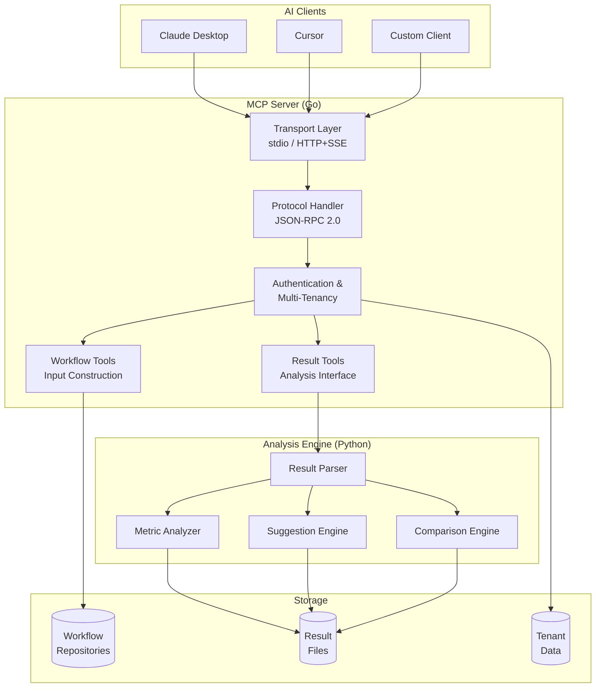
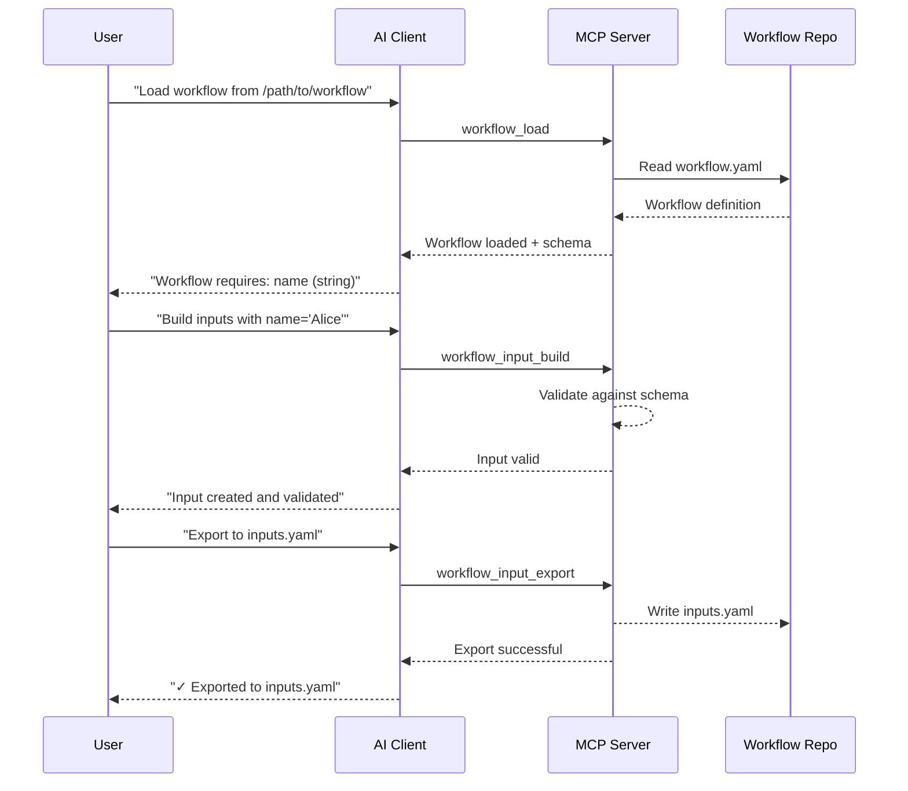
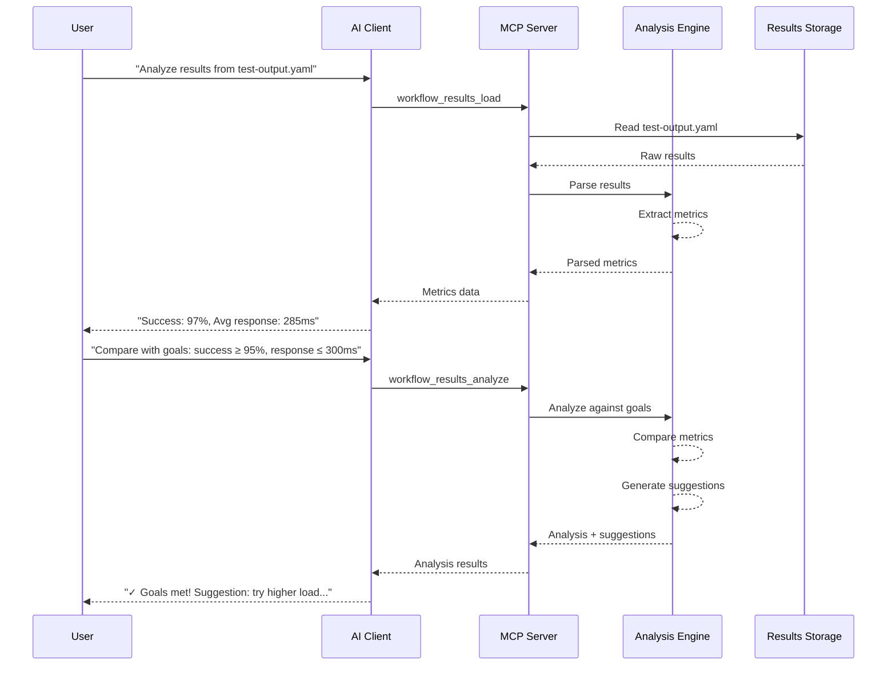
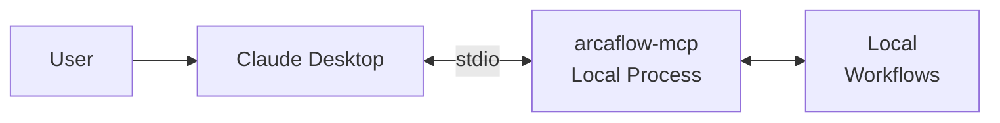
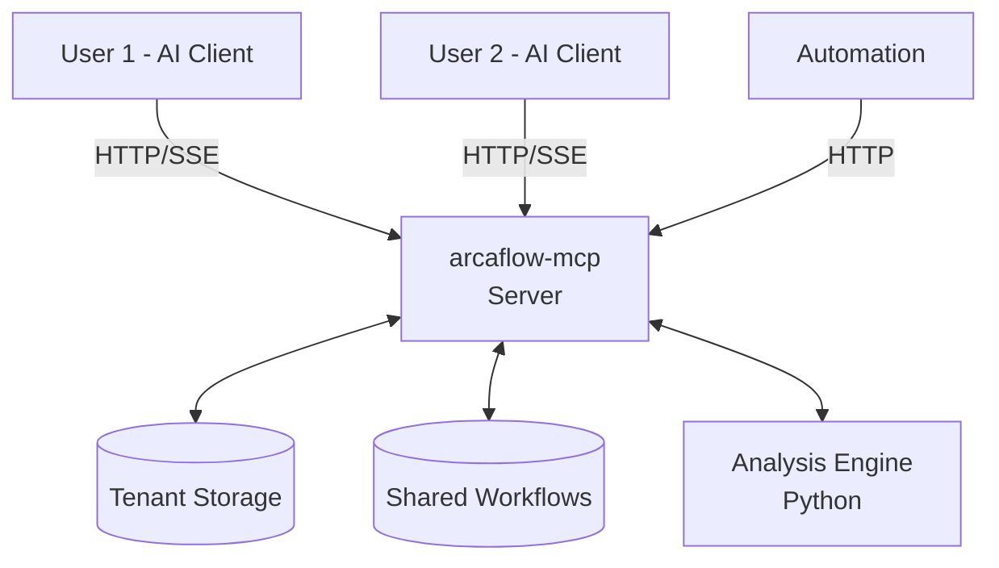
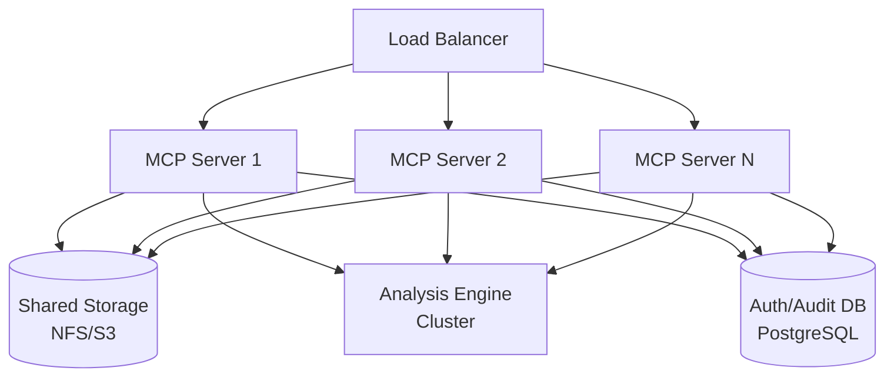

# Architecture

**System Design from a User Perspective**

Arcaflow MCP is a hybrid system combining a Go-based MCP server with a Python analysis engine, providing natural language capabilities for Arcaflow workflow input construction and result analysis.

---

## Two-Component Architecture

**Arcaflow MCP consists of TWO independent components:**

| Component | Technology | Purpose | Required For |
|-----------|-----------|---------|--------------|
| **Go MCP Server** | Go 1.23+ | MCP protocol handler, workflow loading, input validation | **Always required** |
| **Python Analysis Engine** | Python 3.12+ | Result parsing, analysis, optimization suggestions | **Only for result analysis** |

### Component Dependencies

```
Task: Build workflow inputs
└── Requires: Go MCP Server only

Task: Analyze workflow results  
├── Requires: Go MCP Server (always)
└── Requires: Python Analysis Engine (for analysis features)
```

### Why Two Components?

**Go Server:**
- Fast protocol handling and concurrency
- Single binary deployment (no runtime dependencies)
- Strong typing for MCP compliance
- Efficient input validation

**Python Engine:**
- Rich data science ecosystem (NumPy, Pandas concepts)
- Flexible analysis algorithms
- Easy integration with AI/ML libraries (future)
- Rapid development for new analysis features

### Communication

- **Local Mode**: Go server connects to Python engine at `http://localhost:8081`
- **Server Mode**: Both run as services, connected via internal HTTP

### Startup Order

**Critical:** If using result analysis features, start components in this order:
1. **Python Analysis Engine FIRST** (runs on port 8081)
2. **Go MCP Server SECOND** (connects to analysis engine)

The Go server will fail to start or function partially if analysis engine is needed but not reachable.

---

## High-Level Architecture



---

## Components

### AI Clients

**What they do:**
- Provide natural language interface to users
- Manage MCP server lifecycle (local mode) or connect to server (server mode)
- Send JSON-RPC requests to MCP server
- Display AI-generated responses based on MCP tool results

**Examples:**
- Claude Desktop (Anthropic's AI assistant)
- Cursor (AI-powered code editor)
- Custom MCP clients using MCP SDKs

### MCP Server (Go)

**What it does:**
- Implements Model Context Protocol (MCP) specification
- Handles transport (stdio for local, HTTP/SSE for server)
- Manages authentication and multi-tenancy (server mode)
- Provides MCP tools for workflow input construction
- Interfaces with Python analysis engine for result analysis

**Why Go:**
- Fast, compiled binary with no runtime dependencies
- Excellent concurrency for handling multiple clients
- Strong static typing for protocol compliance
- Easy deployment (single binary)

**Key Functions:**
- Load workflows from filesystem, git, or URLs
- Extract and validate workflow schemas
- Build and validate workflow inputs
- Coordinate result analysis with Python engine
- Manage tenant workspaces and authentication (server mode)

### Analysis Engine (Python)

**What it does:**
- Parses workflow execution results (YAML/JSON)
- Extracts metrics and statistics
- Analyzes performance against goals
- Generates optimization suggestions
- Compares multiple result sets

**Why Python:**
- Rich ecosystem for data analysis (NumPy, Pandas concepts)
- Flexible for AI/ML integration (future)
- Rapid development for analysis algorithms
- Strong support for scientific computing

**Key Functions:**
- Parse structured and semi-structured results
- Calculate statistical metrics (mean, median, percentiles)
- Identify trends and patterns
- Generate natural language suggestions
- Rank configurations by multiple criteria

---

## Data Flow

### Input Construction Flow



### Result Analysis Flow



---

## Deployment Models

### Local Mode Deployment



**Characteristics:**
- Single process per user
- No network required
- No persistence
- Simple configuration

### Server Mode Deployment (Single Instance)



**Characteristics:**
- Multi-user support
- Persistent tenant data
- Authentication required
- Network accessible

### Server Mode Deployment (Production/HA)



**Characteristics:**
- High availability
- Horizontal scaling
- Shared state via external storage
- Production-grade reliability

---

## Communication Patterns

### Local Mode (stdio)

**Request:**
```
AI Client → stdin → MCP Server
```

**Response:**
```
MCP Server → stdout → AI Client
```

**Characteristics:**
- Synchronous communication
- Single request at a time
- In-order processing
- No session management needed

### Server Mode (HTTP/SSE)

**Without Session Binding (Simple):**
```
Client → HTTP POST /mcp → Server
Server → HTTP Response → Client
```

**With Session Binding (Stateful):**
```
Client → GET /mcp/events → Server (SSE stream opens)
Server → Mcp-Session-Id header → Client
Client → POST /mcp (with Mcp-Session-Id) → Server
Server → SSE event → Client (via stream)
```

**Characteristics:**
- Asynchronous with SSE for responses
- Multiple concurrent requests
- Session-based state (optional)
- Suitable for multi-step workflows

---

## Storage and Persistence

### Local Mode

**No persistence:**
- All state in memory
- Lost when client closes
- No historical tracking
- Fresh state each session

### Server Mode

**Persistent storage:**

**Tenant Data:**
- Path: `$ARCAFLOW_MCP_TENANT_STORE_PATH`
- Contains: Tenant records, metadata
- Format: JSON

**Authentication:**
- Path: `$ARCAFLOW_MCP_TOKEN_STORE_PATH`
- Contains: Token-to-tenant mappings
- Format: JSON

**Audit Logs:**
- Path: `$ARCAFLOW_MCP_AUDIT_STORE_PATH`
- Contains: All operations with timestamps
- Format: JSON (append-only)

**Usage Metrics:**
- Path: `$ARCAFLOW_MCP_USAGE_STORE_PATH`
- Contains: Per-tenant usage statistics
- Format: JSON

**Tenant Workspaces:**
- Root: `$ARCAFLOW_MCP_TENANT_WORKSPACE_ROOT`
- Structure: `{root}/{tenant_id}/`
- Contains: Workflows, inputs, results per tenant

---

## Scalability Considerations

### Local Mode

**Not applicable** - One process per user, no scaling needed.

### Server Mode

**Vertical Scaling:**
- Increase CPU for more concurrent requests
- Increase memory for larger workflow processing
- Increase disk for tenant workspace growth

**Horizontal Scaling:**
- Run multiple server instances behind load balancer
- Use shared storage (NFS, S3) for tenant data
- External database for auth/audit (PostgreSQL)
- Analysis engine can be clustered independently

**Limits:**
- Per-tenant concurrent request limits prevent monopolization
- Rate limiting ensures fair resource allocation
- Workspace quotas prevent disk exhaustion
- Session limits control memory usage

---

## Security Model

### Local Mode

**Threat Model:**
- User's AI client is trusted
- Server runs as user's process
- No network exposure
- No multi-user concerns

**Security:**
- Inherits user's filesystem permissions
- No authentication required
- Same security context as AI client

### Server Mode

**Threat Model:**
- Multiple tenants (potentially untrusted)
- Network-accessible endpoints
- Persistent tenant data
- Resource sharing concerns

**Security Controls:**
- Bearer token authentication
- Per-tenant workspace isolation
- Rate limiting and quotas
- Audit logging of all operations
- TLS for encrypted communication
- Input validation at all boundaries

See [Authentication Guide](../deployment/authentication.md) and [TLS Configuration](../deployment/tls.md) for details.

---

## Performance Characteristics

### Input Construction

**Typical Performance:**
- Workflow loading: < 100ms (local files)
- Schema extraction: < 50ms
- Input validation: < 10ms
- Export to file: < 20ms

**Scaling:**
- Primarily CPU-bound (schema validation)
- Memory usage: ~10-50 MB per workflow
- Concurrent requests: Limited by CPU cores

### Result Analysis

**Typical Performance:**
- Result parsing: < 200ms (1MB file)
- Metric extraction: < 100ms
- Analysis and suggestions: < 500ms
- Multi-run comparison: < 1s (5 runs)

**Scaling:**
- Python analysis is CPU-bound
- Memory usage scales with result file size
- Can be deployed separately for horizontal scaling

---

## Related Documentation

**For Users:**
- **[Deployment Modes](deployment-modes.md)** - Local vs Server mode details
- **[Multi-Tenancy](multi-tenancy.md)** - Server mode multi-user features
- **[Getting Started](../getting-started.md)** - Setup instructions

**For Developers:**
- **[Architecture Overview](../../architecture/overview.md)** - Technical architecture details
- **[Go Server Internals](../../architecture/go-server.md)** - MCP server implementation
- **[Python Engine Internals](../../architecture/python-engine.md)** - Analysis engine design

---

[← Back to Documentation Index](../index.md)
