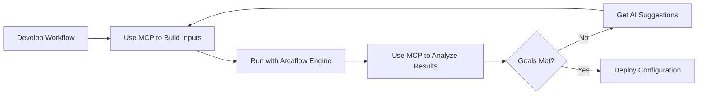

# Capabilities

**What Arcaflow MCP Can Do**

Arcaflow MCP provides two primary capabilities for working with Arcaflow workflows through natural language conversation: **Input Construction** and **Result Analysis**.

**Component Architecture:**
- **Input Construction** → Handled by **Go MCP Server** (always required)
- **Result Analysis** → Handled by **Python Analysis Engine** (required for result analysis features)

---

## Input Construction

Build valid, schema-compliant workflow inputs through conversational AI interaction.

**Provided by:** Go MCP Server

### Core Features

**Workflow Discovery and Loading**
- Load workflows from local filesystem, git repositories, or HTTP URLs
- Automatic schema extraction and validation
- Support for complex nested schemas
- Workflow metadata and documentation extraction

**Schema Understanding**
- Natural language explanation of workflow requirements
- Field type and constraint extraction
- Required vs optional field identification
- Default value discovery
- Nested object and array structure handling

**Conversational Input Building**
- Build inputs through natural language description
- Iterative refinement with validation at each step
- Intelligent defaults based on schema constraints
- Type coercion and validation
- Support for complex data structures (objects, arrays, maps)

**Validation**
- Real-time validation against workflow schema
- Clear error messages with suggested fixes
- Constraint checking (min/max, patterns, enums)
- Required field verification
- Type checking and conversion

**Export**
- Generate ready-to-use YAML or JSON files
- Deterministic serialization (same inputs = same output)
- Guarantee compatibility with Arcaflow Engine
- Support for custom output paths

### Use Cases

**Development and Testing**
- Quickly generate test inputs without manual YAML editing
- Iterate on configurations conversationally
- Validate inputs before execution
- Reduce input-related execution failures

**Workflow Exploration**
- Understand complex workflow schemas
- Discover available options and their constraints
- Learn workflow capabilities through conversation
- Explore parameter combinations

**Team Collaboration**
- Share workflow configurations through conversation
- Build inputs collaboratively with AI assistance
- Document input rationale through natural language
- Standardize input generation across teams

### Example Workflow

```
You: "Load the perf-test workflow from /path/to/workflows/perf-test"
AI: "I've loaded the workflow. It requires test configuration parameters."

You: "Build inputs for a low-load test with 10 users"
AI: "Created inputs with 10 concurrent users. What duration would you like?"

You: "60 seconds with a 5-second ramp-up"
AI: "Added duration and ramp-up. The inputs are now valid."

You: "Export to test-inputs.yaml"
AI: "✓ Exported to test-inputs.yaml"
```

See [Tutorial: Input Construction](../examples/basic-workflow.md) for a complete walkthrough.

---

## Result Analysis

Analyze workflow execution results and get AI-powered optimization suggestions.

**Provided by:** Python Analysis Engine (communicates with Go MCP Server via HTTP)

**Requirements:** Both components must be running for result analysis features to work.

### Core Features

**Result Loading and Parsing**
- Load results from YAML, JSON, or log files
- Automatic metric extraction
- Support for structured and semi-structured results
- Historical result storage and retrieval

**Performance Analysis**
- Metric comparison against defined goals
- Trend analysis across multiple runs
- Statistical analysis (mean, median, percentiles, variance)
- Anomaly detection and outlier identification

**Comparative Analysis**
- Multi-run comparison across configurations
- A/B testing support
- Regression detection (comparing against baselines)
- Parameter sensitivity analysis

**Optimization Suggestions**
- AI-powered configuration recommendations
- Multi-objective optimization (balancing competing goals)
- Root cause analysis for performance issues
- Actionable next steps with rationale

**Reporting**
- Natural language summaries of results
- Metric visualization (text-based charts)
- Decision matrices for configuration selection
- Export formatted reports

### Use Cases

**Performance Optimization**
- Analyze test results against performance goals
- Get recommendations for improving metrics
- Iterate toward optimal configurations
- Track performance trends over time

**Configuration Selection**
- Compare multiple configurations systematically
- Rank by weighted criteria
- Understand trade-offs between competing goals
- Make data-driven deployment decisions

**Regression Testing**
- Compare current results vs historical baselines
- Detect performance degradation
- Identify root causes of regressions
- Track system performance over time

**Multi-Run Comparison**
- Systematically test parameter variations
- Identify optimal parameter combinations
- Understand parameter interactions
- Build organizational knowledge base

### Example Workflow

```
You: "Load and analyze results from perf-test-output.yaml with goals: 
      success rate ≥ 95%, avg response ≤ 300ms"
AI: "Success rate: 97% ✓, Avg response: 285ms ✓ - All goals met! 
     However, throughput could be higher. Try increasing users from 20 to 25."

You: "Compare this run with the previous baseline"
AI: "Response time increased 15ms (+5%). Success rate stable. 
     This is within normal variance."

You: "What should I change to improve throughput by 30%?"
AI: "Increase concurrent users to 28 and ramp-up to 12 seconds. 
     Expected: +32% throughput while maintaining your goals."
```

See [Tutorial: Iterative Optimization](../examples/iterative-optimization.md) for a complete walkthrough.

---

## Integration with Arcaflow

### Workflow Compatibility

Arcaflow MCP works with standard Arcaflow workflows:
- No workflow modifications required
- Uses native Arcaflow schema format
- Compatible with Arcaflow Engine 0.20.0+
- Supports all Arcaflow plugin types

### Workflow Lifecycle



Arcaflow MCP fits into the middle of the workflow lifecycle:
1. **Before execution**: Build and validate inputs
2. **After execution**: Analyze results and optimize

### Schema Format

Arcaflow MCP uses the Arcaflow SDK schema format directly:
- No translation or conversion required
- Full support for complex types (objects, arrays, maps, unions)
- Respects all schema constraints and validations
- Compatible with plugin schemas

---

## Limitations

### Current Limitations

**Input Construction:**
- Cannot create new workflows (only builds inputs for existing workflows)
- Requires valid workflow definitions
- Limited to schema-defined inputs (no arbitrary YAML)

**Result Analysis:**
- Requires structured result data (YAML/JSON)
- Cannot execute workflows directly (use Arcaflow Engine)
- Historical tracking requires manual result storage

**Deployment:**
- Local mode requires MCP-compatible client (Claude Desktop, Cursor, etc.)
- Server mode requires separate deployment and configuration

### Future Capabilities

Planned for future releases:
- **Workflow Execution** - Run workflows directly from MCP server
- **Iterative Loops** - Automated optimization cycles
- **Workflow Creation** - Generate new workflows from natural language descriptions
- **Advanced Visualization** - Graphical charts and dashboards
- **Real-time Monitoring** - Stream execution progress and metrics

See [Roadmap](../getting-started.md#roadmap) for details.

---

## Related Documentation

- **[Getting Started](../getting-started.md)** - Quick start guide
- **[Input Construction Guide](../usage/input-construction.md)** - Detailed input building procedures
- **[Result Analysis Guide](../usage/result-analysis.md)** - Complete analysis features
- **[Tool Reference](../tools/overview.md)** - All available MCP tools
- **[Tutorials](../index.md#learning-path)** - Step-by-step learning path

---

[← Back to Documentation Index](../index.md)
