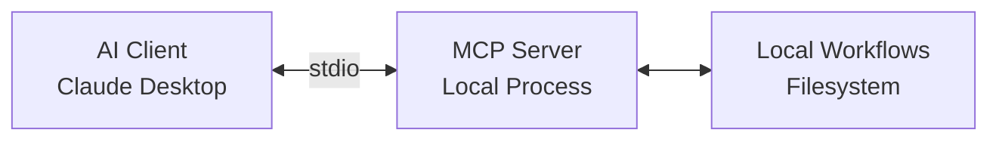
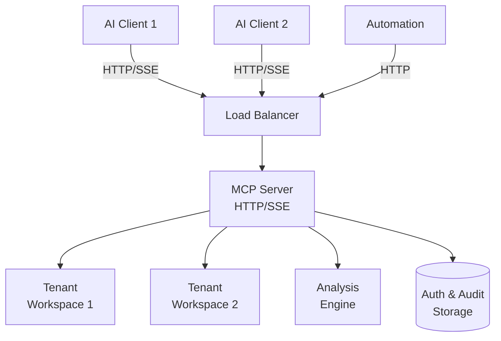
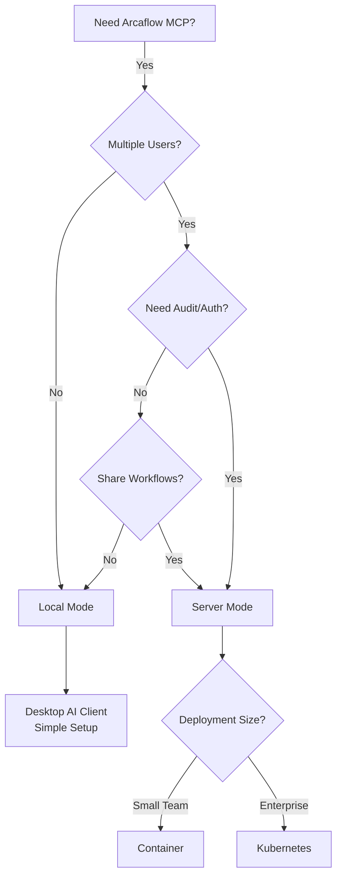

# Deployment Modes

**Local Mode vs Server Mode: Choosing the Right Deployment**

Arcaflow MCP supports two deployment modes optimized for different use cases: **Local Mode** for personal desktop AI clients, and **Server Mode** for multi-user production deployments.

---

## Local Mode (stdio)

Personal deployment for desktop AI assistants like Claude Desktop, Cursor, and other MCP-compatible clients.

### Architecture



**Transport:** Standard input/output (stdio)  
**Process Model:** One server instance per AI client session  
**State:** In-memory only (no persistence between sessions)  
**Authentication:** None (local process, same user)

### When to Use Local Mode

**✅ Best For:**
- Personal workflow development and testing
- Desktop AI assistants (Claude Desktop, Cursor)
- Single-user scenarios
- Quick experimentation and learning
- Local workflow repositories

**❌ Not Suitable For:**
- Team collaboration
- Shared workflow access
- Production automation
- Multi-user deployments
- Remote access requirements

### Characteristics

**Simplicity:**
- No server management required
- No authentication or configuration
- Client manages server lifecycle
- Zero network exposure

**Performance:**
- Fast local execution
- No network latency
- Direct filesystem access
- Immediate response times

**Security:**
- Runs as user's process
- No network attack surface
- User's filesystem permissions
- No credential management

**Limitations:**
- Single user only
- No persistence across sessions
- No result history tracking
- Cannot share workflows with team

### Setup

Simple configuration in your AI client (e.g., Claude Desktop):

```json
{
  "mcpServers": {
    "arcaflow": {
      "command": "/path/to/arcaflow-mcp",
      "args": ["--mode", "local"]
    }
  }
}
```

See [Local Mode Setup](../usage/local-mode.md) for complete instructions.

---

## Server Mode (HTTP/SSE)

Production deployment for teams, automation, and multi-user access.

### Architecture



**Transport:** HTTP POST (requests) + Server-Sent Events (responses)  
**Process Model:** Long-running server with multi-tenancy  
**State:** Persistent (tenants, tokens, audit logs, usage metrics)  
**Authentication:** Bearer token authentication with tenant isolation

### When to Use Server Mode

**✅ Best For:**
- Team collaboration and shared access
- Production automation and CI/CD
- Multi-user deployments
- Enterprise environments requiring audit trails
- Remote access to workflows
- Centralized workflow management

**❌ Not Suitable For:**
- Personal desktop use (use local mode instead)
- Single-user scenarios (overhead not justified)
- Air-gapped environments without network access
- Scenarios requiring zero configuration

### Characteristics

**Multi-Tenancy:**
- Isolated workspaces per tenant
- Independent authentication tokens
- Per-tenant usage tracking
- Workspace quotas and limits

**Enterprise Features:**
- Authentication and authorization
- Audit logging of all operations
- Rate limiting per tenant
- Usage metrics and billing support
- TLS/HTTPS support

**Scalability:**
- Multiple concurrent sessions
- Horizontal scaling support
- Load balancing compatible
- Container and Kubernetes deployment

**Persistence:**
- Tenant data survives restarts
- Token management and rotation
- Audit trail retention
- Usage history tracking

**Administration:**
- Admin API for tenant management
- Token provisioning and revocation
- Usage monitoring
- Audit log queries

### Deployment Options

**Container (Podman/Docker):**
- Single-command deployment
- Pre-built images available
- Compose files for multi-service setup
- Suitable for development and small teams

**Kubernetes:**
- Production-grade orchestration
- High availability with multiple replicas
- ConfigMaps and Secrets for configuration
- Ingress for external access
- Suitable for enterprise deployments

**Bare Metal:**
- Systemd service files provided
- Direct server deployment
- Full control over resources
- Suitable for on-premise requirements

See [Server Mode Setup](../usage/server-mode.md) for setup instructions.

---

## Comparison

| Feature | Local Mode | Server Mode |
|---------|------------|-------------|
| **Transport** | stdio | HTTP/SSE |
| **Users** | Single | Multi-tenant |
| **Authentication** | None | Bearer tokens |
| **State** | In-memory | Persistent |
| **Setup Complexity** | Minimal | Moderate |
| **Network** | None | Required |
| **Audit Logging** | None | Full audit trail |
| **Rate Limiting** | None | Per-tenant |
| **Scalability** | N/A | Horizontal |
| **Use Case** | Desktop AI | Production/Teams |

---

## Choosing Your Mode

### Decision Tree



### Quick Guide

**Use Local Mode if:**
- You're a single user
- Working on personal workflows
- Using desktop AI clients (Claude Desktop, Cursor)
- Want zero configuration
- Don't need result history

**Use Server Mode if:**
- Multiple users need access
- Team collaboration required
- Audit trails needed
- Enterprise authentication required
- Production automation
- Centralized workflow management

### Hybrid Approach

You can use both modes for different purposes:

**Development (Local Mode):**
- Experiment with workflows locally
- Test input variations quickly
- Learn MCP server capabilities

**Production (Server Mode):**
- Deploy tested configurations
- Share with team members
- Track usage and audit operations
- Integrate with CI/CD pipelines

---

## Migration Between Modes

### Local → Server

To move from local to server deployment:

1. **Deploy Server**: Set up server mode with authentication
2. **Create Tenant**: Use admin API to create tenant for your team
3. **Configure Clients**: Update AI client config to use HTTP/SSE endpoint
4. **Migrate Workflows**: Copy workflow repositories to server-accessible locations
5. **Test Access**: Verify multi-user access and permissions

See [Server Mode Setup](../usage/server-mode.md) for details.

### Server → Local

To fall back from server to local mode (e.g., for offline work):

1. **Export Workflows**: Download workflow repositories locally
2. **Reconfigure Client**: Switch AI client back to local mode (stdio)
3. **Resume Work**: Continue with local-only access

**Note:** Result history stored on server won't be available in local mode.

---

## Related Documentation

- **[Local Mode Setup](../usage/local-mode.md)** - Local mode installation and configuration
- **[Server Mode Setup](../usage/server-mode.md)** - Server mode deployment guide
- **[Multi-Tenancy](multi-tenancy.md)** - Server mode multi-user features
- **[Architecture](architecture.md)** - System design overview

---

[← Back to Documentation Index](../index.md)
