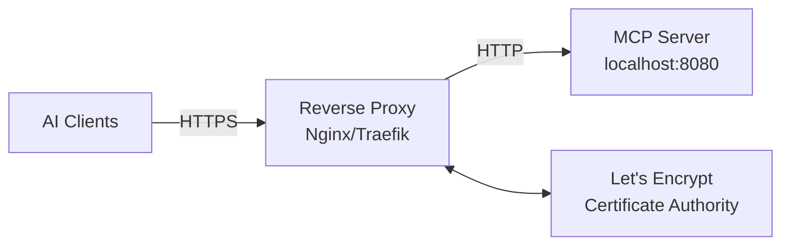

# TLS Configuration

**Securing Server Mode with HTTPS/TLS**

Production deployments should use TLS encryption for all network communication. This guide covers TLS setup, certificate management, and secure deployment practices.

---

## Overview

TLS (Transport Layer Security) provides:
- **Encryption** - Protects tokens and data in transit
- **Authentication** - Verifies server identity
- **Integrity** - Prevents tampering with requests/responses

**Required for production** - Bearer tokens transmitted over plain HTTP can be intercepted.

---

## Prerequisites

- Arcaflow MCP server deployed in server mode
- Domain name pointing to your server (for certificate validation)
- Certificate authority access (Let's Encrypt, internal CA, or self-signed)
- Access to server configuration

---

## Option 1: Reverse Proxy (Recommended)

Use a reverse proxy (Nginx, Traefik, HAProxy) to terminate TLS and forward to MCP server.

### Why Reverse Proxy?

**Advantages:**
- Dedicated TLS implementation (battle-tested)
- Automatic certificate renewal (Let's Encrypt)
- Advanced features (load balancing, caching, rate limiting)
- Separation of concerns (TLS vs application logic)

**Architecture:**



### Nginx Configuration

**1. Install Nginx:**
```bash
# Fedora/RHEL
sudo dnf install nginx certbot python3-certbot-nginx

# Ubuntu/Debian
sudo apt install nginx certbot python3-certbot-nginx
```

**2. Create Nginx configuration:**

```nginx
# /etc/nginx/conf.d/arcaflow-mcp.conf

upstream arcaflow_mcp {
    server 127.0.0.1:8080;
}

server {
    listen 80;
    server_name arcaflow-mcp.example.com;
    
    # Redirect HTTP to HTTPS
    return 301 https://$server_name$request_uri;
}

server {
    listen 443 ssl http2;
    server_name arcaflow-mcp.example.com;
    
    # TLS certificate paths (certbot will configure these)
    ssl_certificate /etc/letsencrypt/live/arcaflow-mcp.example.com/fullchain.pem;
    ssl_certificate_key /etc/letsencrypt/live/arcaflow-mcp.example.com/privkey.pem;
    
    # Modern TLS configuration
    ssl_protocols TLSv1.2 TLSv1.3;
    ssl_ciphers 'ECDHE-ECDSA-AES128-GCM-SHA256:ECDHE-RSA-AES128-GCM-SHA256:ECDHE-ECDSA-AES256-GCM-SHA384:ECDHE-RSA-AES256-GCM-SHA384';
    ssl_prefer_server_ciphers on;
    ssl_session_cache shared:SSL:10m;
    ssl_session_timeout 10m;
    
    # Security headers
    add_header Strict-Transport-Security "max-age=31536000; includeSubDomains" always;
    add_header X-Content-Type-Options "nosniff" always;
    add_header X-Frame-Options "DENY" always;
    
    # MCP HTTP endpoint
    location /mcp {
        proxy_pass http://arcaflow_mcp;
        proxy_http_version 1.1;
        proxy_set_header Host $host;
        proxy_set_header X-Real-IP $remote_addr;
        proxy_set_header X-Forwarded-For $proxy_add_x_forwarded_for;
        proxy_set_header X-Forwarded-Proto $scheme;
        
        # Timeouts for long-running operations
        proxy_connect_timeout 60s;
        proxy_send_timeout 60s;
        proxy_read_timeout 300s;
    }
    
    # SSE event stream
    location /mcp/events {
        proxy_pass http://arcaflow_mcp;
        proxy_http_version 1.1;
        proxy_set_header Connection '';
        proxy_buffering off;
        proxy_cache off;
        chunked_transfer_encoding off;
        
        # SSE-specific settings
        proxy_read_timeout 3600s;
        proxy_set_header X-Accel-Buffering no;
    }
    
    # Admin API
    location /admin {
        proxy_pass http://arcaflow_mcp;
        proxy_http_version 1.1;
        proxy_set_header Host $host;
        proxy_set_header X-Real-IP $remote_addr;
        proxy_set_header X-Forwarded-For $proxy_add_x_forwarded_for;
        proxy_set_header X-Forwarded-Proto $scheme;
    }
    
    # Health check
    location /healthz {
        proxy_pass http://arcaflow_mcp;
        access_log off;
    }
}
```

**3. Obtain TLS certificate with Let's Encrypt:**

```bash
# Stop Nginx temporarily
sudo systemctl stop nginx

# Get certificate (certbot will configure Nginx)
sudo certbot --nginx -d arcaflow-mcp.example.com

# Start Nginx
sudo systemctl start nginx
sudo systemctl enable nginx
```

**4. Start MCP server (listens only on localhost):**

```bash
# Server only needs to listen on localhost since Nginx proxies
export ARCAFLOW_MCP_ADMIN_TOKEN="your-secure-token"
export DATA_DIR="/var/lib/arcaflow-mcp"
# ... (configure storage paths)

./arcaflow-mcp --mode server --address 127.0.0.1:8080
```

**5. Test HTTPS access:**

```bash
curl https://arcaflow-mcp.example.com/healthz
```

**Expected:** `{"status":"ok"}`

### Automatic Certificate Renewal

Let's Encrypt certificates expire after 90 days. Setup automatic renewal:

```bash
# Test renewal (dry run)
sudo certbot renew --dry-run

# Certbot automatic renewal is enabled by default via systemd timer
sudo systemctl status certbot-renew.timer

# Manual renewal (if needed)
sudo certbot renew
sudo systemctl reload nginx
```

---

## Option 2: Traefik (For Container/K8s)

Traefik provides automatic TLS with Let's Encrypt integration.

### Docker Compose with Traefik

```yaml
# docker-compose.yml
version: '3.8'

services:
  traefik:
    image: traefik:v2.10
    command:
      - "--api.insecure=false"
      - "--providers.docker=true"
      - "--entrypoints.web.address=:80"
      - "--entrypoints.websecure.address=:443"
      - "--certificatesresolvers.le.acme.tlschallenge=true"
      - "--certificatesresolvers.le.acme.email=admin@example.com"
      - "--certificatesresolvers.le.acme.storage=/letsencrypt/acme.json"
    ports:
      - "80:80"
      - "443:443"
    volumes:
      - "/var/run/docker.sock:/var/run/docker.sock:ro"
      - "./letsencrypt:/letsencrypt"
    
  arcaflow-mcp:
    image: arcaflow-mcp:latest
    environment:
      - ARCAFLOW_MCP_MODE=server
      - ARCAFLOW_MCP_ADDRESS=:8080
      - ARCAFLOW_MCP_ADMIN_TOKEN=${ARCAFLOW_MCP_ADMIN_TOKEN}
    labels:
      - "traefik.enable=true"
      - "traefik.http.routers.arcaflow.rule=Host(`arcaflow-mcp.example.com`)"
      - "traefik.http.routers.arcaflow.entrypoints=websecure"
      - "traefik.http.routers.arcaflow.tls.certresolver=le"
      - "traefik.http.services.arcaflow.loadbalancer.server.port=8080"
```

Start with:
```bash
docker-compose up -d
```

Traefik automatically:
- Obtains Let's Encrypt certificate
- Renews certificates before expiration
- Terminates TLS
- Forwards to MCP server

---

## Option 3: Self-Signed Certificates (Development Only)

For development/testing environments where public CA isn't available.

**⚠️ Warning:** Not for production. Self-signed certificates don't provide authentication guarantees.

### Generate Self-Signed Certificate

```bash
# Generate private key
openssl genrsa -out server.key 2048

# Generate certificate signing request
openssl req -new -key server.key -out server.csr \
  -subj "/CN=arcaflow-mcp.local/O=Development/C=US"

# Generate self-signed certificate (valid 365 days)
openssl x509 -req -days 365 -in server.csr \
  -signkey server.key -out server.crt

# Combine for nginx
cat server.crt server.key > server.pem
```

### Configure Nginx with Self-Signed

```nginx
server {
    listen 443 ssl;
    server_name arcaflow-mcp.local;
    
    ssl_certificate /path/to/server.crt;
    ssl_certificate_key /path/to/server.key;
    
    # ... rest of configuration ...
}
```

### Client Configuration

**Trust self-signed certificate:**

```bash
# macOS
sudo security add-trusted-cert -d -r trustRoot \
  -k /Library/Keychains/System.keychain server.crt

# Linux
sudo cp server.crt /usr/local/share/ca-certificates/
sudo update-ca-certificates

# Or use --insecure flag (testing only!)
curl --insecure https://arcaflow-mcp.local/healthz
```

---

## Kubernetes Ingress with TLS

For Kubernetes deployments, use Ingress with cert-manager for automatic TLS.

### Install cert-manager

```bash
kubectl apply -f https://github.com/cert-manager/cert-manager/releases/download/v1.13.0/cert-manager.yaml
```

### Create ClusterIssuer (Let's Encrypt)

```yaml
# cluster-issuer.yaml
apiVersion: cert-manager.io/v1
kind: ClusterIssuer
metadata:
  name: letsencrypt-prod
spec:
  acme:
    server: https://acme-v02.api.letsencrypt.org/directory
    email: admin@example.com
    privateKeySecretRef:
      name: letsencrypt-prod
    solvers:
    - http01:
        ingress:
          class: nginx
```

```bash
kubectl apply -f cluster-issuer.yaml
```

### Create Ingress with TLS

```yaml
# ingress.yaml
apiVersion: networking.k8s.io/v1
kind: Ingress
metadata:
  name: arcaflow-mcp
  annotations:
    cert-manager.io/cluster-issuer: letsencrypt-prod
    nginx.ingress.kubernetes.io/ssl-redirect: "true"
spec:
  tls:
  - hosts:
    - arcaflow-mcp.example.com
    secretName: arcaflow-mcp-tls
  rules:
  - host: arcaflow-mcp.example.com
    http:
      paths:
      - path: /
        pathType: Prefix
        backend:
          service:
            name: arcaflow-mcp
            port:
              number: 8080
```

```bash
kubectl apply -f ingress.yaml
```

Cert-manager automatically:
- Obtains certificate from Let's Encrypt
- Stores in `arcaflow-mcp-tls` Secret
- Renews before expiration
- Updates Ingress configuration

See [Kubernetes Deployment](kubernetes.md) for complete K8s setup.

---

## Verification

### Test TLS Configuration

**Check certificate:**
```bash
openssl s_client -connect arcaflow-mcp.example.com:443 -servername arcaflow-mcp.example.com
```

**Verify TLS version:**
```bash
curl -v https://arcaflow-mcp.example.com/healthz 2>&1 | grep "SSL connection"
```

**Expected:** `SSL connection using TLSv1.3 / TLS_AES_256_GCM_SHA384`

### Test with MCP Client

```bash
# Initialize MCP session over HTTPS
curl -X POST https://arcaflow-mcp.example.com/mcp \
  -H "Content-Type: application/json" \
  -H "Authorization: Bearer $ARCAFLOW_MCP_ADMIN_TOKEN" \
  -d @- <<'EOF'
{"jsonrpc":"2.0","id":1,"method":"initialize","params":{"protocolVersion":"2025-11-25","capabilities":{},"clientInfo":{"name":"test","version":"1.0"}}}
EOF
```

**Expected:** Successful initialization response with server capabilities.

### Security Scan

Use SSL Labs to verify TLS configuration:

```bash
# For public deployments
# Visit: https://www.ssllabs.com/ssltest/analyze.html?d=arcaflow-mcp.example.com
```

**Target:** A or A+ rating

---

## Troubleshooting

### Certificate Errors

**"Certificate not valid":**
- Verify domain name matches certificate CN/SAN
- Check certificate expiration date
- Ensure full certificate chain is configured
- Verify Let's Encrypt challenge completed successfully

**"Certificate verification failed":**
- Check system trust store includes CA
- For Let's Encrypt, ensure ca-certificates package is up to date
- For self-signed, add to system trust store

### Connection Errors

**"Connection refused":**
- Verify Nginx/Traefik is running
- Check firewall allows ports 80 and 443
- Verify server is listening on correct interface

**"Timeout":**
- Check reverse proxy configuration
- Verify MCP server is running and reachable
- Review proxy timeout settings (especially for SSE)

### Mixed Content

**"Mixed content blocked":**
- Ensure all URLs use HTTPS scheme
- Check reverse proxy forwards protocol correctly
- Verify `X-Forwarded-Proto` header is set

---

## Security Best Practices

### Certificate Management

**✅ Do:**
- Use Let's Encrypt for public deployments (free, automated)
- Use internal CA for private deployments
- Automate certificate renewal
- Monitor certificate expiration
- Use wildcard certificates sparingly

**❌ Don't:**
- Use self-signed certificates in production
- Ignore certificate expiration warnings
- Commit private keys to version control
- Share private keys between environments

### TLS Configuration

**✅ Do:**
- Use TLS 1.2 or 1.3 only (disable TLS 1.0, 1.1)
- Use strong cipher suites
- Enable HSTS (HTTP Strict Transport Security)
- Disable SSL compression (CRIME attack)
- Use perfect forward secrecy (PFS)

**❌ Don't:**
- Allow SSLv3 or older
- Use weak ciphers (DES, RC4, MD5)
- Disable certificate validation
- Use insecure renegotiation

### Recommended TLS Settings

```nginx
# Modern TLS configuration (Nginx)
ssl_protocols TLSv1.2 TLSv1.3;
ssl_ciphers 'ECDHE-ECDSA-AES128-GCM-SHA256:ECDHE-RSA-AES128-GCM-SHA256:ECDHE-ECDSA-AES256-GCM-SHA384:ECDHE-RSA-AES256-GCM-SHA384:ECDHE-ECDSA-CHACHA20-POLY1305:ECDHE-RSA-CHACHA20-POLY1305:DHE-RSA-AES128-GCM-SHA256:DHE-RSA-AES256-GCM-SHA384';
ssl_prefer_server_ciphers off;
ssl_stapling on;
ssl_stapling_verify on;
add_header Strict-Transport-Security "max-age=63072000; includeSubDomains; preload" always;
```

Test configuration:
```bash
# Test TLS configuration
testssl.sh https://arcaflow-mcp.example.com

# Or use nmap
nmap --script ssl-enum-ciphers -p 443 arcaflow-mcp.example.com
```

---

## Production Checklist

- [ ] TLS 1.2+ only (TLS 1.3 preferred)
- [ ] Strong cipher suites configured
- [ ] Certificate from trusted CA (Let's Encrypt or internal CA)
- [ ] Certificate auto-renewal configured
- [ ] Certificate expiration monitoring setup
- [ ] HSTS header enabled
- [ ] HTTP redirects to HTTPS
- [ ] Firewall allows ports 80 (redirect) and 443 (HTTPS)
- [ ] Private keys secured (chmod 600, encrypted storage)
- [ ] Security headers configured (X-Content-Type-Options, X-Frame-Options)
- [ ] SSL Labs A rating achieved
- [ ] Tested with actual MCP clients

---

## Certificate Renewal

### Let's Encrypt (via Certbot)

**Automatic renewal:**
```bash
# Certbot sets up automatic renewal via systemd timer
sudo systemctl status certbot-renew.timer

# Check next renewal time
sudo certbot certificates
```

**Manual renewal:**
```bash
# Test renewal without applying
sudo certbot renew --dry-run

# Actually renew
sudo certbot renew

# Reload Nginx to use new certificate
sudo systemctl reload nginx
```

**Renewal hooks:**

```bash
# /etc/letsencrypt/renewal-hooks/deploy/reload-nginx.sh
#!/bin/bash
systemctl reload nginx
```

```bash
chmod +x /etc/letsencrypt/renewal-hooks/deploy/reload-nginx.sh
```

### Certificate Monitoring

**Monitor expiration:**

```bash
# Check certificate expiration
echo | openssl s_client -servername arcaflow-mcp.example.com \
  -connect arcaflow-mcp.example.com:443 2>/dev/null | \
  openssl x509 -noout -dates
```

**Alerting:**
- Set up monitoring (Prometheus, Nagios, etc.)
- Alert 30 days before expiration
- Escalate if renewal fails

---

## Alternative: Cloud Load Balancers

Cloud providers offer managed load balancers with automatic TLS:

### AWS Application Load Balancer

```bash
# AWS ALB automatically handles TLS with ACM certificates
# Configure via AWS Console or CloudFormation
```

**Benefits:**
- Automatic certificate management
- No server configuration needed
- Integrated with AWS ecosystem

### Google Cloud Load Balancer

```bash
# GCP load balancer with Google-managed certificates
# Configure via GCP Console or Terraform
```

### Azure Application Gateway

```bash
# Azure App Gateway with managed certificates
# Configure via Azure Portal or ARM templates
```

**Note:** Cloud load balancers abstract TLS complexity but require cloud deployment.

---

## Related Documentation

- **[Authentication](authentication.md)** - Token management and security
- **[Server Mode](../usage/server-mode.md)** - Server deployment guide
- **[Kubernetes Deployment](kubernetes.md)** - K8s deployment with Ingress
- **[Container Deployment](container.md)** - Podman/Docker deployment

---

[← Back to Documentation Index](../index.md)
