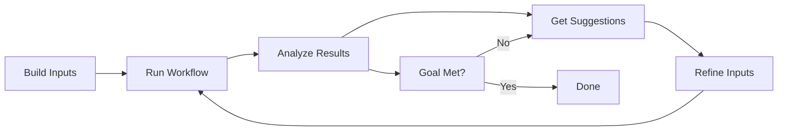

# Tutorial: Iterative Optimization with Result Analysis

**Learn how to analyze workflow results and optimize through AI-powered iteration**

This tutorial demonstrates the complete cycle of running workflows, analyzing results, getting optimization suggestions, and refining inputs based on AI insights.

**Duration:** 20-30 minutes  
**Prerequisites:** 
- Arcaflow MCP server installed
- Arcaflow Engine installed (for workflow execution)
- Completed [Basic Workflow Tutorial](basic-workflow.md)

**What you'll learn:**
- How to load and parse workflow results
- How to analyze results against performance goals
- How to get AI-powered optimization suggestions
- How to iterate toward optimal configurations

---

## Overview: The Optimization Cycle

Performance testing and optimization typically involves:



With Arcaflow MCP, the AI assists at every step, helping you converge on optimal configurations faster.

---

## Scenario: Optimizing a Performance Test

We'll use the `perf-test` workflow to optimize load testing parameters. Our goal:
- **Success rate**: ≥ 95%
- **Average response time**: ≤ 300ms
- **P95 response time**: ≤ 500ms

---

## Iteration 1: Initial Test

### Step 1.1: Build Initial Inputs

**You:**
```
Load the perf-test workflow from /path/to/examples/workflows/perf-test
and build inputs for an initial low-load test
```

**AI:**
```
I've loaded the perf-test workflow. Let me help you build initial inputs.

This workflow tests HTTP endpoint performance with configurable load.

For a low-load initial test, I suggest:
- users: 10 (concurrent users)
- duration: 60 (seconds)
- ramp_up: 5 (seconds to ramp up)

Shall I build these inputs?
```

**You:**
```
Yes, and add a timeout of 5 seconds and success threshold of 0.95
```

**AI (using `workflow_input_build`):**
```
Created inputs:
```yaml
test_config:
  name: "Initial Low Load Test"
  users: 10
  duration: 60
  ramp_up: 5
  timeout: 5
  success_threshold: 0.95
```

Exported to perf-test-inputs-v1.yaml
```

### Step 1.2: Run the Workflow

Run the workflow with Arcaflow Engine:

```bash
arcaflow \
  -input perf-test-inputs-v1.yaml \
  -workflow /path/to/workflows/perf-test/workflow.yaml \
  -output perf-test-results-v1.yaml
```

### Step 1.3: Analyze Results

**You:**
```
Load and analyze the results from perf-test-results-v1.yaml
Compare against goals: success rate ≥ 0.95, avg response time ≤ 300ms, p95 ≤ 500ms
```

**AI (using `workflow_results_load` and `workflow_results_analyze`):**
```
📊 Results Analysis: Run 1 (Low Load)

**Metrics:**
- Total requests: 600
- Successful: 600
- Success rate: 1.00 ✓ (Goal: ≥ 0.95)
- Average response time: 125ms ✓ (Goal: ≤ 300ms)
- P95 response time: 180ms ✓ (Goal: ≤ 500ms)
- P99 response time: 220ms

**Analysis:**
All goals met! However, this is a low-load scenario. The system can likely
handle more load while still meeting goals.

**Recommendation:**
Increase load to test capacity limits. Try doubling concurrent users to 20
and observe if goals are still met.
```

---

## Iteration 2: Increased Load

### Step 2.1: Refine Inputs Based on Suggestions

**You:**
```
Update the inputs with 20 users as suggested, keeping other params the same
```

**AI (using `workflow_input_build` with merge):**
```
Updated inputs:
```yaml
test_config:
  name: "Medium Load Test"
  users: 20  # Increased from 10
  duration: 60
  ramp_up: 5
  timeout: 5
  success_threshold: 0.95
```

Exported to perf-test-inputs-v2.yaml
```

### Step 2.2: Run Again

```bash
arcaflow \
  -input perf-test-inputs-v2.yaml \
  -workflow /path/to/workflows/perf-test/workflow.yaml \
  -output perf-test-results-v2.yaml
```

### Step 2.3: Analyze and Compare

**You:**
```
Analyze perf-test-results-v2.yaml and compare with run 1
```

**AI (using `workflow_results_compare`):**
```
📊 Comparative Analysis: Run 1 vs Run 2

**Run 1 (10 users):**
- Success rate: 1.00
- Avg response: 125ms
- P95 response: 180ms

**Run 2 (20 users):**
- Success rate: 0.98 ✓ (Goal: ≥ 0.95)
- Avg response: 245ms ✓ (Goal: ≤ 300ms)
- P95 response: 410ms ✓ (Goal: ≤ 500ms)

**Observations:**
- Success rate dropped slightly but still above threshold
- Response times increased but remain within acceptable range
- P95 shows more variance under higher load
- All goals still met

**Recommendation:**
System appears to have more capacity. Try 30 users to find the breaking point,
or increase ramp_up time to smooth the load distribution.
```

---

## Iteration 3: Finding the Limit

### Step 3.1: Push Further

**You:**
```
Try 30 users with a longer ramp-up of 10 seconds to smooth the load
```

**AI:**
```
Updated inputs:
```yaml
test_config:
  name: "High Load Test"
  users: 30
  duration: 60
  ramp_up: 10  # Increased for smoother load distribution
  timeout: 5
  success_threshold: 0.95
```

Exported to perf-test-inputs-v3.yaml
```

### Step 3.2: Run and Analyze

```bash
arcaflow \
  -input perf-test-inputs-v3.yaml \
  -workflow /path/to/workflows/perf-test/workflow.yaml \
  -output perf-test-results-v3.yaml
```

**You:**
```
Analyze results v3 and compare with previous runs
```

**AI:**
```
📊 Comparative Analysis: All Runs

**Run 1 (10 users):**
- Success: 1.00 | Avg: 125ms | P95: 180ms ✓ All goals met

**Run 2 (20 users):**
- Success: 0.98 | Avg: 245ms | P95: 410ms ✓ All goals met

**Run 3 (30 users):**
- Success: 0.92 | Avg: 380ms | P95: 650ms ✗ Goals NOT met
- Failed requests: 80 (8%)
- Timeout errors: 45

**Analysis:**
The system reached its capacity limit between 20-30 concurrent users:
- Success rate dropped below 0.95 threshold
- Average response time exceeded 300ms target
- P95 response time exceeded 500ms limit
- Timeout errors indicate resource saturation

**Root Cause:**
At 30 users, the system is overloaded. The longer ramp-up didn't prevent
saturation once all 30 users were active.

**Recommendations:**
1. **Optimal Configuration**: Use 20 concurrent users for reliable performance
   within goals
2. **If more capacity needed**: 
   - Increase timeout to 7-8 seconds (reduces timeout failures)
   - Add backend resources (horizontal scaling)
   - Tune backend connection pools
3. **Alternative**: Use 25 users as a middle ground and test
```

---

## Iteration 4: Fine-Tuning

### Step 4.1: Test the Middle Ground

**You:**
```
Let's try 25 users with a 6-second timeout to see if we can stay within goals
```

**AI:**
```
Created refined inputs:
```yaml
test_config:
  name: "Optimal Load Test"
  users: 25
  duration: 60
  ramp_up: 10
  timeout: 6  # Increased to reduce timeout failures
  success_threshold: 0.95
```

Exported to perf-test-inputs-v4.yaml
```

### Step 4.2: Final Analysis

```bash
arcaflow \
  -input perf-test-inputs-v4.yaml \
  -workflow /path/to/workflows/perf-test/workflow.yaml \
  -output perf-test-results-v4.yaml
```

**You:**
```
Analyze final results and provide a summary of optimal configuration
```

**AI:**
```
📊 Final Analysis: Run 4 (25 users, 6s timeout)

**Results:**
- Success rate: 0.96 ✓ (Goal: ≥ 0.95)
- Avg response: 295ms ✓ (Goal: ≤ 300ms)
- P95 response: 485ms ✓ (Goal: ≤ 500ms)
- P99 response: 580ms
- Total requests: 1500
- Failed requests: 60 (4%)

**Verdict:** ✓ All goals met!

**Optimal Configuration Found:**
```yaml
test_config:
  users: 25          # Concurrent users
  duration: 60       # Test duration
  ramp_up: 10        # Smooth load distribution
  timeout: 6         # Prevents premature timeouts
  success_threshold: 0.95
```

**Summary:**
After 4 iterations, we found the optimal balance:
- Run 1 (10 users): Under-utilized, all goals easily met
- Run 2 (20 users): Good performance, all goals met
- Run 3 (30 users): Overloaded, goals not met
- Run 4 (25 users): Optimal - meets all goals at near-maximum capacity

**Recommendations for Production:**
- Use 25 concurrent users for load testing
- Monitor P99 response times (close to limits)
- Consider 20 users for a safer margin
- Scale backend if consistently higher load needed
```

---

## Key Takeaways

### The Optimization Process

1. **Start Conservative**: Begin with low load to establish baseline
2. **Iterate Upward**: Gradually increase load to find limits
3. **Analyze Trends**: Use comparison to understand behavior
4. **Fine-Tune**: Adjust parameters based on AI suggestions
5. **Document Optimal**: Save the winning configuration

### AI-Assisted Benefits

**Without AI:**
- Manually parse JSON/YAML results
- Calculate metrics and comparisons
- Guess what parameters to change
- Iterate slowly with trial and error

**With Arcaflow MCP:**
- Natural language result analysis
- Automatic metric extraction and comparison
- AI-powered optimization suggestions
- Faster convergence on optimal configuration

### Conversation Patterns

**Quick Analysis:**
```
Analyze these results and tell me if I met my goals
```

**Comparative Analysis:**
```
Compare runs 1, 2, and 3 and show me the trends
```

**Guided Optimization:**
```
I want to improve response times by 20%. What should I change?
```

**Multi-Metric Optimization:**
```
Find the configuration that maximizes throughput while keeping 
response time under 300ms
```

---

## Advanced Topics

### Multi-Metric Optimization

When optimizing for multiple goals with trade-offs:

**You:**
```
I want to maximize throughput while keeping success rate above 0.95
and response time below 400ms. What configuration should I try?
```

**AI:**
```
Based on the trend analysis across your runs, I suggest:

```yaml
test_config:
  users: 28          # Higher than 25, lower than 30
  duration: 60
  ramp_up: 12        # Longer ramp for smoother distribution
  timeout: 7         # Higher timeout for stability
  success_threshold: 0.95
```

**Rationale:**
- 28 users: Pushes closer to capacity limit (30) where throughput peaks
- 12s ramp_up: Smooths load distribution to prevent early failures
- 7s timeout: Provides buffer for slower responses under high load

Expected results:
- Throughput: ~1680 requests/min (vs 1500 at 25 users)
- Success rate: ~0.95-0.96
- Avg response: ~350-380ms
- P95 response: ~480-490ms

This balances throughput with your constraints.
```

### Historical Tracking

For long-term optimization across days/weeks:

**You:**
```
Compare today's run with last week's baseline to see if performance degraded
```

**AI (using `workflow_history_load` and `workflow_results_compare`):**
```
📊 Week-over-Week Comparison

**Baseline (2026-01-20):**
- Users: 25 | Success: 0.96 | Avg: 295ms | P95: 485ms

**Current (2026-01-27):**
- Users: 25 | Success: 0.94 | Avg: 315ms | P95: 520ms

**Analysis:**
⚠️ Performance degradation detected:
- Success rate dropped 2% (0.96 → 0.94)
- Avg response increased 20ms (+6.8%)
- P95 response increased 35ms (+7.2%)

**Possible Causes:**
- Increased data volume in database
- Backend resource contention
- Network latency changes
- Code changes in recent deployments

**Recommendation:**
Investigate recent changes and consider:
1. Database optimization (indexes, query performance)
2. Backend resource scaling
3. Code profiling for new performance regressions
```

---

## Next Steps

**Continue Learning:**
- **[Multi-Run Comparison Tutorial](multi-run-comparison.md)** - Compare multiple configurations systematically
- **[Result Analysis Guide](../usage/result-analysis.md)** - Deep dive into all analysis features
- **[Tool Reference: Result Tools](../tools/result-tools.md)** - Complete tool documentation

**Apply to Your Workflows:**
- Use your own performance test workflows
- Define your specific goals and constraints
- Iterate with AI assistance to optimize
- Document your optimal configurations

**Team Workflows:**
- Deploy in [Server Mode](../usage/server-mode.md) for shared access
- Store optimization history for team reference
- Share successful configurations across projects

---

## Troubleshooting

**"Can't load results file"**
- Ensure the file path is correct
- Verify the file is valid JSON/YAML
- Check file permissions

**"Analysis doesn't match my goals"**
- Clearly state your goals in the prompt
- Use specific metrics (e.g., "P95 response time ≤ 500ms")
- Provide units and thresholds

**"Suggestions don't seem relevant"**
- Provide more context about your system
- Explain constraints (e.g., "can't exceed 30 users due to license limits")
- Share previous iteration results for better trend analysis

---

**Questions or issues?** Check the [FAQ](../faq.md) or [Troubleshooting Guide](../troubleshooting.md).
