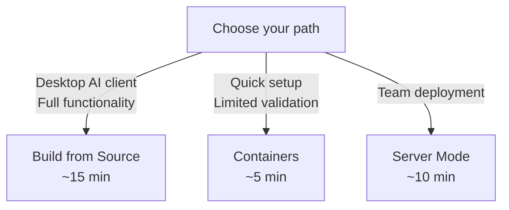

# Getting Started with Arcaflow MCP

Arcaflow MCP helps you build validated workflow inputs and analyze execution
results through natural language conversations with AI agents.

## Understanding the Architecture

Arcaflow MCP uses **two components** that work together:

| Component | Purpose | Required For |
|-----------|---------|--------------|
| **Go MCP Server** | MCP protocol, workflow loading, input validation | Always required |
| **Python Analysis Engine** | Result parsing, analysis, optimization suggestions | Result analysis |

```
Your Goal                     Components Needed
------------------------------------------------------
Build workflow inputs         Go Server only
Analyze workflow results      Go Server + Python Engine
```

The Go server handles MCP protocol communication and workflow operations.
The Python engine provides statistical analysis and optimization suggestions
for workflow results. They communicate over HTTP.

## Choose Your Path



### Build from Source (Recommended)

For individual users with Claude Desktop, Cursor, Claude Code, or similar
MCP clients. The MCP server runs natively on your host with full access to
the container runtime for plugin schema resolution and input validation.
Requires Go and Python.

**[Get started from Source](getting-started-source.md)** -- ~15 minutes

### Local Mode with Containers

Uses pre-built container images. Quick to set up, but input validation
and template generation are limited because the containerized MCP server
needs container-in-container access to resolve plugin schemas.

**[Get started with Containers](getting-started-local.md)** -- ~5 minutes

### Server Mode (Multi-Tenant)

For teams sharing a deployment with authentication and workspace isolation.
Uses Docker Compose or Podman Compose to deploy both components as services.

**[Get started with Server Mode](getting-started-server.md)** -- ~10 minutes

> [!NOTE]
> **Pre-compiled binaries** will be available after the v0.1.0 release.
> Download Go binaries from
> [GitHub Releases](https://github.com/arcalot/arcaflow-mcp/releases)
> once published. Until then, use containers or build from source.

## Next Steps After Setup

Once you have Arcaflow MCP running, explore these resources:

**Learn the basics:**

- [Architecture](concepts/architecture.md) -- how the components fit together
- [Capabilities](concepts/capabilities.md) -- what you can do with Arcaflow MCP
- [Deployment Modes](concepts/deployment-modes.md) -- local vs server mode in depth

**Try the tutorials:**

- [Basic Workflow](examples/basic-workflow.md) -- build inputs for a simple workflow
- [Iterative Optimization](examples/iterative-optimization.md) -- analyze results and refine
- [Multi-Run Comparison](examples/multi-run-comparison.md) -- compare across runs

**Get help:**

- [Troubleshooting](troubleshooting.md) -- common issues and solutions
- [FAQ](faq.md) -- frequently asked questions
- [Community Discussions](https://github.com/arcalot/arcalot-round-table/discussions)
