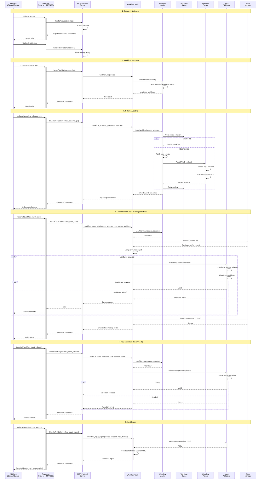
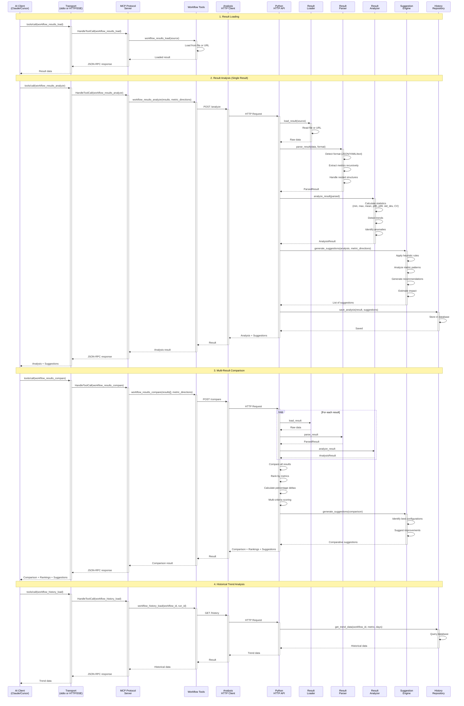
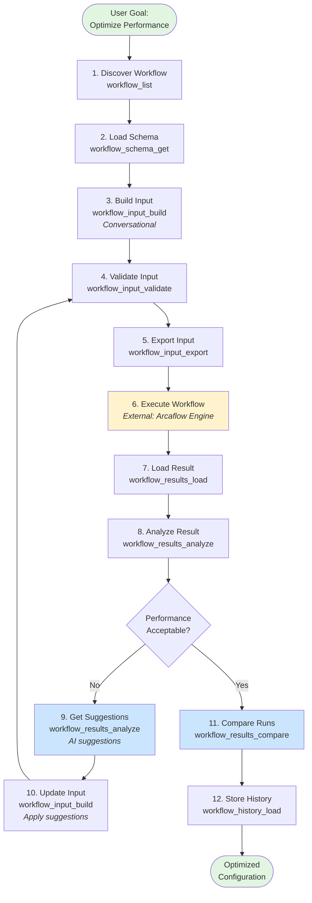
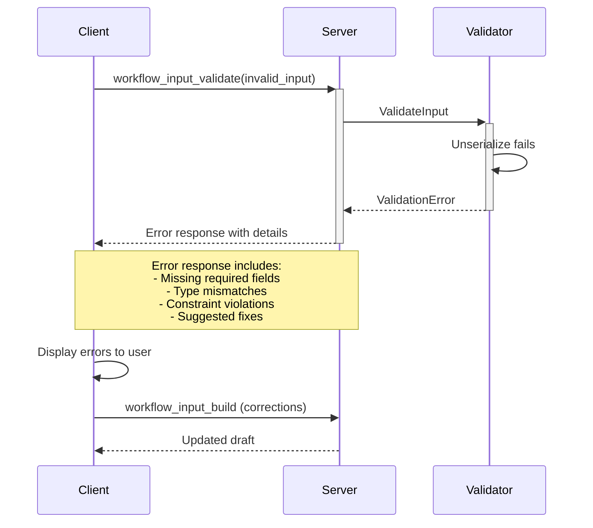
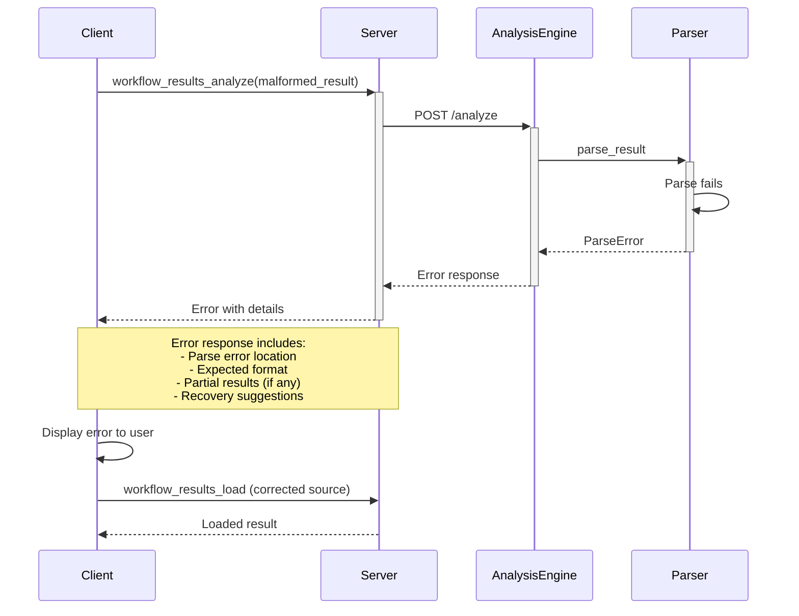
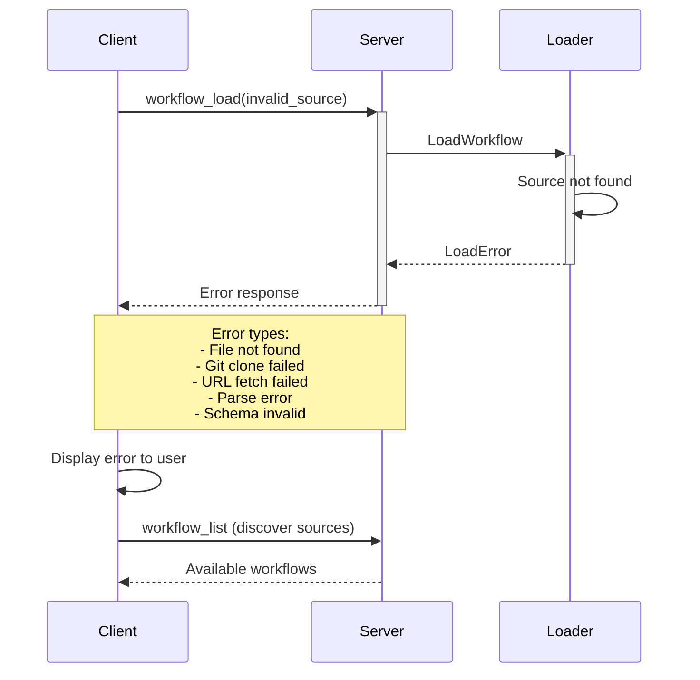

# Data Flow Architecture

This document describes the end-to-end data flows for the two primary use cases: **Input Construction** and **Result Analysis**.

## Table of Contents

1. [Input Construction Flow](#input-construction-flow)
2. [Result Analysis Flow](#result-analysis-flow)
3. [Combined Optimization Loop](#combined-optimization-loop)
4. [Error Handling Flows](#error-handling-flows)

---

## Input Construction Flow

### Overview

Input construction enables conversational, AI-driven building of workflow inputs through iterative dialog with the MCP client.

### Complete Flow Diagram

### Flow Steps Explained

#### 1. Session Initialization

- Client sends `initialize` request with protocol version
- Server validates protocol version (`2025-11-25`)
- Server returns capabilities (tools, resources, prompts)
- Client confirms with `initialized` notification
- Session marked ready for tool calls

#### 2. Workflow Discovery

- Client requests available workflows from a source (filesystem, git, URL)
- Server scans source and returns workflow list
- Client displays workflows to user for selection

#### 3. Schema Loading

- Client requests workflow input/output schemas
- Server loads workflow (from cache if available)
- Server parses workflow and extracts schemas
- Client receives schema definitions for validation

#### 4. Conversational Input Building

**Iterative Process:**

1. AI prompts user for input values conversationally
2. Client sends partial input to `workflow_input_build`
3. Server merges new input with existing draft
4. Optionally validates against schema (partial validation allowed)
5. Server returns updated draft and missing fields
6. Repeat until input complete

**Features:**

- **Merge Mode**: Add/update fields without replacing entire input
- **Replace Mode**: Replace entire input
- **Validation Optional**: Can build incrementally without validation
- **Session Persistence**: Draft stored in session state

#### 5. Input Validation

- Final validation with all required fields present
- Server performs complete schema validation
- Returns success or detailed error messages
- Ensures input ready for workflow execution

#### 6. Input Export

- Client requests final input in desired format (JSON/YAML)
- Server validates and serializes input
- Returns formatted input ready for Arcaflow Engine execution

---

## Result Analysis Flow

### Overview

Result analysis processes workflow execution results, extracts metrics, performs statistical analysis, and generates AI-driven optimization suggestions.

### Complete Flow Diagram

### Flow Steps Explained

#### 1. Result Loading

- Client loads workflow execution result from file or URL
- Server reads result data
- Returns raw result to client

#### 2. Result Analysis

**Single Result Analysis:**

1. Client sends result to `workflow_results_analyze`
2. Go server forwards to Python analysis engine via HTTP
3. Python engine loads and parses result
4. Extracts metrics (all numeric values)
5. Performs statistical analysis
6. Generates optimization suggestions based on heuristics
7. Stores analysis in history database
8. Returns analysis and suggestions to client

**Metrics Extracted:**

- All numeric values in result (nested)
- Time series data (if present)
- Resource utilization (CPU, memory, disk, network)
- Application metrics (throughput, latency, errors)

**Statistical Analysis:**

- Min, max, mean, median
- Percentiles (p95, p99)
- Standard deviation
- Coefficient of variation (variability measure)

**Suggestion Generation:**

- High variability → Stabilization recommendations
- Low utilization → Resource reduction
- High utilization → Resource increase
- Performance patterns → Configuration tuning

#### 3. Multi-Result Comparison

**Comparative Analysis:**

1. Client submits multiple results (different configurations)
2. Python engine analyzes each result independently
3. Compares all results across metrics
4. Ranks results by optimization direction (higher/lower)
5. Calculates percentage improvements/regressions
6. Performs multi-criteria scoring for overall ranking
7. Generates comparative suggestions

**Use Cases:**

- A/B testing different configurations
- Performance regression detection
- Configuration optimization experiments
- Trend analysis over time

#### 4. Historical Trend Analysis

- Query historical execution data from database
- Visualize metric trends over time
- Detect performance regressions
- Track improvement progress

---

## Combined Optimization Loop

### Overview

The complete optimization workflow combines input construction and result analysis in an iterative loop.

### Optimization Loop Diagram

### Optimization Loop Steps

1. **Discovery**: Find workflow to optimize
2. **Schema Loading**: Understand input requirements
3. **Input Building**: Create baseline configuration (conversationally)
4. **Validation**: Ensure input is valid
5. **Export**: Generate execution-ready input
6. **Execution**: Run workflow with Arcaflow Engine (external)
7. **Load Result**: Import execution result
8. **Analysis**: Extract metrics, generate suggestions
9. **Satisfaction Check**: Are performance goals met?
   - **Yes**: Proceed to comparison and archival
   - **No**: Apply suggestions, update input, repeat
10. **Suggestion Application**: Update input based on AI recommendations
11. **Comparison**: Compare all iterations
12. **History**: Store for future reference

---

## Error Handling Flows

### Input Validation Errors

### Analysis Errors

### Workflow Loading Errors

---

## Performance Characteristics

### Input Construction

- **Latency**: Low (< 100ms for cached workflows)
- **Throughput**: High (stateless, concurrent)
- **Bottlenecks**: Git clones (mitigated by caching)

### Result Analysis

- **Latency**: Medium (100-500ms depending on result size)
- **Throughput**: Medium (limited by Python HTTP server)
- **Bottlenecks**: Large result parsing, database writes

### Optimization Loop

- **Total Time**: Dominated by workflow execution (external)
- **Iterations**: Typically 2-5 iterations to optimize
- **Efficiency**: Each iteration informed by previous results

---

## Related Documentation

- [Architecture Overview](overview.md) - High-level system architecture
- [Go Server Architecture](go-server.md) - Go component details
- [Python Analysis Engine](python-engine.md) - Python component details
- [Inter-Service Communication](inter-service.md) - Go ↔ Python protocol details

---

*For usage examples, see the [User Documentation](../arcaflow-mcp/examples/).*
