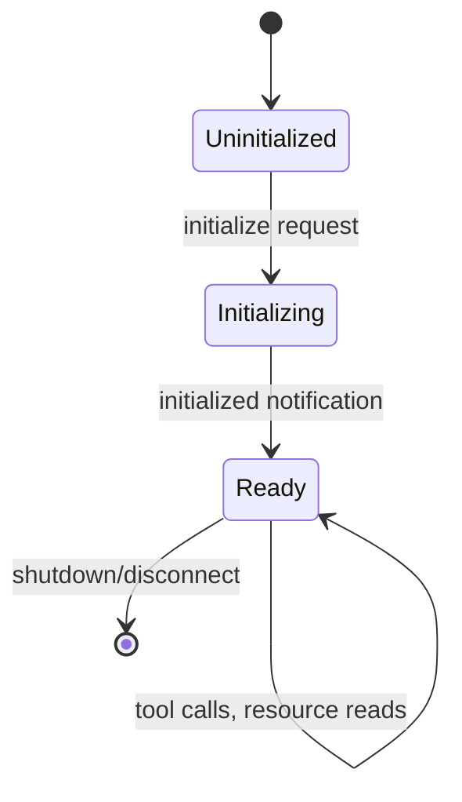
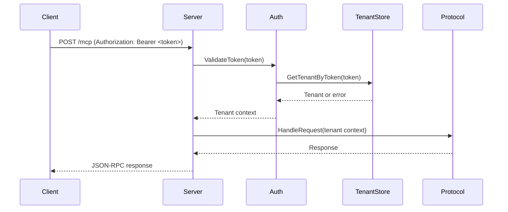
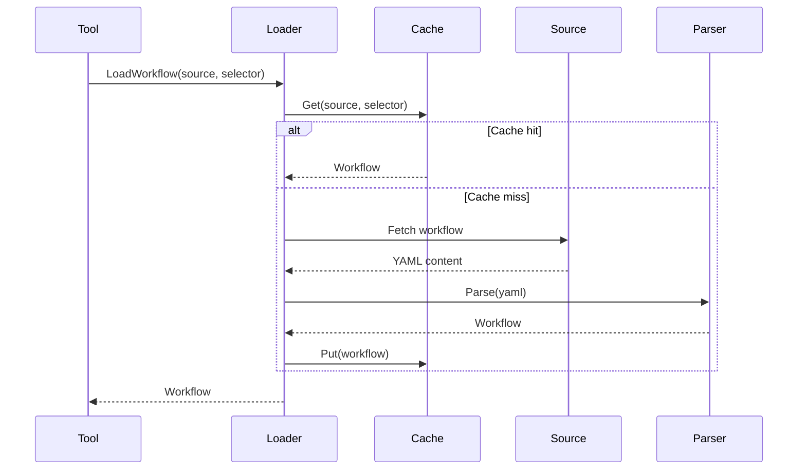

# Go Server Architecture

The Go server (`server/`) implements the MCP protocol and provides all workflow-related tools and resources.

## Package Structure

```
server/
├── cmd/
│   ├── arcaflow-mcp/        # Main server binary
│   └── manual-validate/     # Validation utility
└── pkg/
    ├── analysis/            # Analysis engine HTTP client
    ├── arcaflow/            # Arcaflow integration
    │   ├── pluginschema/    # Plugin schema handling
    │   └── workflow/        # Workflow loading and validation
    ├── audit/               # Audit logging
    ├── auth/                # Authentication
    ├── config/              # Configuration management
    ├── protocol/            # MCP protocol implementation
    ├── ratelimit/           # Rate limiting
    ├── resources/           # MCP resources
    ├── state/               # Session state management
    ├── tenant/              # Multi-tenancy
    ├── tools/               # MCP tools
    │   └── workflowtools/   # Workflow-specific tools
    ├── transport/           # Transport implementations
    │   ├── httpserver/      # HTTP/SSE transport
    │   └── stdio/           # stdio transport
    └── version/             # Version information
```

## Core Components

### Protocol Layer (`pkg/protocol/`)

**Purpose**: Implements MCP JSON-RPC 2.0 protocol handling.

**Key Types:**

```go
// Server manages MCP protocol lifecycle
type Server struct {
    tools     []protocol.Tool      // Available MCP tools
    resources []protocol.Resource  // Available MCP resources
    state     *state.Manager       // Session state
    // ...
}

// Session represents an MCP session
type Session struct {
    ClientInfo protocol.ClientInfo
    ServerInfo protocol.ServerInfo
    // ...
}
```

**Key Operations:**

1. **Initialize Handshake**:
   - Client sends `initialize` request with client info and protocol version
   - Server validates protocol version (`2025-11-25`)
   - Server returns capabilities (tools, resources, prompts)
   - Client sends `initialized` notification
   - Session ready for tool calls

2. **Tool Execution**:
   - Client sends `tools/call` request with tool name and arguments
   - Server validates arguments against tool schema
   - Server executes tool logic
   - Server returns result or error

3. **Resource Access**:
   - Client sends `resources/read` request with resource URI
   - Server retrieves resource content
   - Server returns resource data

4. **Error Handling**:
   - Standard MCP error codes
   - Detailed error messages with context
   - Structured error responses

**Protocol State Machine:**



### Transport Layer (`pkg/transport/`)

#### stdio Transport (`pkg/transport/stdio/`)

**Purpose**: Direct stdin/stdout communication for local mode.

**Features:**

- Newline-delimited JSON framing
- Single client, single session
- No authentication
- Synchronous request/response

**Implementation:**

```go
// Server manages stdio transport
type Server struct {
    reader *bufio.Reader
    writer *bufio.Writer
    // ...
}

// Run starts the stdio server
func (s *Server) Run(ctx context.Context) error {
    // Read JSON-RPC messages from stdin
    // Write responses to stdout
    // ...
}
```

#### HTTP/SSE Transport (`pkg/transport/httpserver/`)

**Purpose**: Multi-user server mode with HTTP and Server-Sent Events.

**Endpoints:**

- `POST /mcp` - MCP JSON-RPC requests
- `GET /mcp/events` - Server-Sent Events (SSE) for responses
- `GET /health` - Health check
- **Admin API** (requires admin token):
  - `POST /admin/tenants` - Create tenant
  - `GET /admin/tenants` - List tenants
  - `DELETE /admin/tenants/:id` - Delete tenant
  - `POST /admin/tenants/:id/tokens` - Create tenant token
  - `GET /admin/tenants/:id/tokens` - List tenant tokens
  - `DELETE /admin/tenants/:id/tokens/:token_id` - Revoke token
  - `GET /admin/audit` - Query audit logs
  - `GET /admin/usage` - Query usage statistics

**Features:**

- Bearer token authentication
- Session binding via `Mcp-Session-Id` header
- SSE for streaming responses
- Admin API for tenant management
- Audit logging for all operations
- Rate limiting per tenant

**Session Management:**

```go
// Session state stored in-memory (per-instance)
type SessionStore struct {
    sessions map[string]*protocol.Session
    mu       sync.RWMutex
    // ...
}
```

**Authentication Flow:**



### Tool Layer (`pkg/tools/workflowtools/`)

**Purpose**: Implements all MCP tools for workflow operations.

**Tool Categories:**

1. **Workflow Discovery**:
   - `workflow_list` - List available workflows from source
   - `workflow_load` - Load workflow definition
   - `workflow_describe` - Get human-readable workflow description
   - `workflow_schema_get` - Get input/output schemas

2. **Input Construction**:
   - `workflow_input_build` - Build/update draft inputs
   - `workflow_input_validate` - Validate inputs against schema
   - `workflow_input_export` - Export inputs (JSON/YAML)
   - `workflow_input_examples_get` - Get example inputs

3. **Result Analysis**:
   - `workflow_results_load` - Load results from file/URL
   - `workflow_results_parse` - Parse results and extract metrics
   - `workflow_results_analyze` - Analyze results and suggest improvements
   - `workflow_results_compare` - Compare multiple results
   - `workflow_results_metrics_extract` - Extract metrics only
   - `workflow_inputs_suggest` - Generate input suggestions from results
   - `workflow_optimization_guide` - Strategic optimization guidance

4. **Plugin Schema**:
   - `plugin_schema_get` - Get plugin schemas referenced by workflow

5. **History**:
   - `workflow_history_load` - Load stored workflow execution history

**Tool Implementation Pattern:**

```go
// Tool registration
func RegisterTools(server *protocol.Server) {
    server.AddTool(protocol.Tool{
        Name:        "workflow_list",
        Description: "List workflows from a source",
        InputSchema: listInputSchema,
    }, handleWorkflowList)
    // ...
}

// Tool handler
func handleWorkflowList(
    ctx context.Context,
    tenant *tenant.Context,
    args map[string]interface{},
) (interface{}, error) {
    // 1. Validate arguments
    // 2. Execute business logic
    // 3. Return result or error
    // ...
}
```

### Workflow Layer (`pkg/arcaflow/workflow/`)

**Purpose**: Load, parse, and validate Arcaflow workflows.

**Key Components:**

1. **Loader** (`loader.go`):
   - Workflow source abstraction (filesystem, git, URL)
   - Caching with TTL
   - Concurrent loading with safety

2. **Parser** (`parser.go`):
   - YAML workflow parsing
   - Input/output schema extraction
   - Plugin reference resolution

3. **Validator** (`validator.go`):
   - Schema-driven input validation
   - Uses Arcaflow SDK (`go.flow.arcalot.io/pluginsdk/schema`)
   - Unserialize/serialize roundtrip for validation

4. **Input Generator** (`input_generator.go`):
   - AI-driven conversational input building
   - Merge or replace semantics
   - Partial input support (validation optional)

5. **Cache** (`cache.go`):
   - In-memory workflow cache
   - TTL-based expiration
   - Concurrent-safe access

**Workflow Loading Flow:**



**Input Validation:**

```go
// Validate input against workflow schema
func ValidateInput(workflow *Workflow, input map[string]interface{}) error {
    // 1. Get input schema from workflow
    schema := workflow.InputSchema
    
    // 2. Unserialize input data
    unserializedData, err := schema.Unserialize(input)
    if err != nil {
        return fmt.Errorf("validation failed: %w", err)
    }
    
    // 3. Serialize back (validates completeness)
    _, err = schema.Serialize(unserializedData)
    if err != nil {
        return fmt.Errorf("serialization failed: %w", err)
    }
    
    return nil
}
```

### Multi-Tenancy Layer (`pkg/tenant/`)

**Purpose**: Tenant isolation, quotas, and workspace management.

**Key Components:**

1. **Tenant Store** (`store.go`):
   - CRUD operations for tenants
   - File-based persistence (`tenancy.tenant_store_path`)
   - Thread-safe access

2. **Context** (`context.go`):
   - Tenant context for request handling
   - Workspace path resolution
   - Quota enforcement

3. **Quota** (`quota.go`):
   - Resource limits per tenant
   - Configurable quotas (workflows, sessions, storage)
   - Enforcement at tool execution

4. **Usage Tracking** (`usage.go`):
   - Per-tenant usage statistics
   - Tool call counts, storage usage
   - File-based persistence

5. **Workspace** (`workspace.go`):
   - Isolated filesystem for each tenant
   - Path validation (prevent traversal)
   - Automatic cleanup

**Tenant Isolation:**

```
/tenancy.workspace_root/
├── tenant-<id1>/
│   ├── workflows/
│   ├── inputs/
│   └── results/
├── tenant-<id2>/
│   ├── workflows/
│   ├── inputs/
│   └── results/
└── ...
```

### Authentication Layer (`pkg/auth/`)

**Purpose**: Token-based authentication for server mode.

**Key Components:**

1. **Token Store** (`file_store.go`):
   - Admin token storage
   - Tenant token storage
   - File-based persistence (`auth.token_store_path`)

2. **Authenticator** (`auth.go`):
   - Token validation
   - Admin vs. tenant token differentiation
   - Token-to-tenant resolution

**Token Types:**

- **Admin Token**: Full server control, set via `ARCAFLOW_MCP_ADMIN_TOKEN`
- **Tenant Tokens**: Scoped to tenant, created via admin API

**Authentication Flow:**

```go
// Authenticate request
func (a *Authenticator) Authenticate(token string) (*tenant.Context, bool, error) {
    // 1. Check if admin token
    if token == a.adminToken {
        return nil, true, nil // Admin context, no tenant
    }
    
    // 2. Look up tenant by token
    tenant, err := a.tokenStore.GetTenantByToken(token)
    if err != nil {
        return nil, false, err
    }
    
    // 3. Return tenant context
    return tenant, false, nil
}
```

### Audit Layer (`pkg/audit/`)

**Purpose**: Audit logging for compliance and troubleshooting.

**Features:**

- All tool calls logged with tenant context
- Admin operations logged
- Authentication failures logged
- File-based persistence (`audit.store_path`)
- Query API for audit log retrieval

**Audit Entry:**

```go
type Entry struct {
    Timestamp   time.Time
    TenantID    string
    Operation   string
    User        string
    Arguments   map[string]interface{}
    Result      string
    Error       string
}
```

### State Management (`pkg/state/`)

**Purpose**: In-memory session state for MCP protocol.

**Features:**

- Session lifecycle management
- Draft input storage for iterative building
- Session-scoped caching
- Automatic cleanup on session end

**State Storage:**

```go
type Manager struct {
    sessions map[string]*Session
    drafts   map[string]map[string]interface{} // sessionID -> draft inputs
    mu       sync.RWMutex
}
```

### Analysis Client (`pkg/analysis/`)

**Purpose**: HTTP client for Python analysis engine.

**Features:**

- REST API client
- Request/response serialization
- Error handling and retries
- Configurable endpoint (`ARCAFLOW_MCP_ANALYSIS_HTTP_URL`)

**API Methods:**

```go
type Client struct {
    baseURL string
    client  *http.Client
}

func (c *Client) Analyze(ctx context.Context, result interface{}) (*AnalysisResult, error)
func (c *Client) Compare(ctx context.Context, results []interface{}) (*ComparisonResult, error)
func (c *Client) Suggest(ctx context.Context, result interface{}) (*SuggestionResult, error)
```

### Configuration (`pkg/config/`)

**Purpose**: Server configuration management.

**Configuration Sources:**

1. Environment variables (highest priority)
2. Configuration file (YAML/JSON)
3. Defaults (lowest priority)

**Key Settings:**

- Server mode: `server.enabled`
- HTTP listen address: `server.listen_addr`
- Admin token: `auth.admin_token`
- Tenant store: `tenancy.tenant_store_path`
- Token store: `auth.token_store_path`
- Audit store: `audit.store_path`
- Usage store: `usage.store_path`
- Workspace root: `tenancy.workspace_root`
- Analysis engine URL: `analysis.http_url`

## Concurrency Model

### Request Handling

- Each request handled in a separate goroutine
- No shared mutable state across requests (except caches, stores)
- Thread-safe access to stores via mutexes
- Context-based cancellation for graceful shutdown

### Caching Strategy

- **Workflow Cache**: In-memory, TTL-based, LRU eviction
- **Git Repository Cache**: Local clones, periodic refresh
- **Schema Cache**: Per-workflow, invalidated on workflow reload

### Synchronization

- **Mutexes**: Used for all shared stores (tenant, token, audit, usage)
- **Read-Write Locks**: Used for caches (many readers, few writers)
- **Context**: Used for request cancellation and timeout

## Error Handling

### Error Types

1. **Protocol Errors**: MCP-specific error codes
2. **Validation Errors**: Schema validation failures
3. **Resource Errors**: File not found, permission denied
4. **Internal Errors**: Unexpected server errors

### Error Response Format

```json
{
  "jsonrpc": "2.0",
  "id": 1,
  "error": {
    "code": -32600,
    "message": "Invalid Request",
    "data": {
      "detail": "missing required field: source"
    }
  }
}
```

## Testing Strategy

### Unit Tests

- Package-level tests (`*_test.go`)
- Mock dependencies
- Table-driven tests
- >85% code coverage required

### Integration Tests

- `test/integration/` directory
- Test MCP protocol compliance
- Test tool execution end-to-end
- Test multi-tenancy isolation

### Benchmarks

- Performance benchmarks (`*_test.go` with `Benchmark*` functions)
- Workflow loading performance
- Schema validation performance
- Concurrent request handling

## Performance Considerations

### Bottlenecks

- Workflow loading (mitigated by caching)
- Git clones (mitigated by local caching)
- Schema validation (fast, using Arcaflow SDK)
- Analysis engine calls (async, batched where possible)

### Optimization Strategies

- In-memory caching of workflows and schemas
- Concurrent workflow loading
- Connection pooling for analysis engine HTTP client
- Rate limiting to prevent resource exhaustion

## Related Documentation

- [Architecture Overview](overview.md) - High-level system architecture
- [Python Analysis Engine](python-engine.md) - Analysis engine details
- [Data Flow](data-flow.md) - End-to-end data flow diagrams
- [Inter-Service Communication](inter-service.md) - Go ↔ Python communication

---

*For API reference and godoc, see the [API Documentation](../api/go-server.md).*
