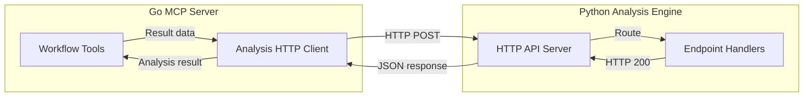
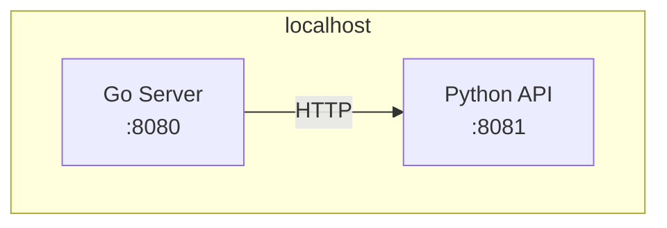
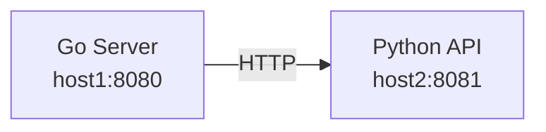
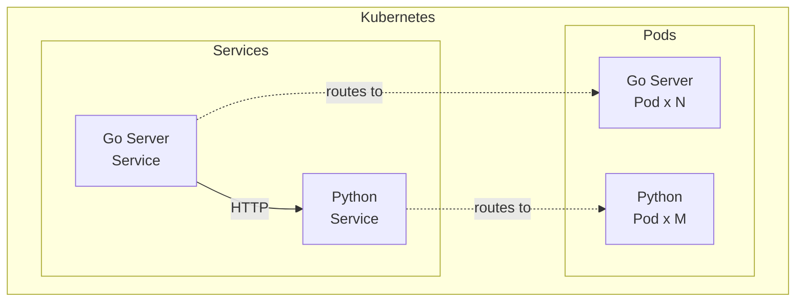

# Inter-Service Communication

This document describes the communication protocol between the Go MCP server and the Python analysis engine.

## Overview

The Go server and Python analysis engine communicate via **HTTP REST API**. This design was chosen for:

- **Simplicity**: Standard HTTP, widely understood
- **Language Independence**: No shared code required
- **Deployability**: Services can run on different hosts
- **Scalability**: Analysis engine can be scaled independently

**Future Enhancement**: gRPC may be considered for performance-critical deployments.

## Communication Architecture



## Configuration

### Go Server Configuration

**Environment Variable:**

```bash
export ARCAFLOW_MCP_ANALYSIS_HTTP_URL="http://localhost:8081"
```

**Configuration File:**

```yaml
# server/config.yaml
analysis:
  http_url: "http://localhost:8081"
  timeout: 30s
  retry_attempts: 3
  retry_delay: 1s
```

**Defaults:**

- URL: `http://localhost:8081`
- Timeout: 30 seconds
- Retry: 3 attempts with 1s delay

### Python Engine Configuration

**Environment Variable:**

```bash
export ANALYSIS_PORT="8081"
export ANALYSIS_HOST="0.0.0.0"
```

**Configuration File:**

```yaml
# analysis/config.yaml
server:
  host: "0.0.0.0"
  port: 8081
  workers: 4
```

## HTTP API Specification

### Base URL

```
http://localhost:8081
```

### Common Headers

**Request:**

```
Content-Type: application/json
Accept: application/json
```

**Response:**

```
Content-Type: application/json
```

### Authentication

**Current**: No authentication (trusted internal communication)

**Future**: Mutual TLS or API key authentication for production deployments

---

## API Endpoints

### 1. Health Check

**Endpoint:** `GET /healthz`

**Purpose:** Check service availability

**Request:**

```http
GET /healthz HTTP/1.1
Host: localhost:8081
```

**Response (200 OK):**

```json
{
  "status": "healthy",
  "version": "0.1.0",
  "uptime_seconds": 3600
}
```

**Response (503 Service Unavailable):**

```json
{
  "status": "unhealthy",
  "error": "database connection failed"
}
```

---

### 2. Analyze Result

**Endpoint:** `POST /analyze`

**Purpose:** Analyze a single workflow result and generate suggestions

**Request:**

```http
POST /analyze HTTP/1.1
Host: localhost:8081
Content-Type: application/json

{
  "results": [
    {
      "payload": {
        "throughput": 300,
        "latency": 50,
        "cpu_usage": 75,
        "memory_usage": 60
      },
      "format": "json"
    }
  ],
  "metric_directions": {
    "throughput": "higher",
    "latency": "lower",
    "cpu_usage": "lower",
    "memory_usage": "lower"
  },
  "compare": false
}
```

**Request Fields:**

- `results` (array, required): Array of result objects
  - `payload` (object/string, required): Result data
  - `format` (string, optional): Format hint (`json`, `yaml`, `txt`)
- `metric_directions` (object, optional): Optimization direction per metric
  - Key: metric name
  - Value: `"higher"` or `"lower"`
- `compare` (boolean, optional): Include comparison summary (default: false)

**Response (200 OK):**

```json
{
  "metrics": {
    "throughput": {
      "min": 300,
      "max": 300,
      "mean": 300,
      "median": 300,
      "p95": 300,
      "p99": 300,
      "std_dev": 0,
      "cv": 0,
      "count": 1
    },
    "latency": {
      "min": 50,
      "max": 50,
      "mean": 50,
      "median": 50,
      "p95": 50,
      "p99": 50,
      "std_dev": 0,
      "cv": 0,
      "count": 1
    }
  },
  "suggestions": [
    {
      "category": "performance",
      "priority": "medium",
      "metric": "cpu_usage",
      "current": 75,
      "target": 60,
      "recommendation": "CPU usage is elevated. Consider optimizing compute-intensive operations or increasing CPU allocation.",
      "rationale": "Current CPU usage is 75%, which may indicate resource constraints.",
      "expected_impact": "10-20% improvement in throughput",
      "confidence": 0.7
    }
  ],
  "trends": {
    "throughput": "stable",
    "latency": "stable"
  },
  "anomalies": []
}
```

**Response Fields:**

- `metrics` (object): Extracted metrics with statistics
- `suggestions` (array): Optimization suggestions
- `trends` (object): Trend detection per metric
- `anomalies` (array): Detected anomalies

**Error Response (400 Bad Request):**

```json
{
  "error": "Invalid input",
  "detail": "Missing required field: results",
  "code": "VALIDATION_ERROR"
}
```

**Error Response (500 Internal Server Error):**

```json
{
  "error": "Analysis failed",
  "detail": "Failed to parse result: invalid JSON",
  "code": "PARSE_ERROR"
}
```

---

### 3. Compare Results

**Endpoint:** `POST /compare`

**Purpose:** Compare multiple workflow results and rank by metrics

**Request:**

```http
POST /compare HTTP/1.1
Host: localhost:8081
Content-Type: application/json

{
  "results": [
    {
      "payload": {"throughput": 300, "latency": 50},
      "format": "json"
    },
    {
      "payload": {"throughput": 400, "latency": 40},
      "format": "json"
    },
    {
      "payload": {"throughput": 350, "latency": 45},
      "format": "json"
    }
  ],
  "metric_directions": {
    "throughput": "higher",
    "latency": "lower"
  },
  "compare": true
}
```

**Response (200 OK):**

```json
{
  "metrics": {
    "throughput": [...],
    "latency": [...]
  },
  "comparison": {
    "rankings": {
      "throughput": [1, 0, 2],
      "latency": [1, 0, 2]
    },
    "deltas": {
      "throughput": [0, 33.3, 16.7],
      "latency": [0, -20.0, -10.0]
    },
    "best_overall": 1,
    "summary": "Configuration 2 (index 1) performs best overall with 33% higher throughput and 20% lower latency."
  },
  "suggestions": [
    {
      "category": "configuration",
      "priority": "high",
      "metric": "overall",
      "recommendation": "Use configuration from result index 1 as baseline.",
      "rationale": "This configuration achieves best overall performance.",
      "expected_impact": "33% improvement",
      "confidence": 0.95
    }
  ]
}
```

---

### 4. Generate Suggestions

**Endpoint:** `POST /suggest`

**Purpose:** Generate optimization suggestions from results (without full analysis)

**Request:**

```http
POST /suggest HTTP/1.1
Host: localhost:8081
Content-Type: application/json

{
  "results": [
    {
      "payload": {"throughput": 300, "latency": 50, "cpu_usage": 90},
      "format": "json"
    }
  ],
  "metric_directions": {
    "throughput": "higher",
    "latency": "lower",
    "cpu_usage": "lower"
  }
}
```

**Response (200 OK):**

```json
{
  "suggestions": [
    {
      "category": "resource",
      "priority": "high",
      "metric": "cpu_usage",
      "current": 90,
      "target": 70,
      "recommendation": "Increase CPU allocation or optimize CPU-intensive code paths.",
      "rationale": "CPU usage at 90% indicates resource saturation.",
      "expected_impact": "20-40% improvement in throughput",
      "confidence": 0.85
    }
  ]
}
```

---

### 5. Extract Metrics Only

**Endpoint:** `POST /metrics`

**Purpose:** Extract and analyze metrics without generating suggestions

**Request:**

```http
POST /metrics HTTP/1.1
Host: localhost:8081
Content-Type: application/json

{
  "results": [
    {
      "payload": {"throughput": 300, "latency": 50},
      "format": "json"
    }
  ]
}
```

**Response (200 OK):**

```json
{
  "metrics": {
    "throughput": {
      "min": 300,
      "max": 300,
      "mean": 300,
      "median": 300,
      "p95": 300,
      "p99": 300,
      "std_dev": 0,
      "cv": 0,
      "count": 1
    },
    "latency": {
      "min": 50,
      "max": 50,
      "mean": 50,
      "median": 50,
      "p95": 50,
      "p99": 50,
      "std_dev": 0,
      "cv": 0,
      "count": 1
    }
  }
}
```

---

### 6. Parse Result

**Endpoint:** `POST /parse`

**Purpose:** Parse a result without performing analysis

**Request:**

```http
POST /parse HTTP/1.1
Host: localhost:8081
Content-Type: application/json

{
  "results": [
    {
      "payload": "throughput: 300\nlatency: 50",
      "format": "yaml"
    }
  ]
}
```

**Response (200 OK):**

```json
{
  "parsed": {
    "metrics": {
      "throughput": 300,
      "latency": 50
    },
    "metadata": {},
    "format": "yaml",
    "errors": []
  }
}
```

---

## Go Client Implementation

### Client Interface

```go
// Client is the interface for the analysis HTTP client
type Client interface {
    Analyze(ctx context.Context, req *AnalyzeRequest) (*AnalyzeResponse, error)
    Compare(ctx context.Context, req *CompareRequest) (*CompareResponse, error)
    Suggest(ctx context.Context, req *SuggestRequest) (*SuggestResponse, error)
    Metrics(ctx context.Context, req *MetricsRequest) (*MetricsResponse, error)
    Parse(ctx context.Context, req *ParseRequest) (*ParseResponse, error)
    Health(ctx context.Context) (*HealthResponse, error)
}
```

### Client Implementation

```go
// pkg/analysis/client.go
type client struct {
    baseURL    string
    httpClient *http.Client
}

func NewClient(baseURL string, timeout time.Duration) Client {
    return &client{
        baseURL: baseURL,
        httpClient: &http.Client{
            Timeout: timeout,
        },
    }
}

func (c *client) Analyze(ctx context.Context, req *AnalyzeRequest) (*AnalyzeResponse, error) {
    // 1. Serialize request to JSON
    body, err := json.Marshal(req)
    if err != nil {
        return nil, fmt.Errorf("failed to marshal request: %w", err)
    }
    
    // 2. Create HTTP request
    httpReq, err := http.NewRequestWithContext(
        ctx,
        http.MethodPost,
        c.baseURL+"/analyze",
        bytes.NewReader(body),
    )
    if err != nil {
        return nil, fmt.Errorf("failed to create request: %w", err)
    }
    httpReq.Header.Set("Content-Type", "application/json")
    httpReq.Header.Set("Accept", "application/json")
    
    // 3. Send request
    resp, err := c.httpClient.Do(httpReq)
    if err != nil {
        return nil, fmt.Errorf("failed to send request: %w", err)
    }
    defer resp.Body.Close()
    
    // 4. Check status code
    if resp.StatusCode != http.StatusOK {
        var errResp ErrorResponse
        if err := json.NewDecoder(resp.Body).Decode(&errResp); err != nil {
            return nil, fmt.Errorf("request failed with status %d", resp.StatusCode)
        }
        return nil, fmt.Errorf("analysis failed: %s (%s)", errResp.Error, errResp.Detail)
    }
    
    // 5. Deserialize response
    var result AnalyzeResponse
    if err := json.NewDecoder(resp.Body).Decode(&result); err != nil {
        return nil, fmt.Errorf("failed to decode response: %w", err)
    }
    
    return &result, nil
}
```

### Error Handling

```go
// ErrorResponse represents an API error response
type ErrorResponse struct {
    Error  string `json:"error"`
    Detail string `json:"detail"`
    Code   string `json:"code"`
}

// HandleError converts API errors to Go errors
func (c *client) HandleError(resp *http.Response) error {
    var errResp ErrorResponse
    if err := json.NewDecoder(resp.Body).Decode(&errResp); err != nil {
        return fmt.Errorf("request failed with status %d", resp.StatusCode)
    }
    
    switch errResp.Code {
    case "VALIDATION_ERROR":
        return &ValidationError{Message: errResp.Detail}
    case "PARSE_ERROR":
        return &ParseError{Message: errResp.Detail}
    default:
        return &InternalError{Message: errResp.Detail}
    }
}
```

### Retry Logic

```go
func (c *client) doWithRetry(ctx context.Context, req *http.Request) (*http.Response, error) {
    var lastErr error
    
    for attempt := 0; attempt < c.retryAttempts; attempt++ {
        // Clone request (body may be consumed)
        reqClone := req.Clone(ctx)
        
        // Send request
        resp, err := c.httpClient.Do(reqClone)
        if err == nil && resp.StatusCode < 500 {
            return resp, nil
        }
        
        // Retry on 5xx or network errors
        if err != nil {
            lastErr = err
        } else {
            resp.Body.Close()
            lastErr = fmt.Errorf("server error: %d", resp.StatusCode)
        }
        
        // Wait before retry (exponential backoff)
        if attempt < c.retryAttempts-1 {
            delay := c.retryDelay * time.Duration(1<<uint(attempt))
            select {
            case <-time.After(delay):
            case <-ctx.Done():
                return nil, ctx.Err()
            }
        }
    }
    
    return nil, fmt.Errorf("request failed after %d attempts: %w", c.retryAttempts, lastErr)
}
```

## Performance Considerations

### Connection Pooling

The Go HTTP client uses connection pooling by default:

```go
transport := &http.Transport{
    MaxIdleConns:        100,
    MaxIdleConnsPerHost: 10,
    IdleConnTimeout:     90 * time.Second,
}

httpClient := &http.Client{
    Transport: transport,
    Timeout:   30 * time.Second,
}
```

### Request Timeouts

- **Default Timeout**: 30 seconds
- **Configurable**: Via `analysis.timeout` config
- **Context Cancellation**: Honors context deadline

### Concurrency

- Go client is **thread-safe**
- Multiple concurrent requests supported
- Python server handles concurrent requests via worker pool

### Bottlenecks

- **Large Payloads**: JSON serialization/deserialization overhead
- **Network Latency**: For remote deployments
- **Python GIL**: Limits concurrency in Python (mitigated by async server)

### Optimization Strategies

- **Batch Requests**: Use `/compare` for multiple results
- **Compression**: Enable gzip compression (future)
- **Local Deployment**: Co-locate services for low latency
- **Caching**: Cache analysis results for identical inputs (future)

## Security Considerations

### Current State

- **No Authentication**: Assumes trusted internal network
- **No Encryption**: Plain HTTP

### Production Recommendations

1. **Mutual TLS**:
   - Client certificate authentication
   - Encrypted communication

2. **API Key Authentication**:
   - Shared secret token
   - Header-based authentication

3. **Network Isolation**:
   - Firewall rules restricting access
   - VPC/private network deployment

4. **Input Validation**:
   - Size limits to prevent DoS
   - Schema validation
   - Sanitization of file paths

### Future Enhancements

```yaml
# Future authentication config
analysis:
  http_url: "https://analysis-engine:8081"
  tls:
    enabled: true
    cert: "/etc/ssl/certs/client.crt"
    key: "/etc/ssl/private/client.key"
    ca: "/etc/ssl/certs/ca.crt"
  auth:
    type: "api_key"  # or "mutual_tls"
    api_key: "${ANALYSIS_API_KEY}"
```

## Deployment Patterns

### Co-Located (Development)



**Configuration:**

```bash
export ARCAFLOW_MCP_ANALYSIS_HTTP_URL="http://localhost:8081"
```

### Separate Hosts (Production)



**Configuration:**

```bash
export ARCAFLOW_MCP_ANALYSIS_HTTP_URL="http://analysis-engine.internal:8081"
```

### Kubernetes (Clustered)



**Configuration:**

```bash
export ARCAFLOW_MCP_ANALYSIS_HTTP_URL="http://analysis-service.default.svc.cluster.local:8081"
```

## Monitoring and Observability

### Metrics to Track

**Go Server:**
- Analysis request count
- Analysis request latency (p50, p95, p99)
- Analysis request errors (by type)
- Retry attempts
- Circuit breaker state (future)

**Python Server:**
- Request count (by endpoint)
- Request latency (by endpoint)
- Error rate (by endpoint)
- Active connections
- Worker utilization

### Logging

**Go Server:**

```go
log.Info("Sending analysis request",
    zap.String("endpoint", "/analyze"),
    zap.Int("result_count", len(req.Results)),
    zap.Duration("timeout", timeout))

log.Error("Analysis request failed",
    zap.Error(err),
    zap.Int("attempt", attempt),
    zap.String("endpoint", "/analyze"))
```

**Python Server:**

```python
logger.info("Received analysis request",
    extra={
        "endpoint": "/analyze",
        "result_count": len(req.results),
        "client_ip": request.remote_addr
    })

logger.error("Analysis failed",
    extra={
        "error": str(e),
        "endpoint": "/analyze",
        "result_format": req.results[0].format
    })
```

### Health Checks

**Go Server Health Check:**

```go
func (c *client) HealthCheck(ctx context.Context) error {
    resp, err := c.Health(ctx)
    if err != nil {
        return fmt.Errorf("analysis engine unreachable: %w", err)
    }
    if resp.Status != "healthy" {
        return fmt.Errorf("analysis engine unhealthy: %s", resp.Error)
    }
    return nil
}
```

## Related Documentation

- [Architecture Overview](overview.md) - High-level system architecture
- [Go Server Architecture](go-server.md) - Go component details
- [Python Analysis Engine](python-engine.md) - Python component details
- [Data Flow](data-flow.md) - End-to-end data flow diagrams

---

*For API implementation details, see the [API Documentation](../api/).*
