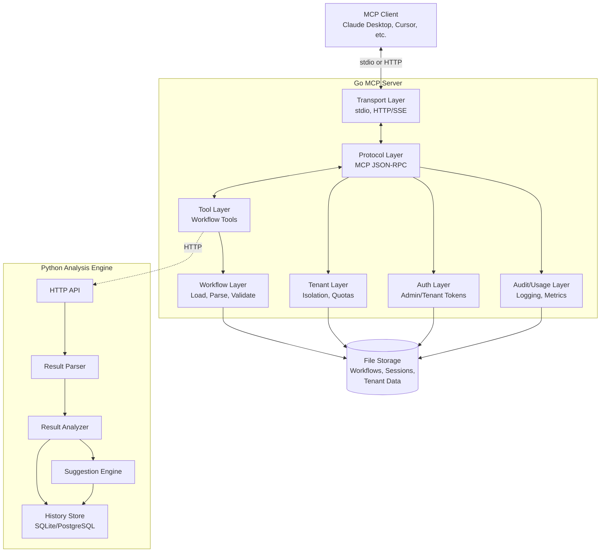
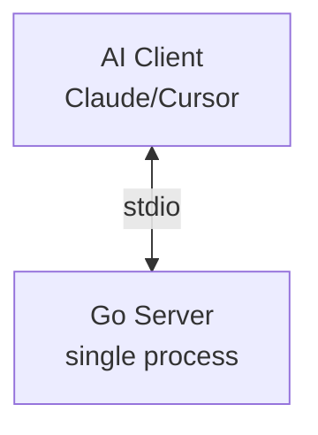
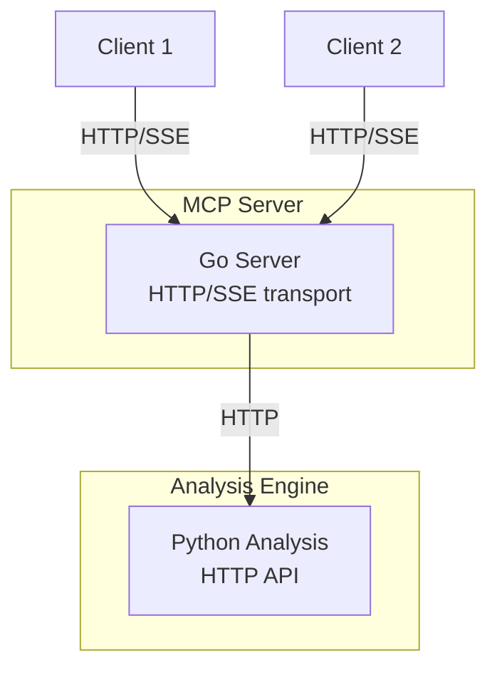
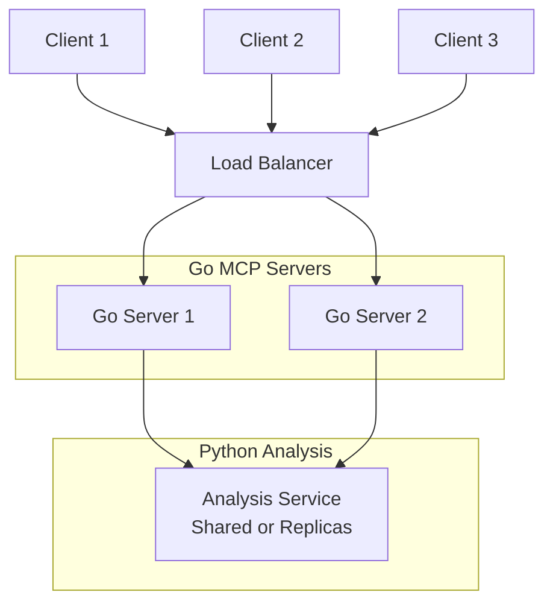

# Architecture Overview

Arcaflow MCP uses a hybrid architecture that combines Go and Python components to provide a robust, performant MCP server for Arcaflow workflows.

## Design Philosophy

The architecture follows these principles:

1. **Language-Specific Strengths**: Go for protocol handling and I/O, Python for data analysis
2. **Clear Separation of Concerns**: Protocol/transport separate from business logic
3. **Extensibility**: New tools and analysis methods can be added without core changes
4. **Performance**: Concurrent request handling, efficient workflow caching
5. **Multi-Tenancy**: Tenant isolation at all layers (auth, storage, quotas)

## High-Level Architecture

## Component Overview

### Go MCP Server

The Go server (`server/`) implements the MCP protocol and handles all client interactions.

**Core Packages:**

- **`pkg/transport/`**: Transport implementations (stdio, HTTP/SSE)
- **`pkg/protocol/`**: MCP JSON-RPC protocol handling, session management
- **`pkg/tools/`**: MCP tool implementations (workflow operations)
- **`pkg/arcaflow/workflow/`**: Workflow loading, parsing, validation
- **`pkg/arcaflow/pluginschema/`**: Plugin schema handling
- **`pkg/auth/`**: Authentication (admin/tenant tokens)
- **`pkg/tenant/`**: Multi-tenancy (isolation, quotas, workspaces)
- **`pkg/audit/`**: Audit logging
- **`pkg/state/`**: Session state management
- **`pkg/resources/`**: MCP resource providers
- **`pkg/analysis/`**: HTTP client for Python analysis engine
- **`pkg/config/`**: Configuration management
- **`pkg/version/`**: Version information

**Key Features:**

- Stateless request handling (except for session management in server mode)
- Concurrent workflow loading with caching
- Git repository support for workflow sources
- Filesystem and URL-based workflow loading
- Schema-driven input validation using Arcaflow SDK
- Admin API for tenant/token management (server mode)

### Python Analysis Engine

The Python analysis engine (`analysis/`) processes workflow results and generates optimization suggestions.

**Core Modules:**

- **`server/`**: HTTP API server, request handling
- **`parser/`**: Result loading and parsing (JSON, YAML, log files)
- **`analyzer/`**: Metrics extraction, statistical analysis
- **`suggester/`**: AI-driven optimization suggestions
- **`db/`**: History persistence (SQLAlchemy, SQLite/PostgreSQL)

**Key Features:**

- Multi-format result parsing (JSON, YAML, plain text)
- Statistical analysis (min, max, mean, p95, p99, std dev, CV)
- Result comparison across multiple runs
- Optimization suggestions based on metrics and patterns
- Historical result storage for trend analysis
- REST API for integration with Go server

## Communication Patterns

### Client ↔ Go Server

**Local Mode (stdio):**
- Direct stdin/stdout communication
- Single client, single session
- No authentication required
- Suitable for desktop AI clients (Claude, Cursor)

**Server Mode (HTTP/SSE):**
- HTTP POST for requests (`/mcp`)
- Server-Sent Events (SSE) for responses (`/mcp/events`)
- Session binding via `Mcp-Session-Id` header
- Authentication via `Authorization: Bearer <token>`
- Multi-tenant with workspace isolation

### Go Server ↔ Python Analysis Engine

**Communication:**
- HTTP REST API (default: `http://localhost:8081`)
- Configurable via `ARCAFLOW_MCP_ANALYSIS_HTTP_URL`

**API Endpoints:**
- `POST /analyze` - Analyze single result
- `POST /compare` - Compare multiple results
- `POST /suggest` - Generate optimization suggestions
- `POST /metrics` - Extract metrics only
- `POST /parse` - Parse result without analysis
- `GET /healthz` - Health check

## Data Flow Patterns

See [`data-flow.md`](data-flow.md) for detailed sequence diagrams covering:

1. **Input Construction Flow**: User prompt → Tool execution → Schema validation → Output
2. **Result Analysis Flow**: Result submission → Parsing → Analysis → Suggestions

## Deployment Models

### Local Mode

- Single process, no authentication
- Direct file system access for workflows
- Suitable for personal use, development

### Server Mode (Single Instance)

- Multiple clients, authentication required
- Tenant isolation, resource quotas
- Persistent storage for tenant data
- Suitable for team use, shared infrastructure

### Server Mode (Clustered)

- Load balancing with session affinity (for SSE)
- Shared storage for tenant data, tokens, audit logs
- Horizontal scaling for high availability
- Suitable for production, enterprise use

## Persistence and State

See [`persistence.md`](persistence.md) for the canonical inventory of server-mode state.

**Go Server Persistence:**
- Tenant records (`tenancy.tenant_store_path`)
- Tenant tokens (`auth.token_store_path`)
- Audit logs (`audit.store_path`)
- Usage statistics (`usage.store_path`)
- Tenant workspaces (`tenancy.workspace_root`)
- Session state (in-memory, not persisted)

**Python Analysis Engine Persistence:**
- Historical results (SQLite or PostgreSQL)
- Workflow execution history
- Analysis metadata

**Workflow Storage:**
- Local filesystem paths
- Git repositories (cloned on demand)
- URL-based loading (fetched on demand)

## Security Model

### Authentication

- **Local Mode**: No authentication (single user, trusted environment)
- **Server Mode**: Bearer token authentication
  - Admin token: Full server control, tenant management
  - Tenant tokens: Scoped to tenant workspace

### Authorization

- **Admin Token**: All operations, tenant CRUD, token management
- **Tenant Token**: Restricted to tenant workspace, no admin operations
- **Tool Execution**: Filesystem access limited to tenant workspace

### Isolation

- **Tenant Workspaces**: Filesystem isolation (`/tenant/<id>/`)
- **Resource Quotas**: Per-tenant limits (workflows, sessions, storage)
- **Rate Limiting**: Per-tenant request rate limits
- **Audit Logging**: All operations logged with tenant context

### Threat Mitigation

- **Path Traversal**: Validated, restricted to tenant workspace
- **Resource Exhaustion**: Quotas and rate limiting
- **Credential Leakage**: Tokens never logged or exposed
- **Workflow Poisoning**: Schema validation, sandboxed execution (future)

## Performance Characteristics

### Go Server

- **Concurrent Request Handling**: Go's goroutine model
- **Workflow Caching**: In-memory cache with TTL
- **Git Repository Caching**: Local clones, periodic refresh
- **Schema Validation**: Fast Arcaflow SDK validation

### Python Analysis Engine

- **Async HTTP Server**: uvicorn/aiohttp for concurrent requests
- **Batch Processing**: Multiple results analyzed in parallel
- **Database**: SQLAlchemy with connection pooling
- **Memory**: Pandas DataFrames for result analysis

### Scalability

- **Local Mode**: Single client, limited by local resources
- **Server Mode**: Scales horizontally with load balancer
- **Analysis Engine**: Can be scaled independently
- **Storage**: Shared storage required for multi-instance deployments

## Extension Points

### Adding New Tools

1. Implement tool in `server/pkg/tools/`
2. Register in protocol server tool list
3. Add schema definition
4. Implement business logic
5. Add tests (unit, integration)

### Adding Analysis Features

1. Add endpoint in `analysis/arcaflow_analysis/server/http_api.py`
2. Implement logic in `analyzer/`, `parser/`, or `suggester/`
3. Update Go client in `server/pkg/analysis/client.go`
4. Add tool wrapper in `server/pkg/tools/workflowtools/`
5. Add tests (unit, integration)

### Custom Workflow Sources

1. Implement `workflow.Source` interface in Go
2. Add loader in `server/pkg/arcaflow/workflow/`
3. Register source type
4. Add configuration options
5. Add tests

## Related Documentation

- [Go Server Architecture](go-server.md) - Detailed Go component design
- [Python Analysis Engine](python-engine.md) - Detailed Python component design
- [Data Flow](data-flow.md) - Sequence diagrams and data flow details
- [Inter-Service Communication](inter-service.md) - gRPC/HTTP protocol details
- [Persistence](persistence.md) - State management and storage

---

*For developer setup and contribution guidelines, see the [Development Documentation](../development/README.md).*
